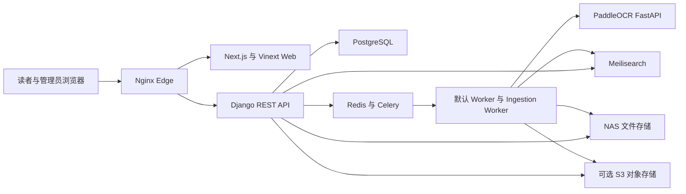

# Social Theory Library 架构

更新日期为 2026-08-16。本文件描述当前源码结构。生产状态只引用已有交接记录，本轮 Git 审计没有连接 NAS、Cloudflare 或生产数据库，也没有重新验证线上服务。

## 总体结构

公网入口和局域网管理入口使用同一套 API、PostgreSQL、Redis、任务队列、搜索索引和 NAS 存储。它们不是两份需要同步的数据副本。

## 技术栈

| 部分 | 当前实现 | 主要位置 |
| --- | --- | --- |
| Web | React 19、Next.js 16、Vinext、Vite | `web/app`、`web/components`、`web/lib` |
| API | Django 5.2、Django REST Framework 3.16 | `api/config` 与各 Django app |
| 主数据库 | PostgreSQL 16。未提供 `DATABASE_URL` 时，本地可回退到 SQLite | `api/config/settings.py` |
| 缓存与队列 | Redis、Celery Worker、独立 Ingestion Worker、Celery Beat | `api/config/celery.py`、`api/*/tasks.py` |
| 全文与语义检索 | Meilisearch `passages` 和版本化 `semantic_passages*` 索引 | `api/ingestion/services/indexing.py`、`api/catalog/services/semantic_*` |
| OCR | FastAPI、PaddleOCR、可选 PP-StructureV3、spawn 子进程隔离 | `ocr_service/app.py` |
| 文件存储 | NAS 保存原件、公开副本、上传临时文件、备份和模型。S3 适配器可承担 intake 与公开分发 | `api/distribution`、`api/ingestion` |
| 边缘代理 | Nginx 负责同源 API、限流、X-Accel 和 PDF Range。Caddy 或 Cloudflare Tunnel 提供外部入口 | `deploy`、`compose.public.yaml`、`compose.cloudflare.yaml` |

API 与 Web 的源码版本为 2.6.1。`ocr_service/app.py` 自身仍标记为 2.6.0，版本统一工作待核实。

## 后端模块

`api/accounts` 负责注册、登录、版本化 JWT、HttpOnly Cookie、密码重置和账户权限。

`api/catalog` 保存作品、版本、资产、逐页文本、全文段落、语义片段、学者、主题、理论节点、知识关系、推荐、检索评估和引用数据。

`api/ingestion` 负责批次、文件项、分片上传、PDF 校验、查重、元数据候选、人工锁、实体消歧、OCR、页码、索引和发布准备。主要持久对象包括 `UploadBatch`、`UploadItem`、`ProcessingAttempt` 和 `ProcessingJob`。

`api/reading` 保存阅读进度、收藏、书单、书签、批注和私人笔记。书库问答的新实现也在本模块，具备私有会话、加密消息、来源校验、SSE 输出和 Reader 回链。

`api/distribution` 负责公开文件地址、S3 同步、受控本地读取、Range、X-Accel、云端删除和备份任务。

`api/common` 提供跨模块权限、中间件和通用支持代码。

## 前端结构

`web/app` 使用 App Router，包含公开网站、Explore、Reader、账户中心和管理后台。`web/components` 保存阅读器、上传、元数据复核、发布、检索和后台工作区组件。`web/lib/server-api.ts` 供服务端渲染访问 Django，`web/lib/runtime-api.ts` 和 `web/lib/api.ts` 负责浏览器同源请求与认证刷新。

生产 Compose 把 `ALLOW_DEMO_FALLBACK` 固定为 `false`。正式页面应读取真实 API 数据，不得以静态示例掩盖服务失败。

## 入库与上传

浏览器先创建 `UploadBatch`，再为每个 PDF 建立独立 `UploadItem`。上传项保存客户端幂等标识、状态、错误、派发状态和处理尝试。单个文件失败不应回滚同批次其他文件。

大文件支持查询已接收分片、原子写入临时分片、manifest 冲突检查和原子合并。前端默认使用 2 MiB 分片，保存本地恢复信息，并对失败分片重试。当前恢复信息依赖同一浏览器的 localStorage，逐分片哈希也尚未实现，详见 [ISSUES.md](ISSUES.md)。

合并完成后，流水线依次执行 PDF 校验、原生文本提取或 OCR、元数据候选、实体关系、逐页文本、全文索引、语义准备和发布预检。原始 PDF 不被 OCR、规范命名或元数据写入覆盖。人工锁定字段和人工确认关系优先于自动结果。

## OCR 与后台任务

PaddleOCR 运行在独立 FastAPI 服务中。重推理放入 spawn 子进程，逐页或按小批次保存结果。OCR 只产生派生文本、版面块、页码候选和可选 OCR PDF，不改写原件。

默认 Worker、独立 Ingestion Worker 和 Beat 使用 Redis。任务消息只传数据库标识。任务记录保留阶段、重试、错误、心跳和恢复状态。暂停为协作式暂停，在安全保存点生效，不强杀正在写文件或提交索引的任务。

## 检索与书库问答

原文检索写入 Meilisearch `passages` 索引，并在外部检索不可用时保留受控数据库降级。观点检索使用版本化语义索引、稀疏与稠密召回、融合、可选重排和访问范围过滤。V2 由功能开关控制，未完成馆藏评估前不应设为默认。

书库问答的新接口位于 `/api/reading/library-conversations/`。旧的 `/api/catalog/library-question/` 仍固定返回 503，不应作为可用 RAG 接口。问答依赖语义检索、`AI_*` 配置和私人数据加密密钥。当前 scope 参数存在源码缺口，登录后的真实生产流程也待核实。

## 数据职责

PostgreSQL 是书目、用户、权限、任务、人工决定、阅读数据和索引版本记录的权威来源。Redis 只承担缓存与队列，不是业务记录的唯一副本。Meilisearch 保存可重建索引，不代替 PostgreSQL。NAS 保存原始 PDF、派生文件、模型和备份。对象存储保存 intake 或公开阅读副本。

以下内容属于运行数据，不进入 Git：

- 真实 `.env`、Token、私钥和证书私钥
- 馆藏 PDF、用户上传、OCR 原始数据和派生结果
- PostgreSQL、SQLite、Redis、Meilisearch 和向量索引数据
- 用户账户、私人笔记、阅读数据和生产备份
- 模型、embedding、离线 wheel、发布包、日志、缓存和构建结果

## 部署模式

`compose.yaml` 用于本地或单机验证。`compose.public.yaml` 提供加固的完整服务。`compose.cloudflare.yaml` 在完整服务上增加 Cloudflare Tunnel 和局域网入口。`compose.nas.yaml` 是只在 NAS 运行 worker、ingestion worker 和 OCR 的拆分模式。

已有交接记录称生产使用 `compose.public.yaml` 与 `compose.cloudflare.yaml`，API 为 r60，Web 为 r59，共 11 个服务。该记录可能随时间变化，本轮没有实时复核。部署前必须重新检查真实 Compose project、环境文件、挂载路径、数据库迁移、活动索引、队列和备份。

## 不变量

- 不直接修改生产数据库，schema 变化必须使用 Django migration。
- 不覆盖或删除 ORIGINAL PDF、人工锁定元数据、人工确认关系和私人阅读数据。
- 不通过删除锁、取消鉴权、吞掉异常或静态假数据处理故障。
- 不把本地测试、包检查或历史记录写成当前 NAS 或公网验收结果。
- 重要修改需要相应测试，并同步更新 [PROGRESS.md](PROGRESS.md) 和 [ISSUES.md](ISSUES.md)。
