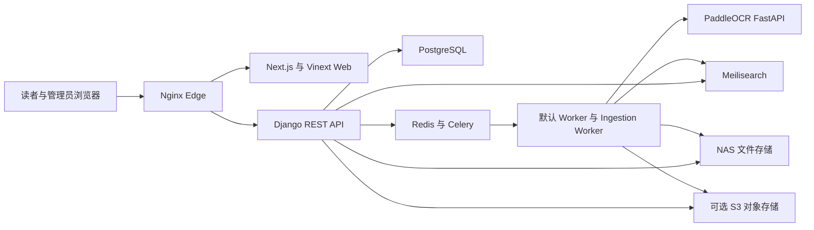

# Social Theory Library 架构

更新日期为 2026-08-20。本文件描述当前源码结构。生产状态来自本轮 NAS 与公网验收，仍属于有时间边界的运行快照。

当前源码目标版本为 2.9.0，生产最近一次已验证版本仍为 2.8.1，直到本轮切换与公网验收完成。生产 migration head 为 catalog 0031、ingestion 0013 和 reading 0007。2.9 没有新增模型或 migration，也不改变 R2 临时上传、公共观点检索 V2、Ask stable retrieval 和活动语义索引。完整生产入口见 [GPT-HANDOFF.md](GPT-HANDOFF.md)。

## 总体结构

公网入口和局域网管理入口使用同一套 API、PostgreSQL、Redis、任务队列、搜索索引和 NAS 存储。它们不是两份需要同步的数据副本。

## 技术栈

| 部分 | 当前实现 | 主要位置 |
| --- | --- | --- |
| Web | React 19、Next.js 16、Vinext、Vite | `web/app`、`web/components`、`web/lib` |
| API | Django 5.2、Django REST Framework 3.16 | `api/config` 与各 Django app |
| 主数据库 | PostgreSQL 16。未提供 `DATABASE_URL` 时，本地可回退到 SQLite | `api/config/settings.py` |
| 缓存与队列 | Redis、Celery Worker、独立 Ingestion Worker、Celery Beat | `api/config/celery.py`、`api/*/tasks.py` |
| 全文与语义检索 | Meilisearch `passages` 和版本化 `semantic_passages*` 索引 | `api/ingestion/services/indexing.py`、`api/catalog/services/semantic_*` |
| OCR | FastAPI、PaddleOCR、可选 PP-StructureV3、spawn 子进程隔离 | `ocr_service/app.py` |
| 文件存储 | NAS 保存原件、公开副本、上传临时文件、备份和模型。S3 适配器可承担 intake 与公开分发 | `api/distribution`、`api/ingestion` |
| 边缘代理 | Nginx 负责同源 API、限流、X-Accel 和 PDF Range。Caddy 或 Cloudflare Tunnel 提供外部入口 | `deploy`、`compose.public.yaml`、`compose.cloudflare.yaml` |

API 与 Web 的源码版本为 2.9.0。公网 API、Web 和 Celery 应用在本轮切换前仍运行 2.8.1；独立 PaddleOCR 镜像不在 2.9 的重建范围。历史镜像版本只在部署记录中保留，不代表当前源码状态。

## 后端模块

`api/accounts` 负责注册、登录、版本化 JWT、HttpOnly Cookie、密码重置和账户权限。

`api/catalog` 保存作品、版本、资产、逐页文本、全文段落、语义片段、学者、主题、理论节点、知识关系、推荐、检索评估和引用数据。新建 SemanticChunk 的 `language` 来自正文脚本检测，取值为 `zh`、`en`、`mixed` 或 `unknown`；Work.language 仍只表示书目属性。PDF 术语发现使用 QueryLexiconCandidate 与 Evidence 保存待审 proposal 和原文定位，不直接写 authority 或 QueryLexiconEntry。

`api/catalog/services/query_lexicon` 保存 QueryLexicon 的派生规则。Person、PersonNameVariant、KnowledgeNode、KnowledgeNodeAlias 和仍未迁移的 authority 对象继续是权威来源。QueryLexiconEntry、Generation、State 和 ChangeEvent 都在 PostgreSQL 中，可从 authority 完整重建。

`api/ingestion` 负责批次、文件项、分片上传、PDF 校验、查重、元数据候选、人工锁、实体消歧、OCR、页码、索引和发布准备。主要持久对象包括 `UploadBatch`、`UploadItem`、`ProcessingAttempt` 和 `ProcessingJob`。Task 3 复用 ProcessingJob 的 claim、retry 和 Beat recovery 执行术语候选提取；它是非阻塞 enrichment，不参与 publication 成败。

`api/reading` 保存阅读进度、收藏、书单、书签、批注和私人笔记。书库问答的新实现也在本模块，具备私有会话、加密消息、来源校验、SSE 输出和 Reader 回链。

`api/distribution` 负责公开文件地址、S3 同步、受控本地读取、Range、X-Accel、云端删除和备份任务。BackupJob 继续是唯一正式数据库备份入口。API 镜像固定安装 PostgreSQL 16 client，API、Worker、Ingestion Worker 与 Beat 使用同一镜像。任务在导出前读取 server、pg_dump 和 pg_restore 版本，任一 client major 低于 server major 时立即停止。归档仍使用 tar.gz 包含 custom-format `database.dump` 与 manifest，不在命令参数或记录中保存密码。

`api/common` 提供跨模块权限、中间件和通用支持代码。

## 前端结构

`web/app` 使用 App Router，包含公开网站、Explore、Reader、账户中心和管理后台。`web/components` 保存阅读器、上传、元数据复核、发布、检索和后台工作区组件。`web/lib/server-api.ts` 供服务端渲染访问 Django，`web/lib/runtime-api.ts` 和 `web/lib/api.ts` 负责浏览器同源请求与认证刷新。

生产 Compose 把 `ALLOW_DEMO_FALLBACK` 固定为 `false`。正式页面应读取真实 API 数据，不得以静态示例掩盖服务失败。

## 2.9 社科研究候选层

`WorkflowSuggestionAggregator` 以当前 Edition 和 Work 为上下文，在 Intake Mode 中额外读取 UploadItem。它把现有 MetadataCandidate、EntityResolutionCandidate、EnrichmentCandidate、TheoryReviewTask、QueryLexiconCandidate、QueryLexicon 解析结果和当前 Work 的 SemanticChunk 转换为统一的只读 DTO。聚合器不保存 Work、Edition、关系或词典数据。

`WorkflowSuggestionPolicyRegistry` 为工作流步骤和字段声明本馆实体、QueryLexicon、当前语料、结构化来源与 Web 的可用范围。`SourceProfileRegistry` 把馆内条目、词典匹配、PDF、书目或 authority、大学课程大纲、学术来源和普通 Web 分开。原 `FieldPolicyRegistry` 仍是持久候选、证据门槛和接受 mutation 的唯一规则来源，没有建立第二套 Candidate 表。

Intake 和 Maintenance 分别提供 `/api/catalog/admin/intake/<itemId>/suggestions/` 与 `/api/catalog/admin/library/works/<workId>/suggestions/`。GET 只读取快速候选。POST 以步骤为单位运行一次有界研究，并复用 Field Enrichment。SearXNG 摘要始终只是线索；只有 SafeWebFetcher 打开的原页且命中当前作品上下文时才显示为 Evidence。普通 Web 线索不能接受为正式知识，也不会写入 QueryLexicon 或馆藏 RAG。

前端在现有 `WorkflowEditor` 中按当前展开步骤加载 `ResearchSuggestionPanel`。`ResearchEntityPicker` 将馆内、QueryLexicon、PDF、学术来源和普通 Web 分组显示。已有词典映射或没有待审决策的馆内实体可以直接选择；实体消歧、PDF、结构化和联网候选先进入共享 Inspector。正式接受仍调用各 Candidate 原有 decision endpoint，并继续要求人工确认分类和知识关系。

2.9 扩展了 Work 与 Edition 的 FieldPolicy 覆盖，包含图书字段以及期刊名、卷、期、页码和 DOI。接受学科候选复用 WorkDisciplineRelation 与 WorkSubdisciplineRelation。接受名称候选后仍由既有 authority mutation 和 QueryLexicon outbox 同步，不从网页直接创建词典条目。2.9 不创建 Web research index，不把网页全文写入 SemanticChunk，也不改变 publication 规则。

## 2.8 馆藏与策展工作流

`/admin/intake/<itemId>` 是 Intake Mode 的唯一单项工作入口。`/admin/library/works/<workId>` 使用相同 `WorkflowEditor` 进入 Maintenance Mode，不要求 UploadItem 存在。两个入口共享 Work、Edition、责任者、分类、知识、Reader、策展和发布组件；Intake 额外显示文件、上传、重复判断与 retry/resume/replace。

九步顺序固定为 file、work、bibliography、contributors、classification、knowledge、reader、curation、publication。`catalog.services.admin_workflow` 是只读 evaluator，返回 current step、建议下一步、step status、issues、summary 和 action target。publication step 直接调用现有 `publication_preflight()`，不复制规则。React 只保存展开、dirty、Inspector 和 hash 状态，不重算完整业务条件。

`EditionWorkflowDecision` 保存 Edition 级 section confirmation 或 curation skip，并记录 actor、时间和内容 fingerprint。Work、Edition、关系或文件状态变化后，旧 fingerprint 会显示为需要重新确认。UploadItem 原技术状态机继续只负责 parsing、enrichment、resolution、indexing 等处理状态，两类 workflow 不混用。

分节 mutation 位于 `catalog.services.work_editor`。它锁 Edition/Work 和相关关系，校验客户端看到的 updated_at，保存后写 FieldLock、匹配的 MetadataCandidate decision 与 section decision。责任者继续写 Contribution；分类继续写 WorkDisciplineRelation/WorkSubdisciplineRelation；理论与主题继续复用 WorkKnowledgeRelation 和 `WorkTheoryRole`；KnowledgeNode 关系继续写 WorkNodeRelation。

单项策展只通过 Work contextual API 修改当前 Work。Reading Path placement 锁路径和 item，并验证 stage 所属关系；Recommendation placement 复用 RecommendationOverride。高级 Reading Path 工作台使用独立 ReadingPathStage 和 stage_groups，一阶段可含多个作品或节点，整条路径更新带 expected_updated_at。公开 serializer 只输出已发布 Work 和 published KnowledgeNode，发布前 placement 不会泄露草稿目标。

管理导航压缩为工作、馆藏、知识、策展、系统五组。Focus Mode 隐藏全局 sidebar，由当前馆藏 step rail、共享 Inspector 和移动端 compact progress 接管。旧 review item 和 publication item URL 只作 redirect/wrapper，不再渲染平行编辑器。

## 入库与上传

浏览器先创建 `UploadBatch`，再为每个 PDF 建立独立 `UploadItem`。上传项保存客户端幂等标识、owner、状态、错误、派发状态和处理尝试。单个文件失败不应回滚同批次其他文件。

2.7.1 的正式浏览器上传使用 Cloudflare R2 staging。服务端为 owner-scoped UploadItem 创建 multipart upload，object key 固定为 `staging/<upload-item-uuid>.pdf`，默认 part 为 8 MiB，签名有效期 15 分钟。浏览器每文件同时上传 3 个 part，全局最多 6 个连接；PDF 字节直接发送到 R2 S3 API。旧 Django chunk endpoint 仅保留兼容，当前 Web 不再调用。

每个 part 使用 XHR `upload.onprogress` 记录本次 attempt 的真实 loaded bytes。最近 5 秒窗口计算当前速度，累计有效字节计算平均速度，ETA 只使用近期速度。5 秒无新字节显示连接等待，18 秒无新字节 abort 当前 XHR，仅重试该 part，最多 3 次并退避。完成 part 的 ETag 来自 R2 响应头并持久化，最终 ETag 不作为 SHA-256。

UploadItem 是服务端可信恢复来源。站内路由切换后进程内 upload manager 继续工作；浏览器完整刷新后数据库仍展示会话和已完成 part，但用户必须重新选择相同文件才能恢复 File 对象。localStorage 不是上传状态事实。

CompleteMultipartUpload 只把 staging 状态改为 uploaded。现有 Ingestion Worker 随后从 R2 流式写入原 `intake` FileField/NAS storage，同时校验大小、PDF magic 并计算 SHA-256，再派发原有 pipeline。导入失败保留 R2 object 并允许 retry。只有 pipeline 已建立正式 Asset 且状态为 needs review、ready 或 published 后才进入 cleanup；DeleteObject 失败不会回滚馆藏，只保留 cleanup pending 并由现有 Beat 恢复。R2 3 天 object Lifecycle 与 1 天 incomplete multipart abort 只是最终兜底。

正式 intake 写入完成后，流水线依次执行 PDF 校验、原生文本提取或 OCR、元数据候选、实体关系、逐页文本、全文索引、语义准备和发布预检。原始 PDF 不被 OCR、规范命名或元数据写入覆盖。PyMuPDF 或 OCR 返回的孤立 UTF-16 surrogate 只在派生文本边界替换为 Unicode repair mark，避免 PostgreSQL UTF-8 写入失败，不修改 PDF。人工锁定字段和人工确认关系优先于自动结果。

## OCR 与后台任务

PaddleOCR 运行在独立 FastAPI 服务中。重推理放入 spawn 子进程，逐页或按小批次保存结果。OCR 只产生派生文本、版面块、页码候选和可选 OCR PDF，不改写原件。

默认 Worker、独立 Ingestion Worker 和 Beat 使用 Redis。任务消息只传数据库标识。任务记录保留阶段、重试、错误、心跳和恢复状态。暂停为协作式暂停，在安全保存点生效，不强杀正在写文件或提交索引的任务。

## 检索与书库问答

原文检索写入 Meilisearch `passages` 索引，并在外部检索不可用时保留受控数据库降级。观点检索使用版本化语义索引、稀疏与稠密召回、融合、可选重排和访问范围过滤。V2 现在在查询阶段读取 QueryLexicon，使用有界的 original、canonical、verified translation 和 verified alias branches，并记录实体覆盖与跨语言覆盖。Task 2B-0 增加了只读 shadow runner、四路候选池、盲标包和分组指标。它们显式读取指定 SemanticIndexVersion，不改变活动索引或公共默认版本。V2 仍由功能开关控制，未完成馆藏评估前不应设为默认。V1 不读取 QueryLexicon。

Task 2B-0.5 增加独立 evaluation 数据面定义。它使用单独的 PostgreSQL、`semantic_passages_eval_*` Meilisearch UID 和 search-only bundle，不启动面向用户的 API 或 Celery。完整 backup 只作为可选来源工件。Search-only evaluation DB 不含账户、session 或 Reader 私有数据。Authority 恢复后重新派生 QueryLexicon。Evaluation SemanticIndexVersion 保持 ready，不进入 active。2026-08-16 已在真实馆藏副本上完成首次隔离运行，公开 UID 和 feature flag 均未改变。

语义文档写入使用有界 batch，默认 128，硬上限 1,000。active SemanticIndexVersion 的 `document_count` 表示当前 UID 的实际文档数，增量 asset 写入、删除和零 chunk 清理后都要同步。ready 与 retired version 的值表示冻结时实际文档数。`expected_document_count` 独立保存建立快照预期。只读 consistency audit 比较数据库 ready chunk、稳定 record/document ID 和 Meilisearch 文档。metadata-only repair 不允许修改 active version，也不能在 corpus 或 schema 不一致时执行。新的 job 与直接索引写入必须绑定唯一 active version；历史 null-version job 只有在唯一 active version 可证明时回填，否则以 `INDEX_VERSION_REQUIRED` 失败。离线模型文件缺失以 `MODEL_UNAVAILABLE` 失败，并保留已有 SemanticChunk。

语义索引属于独立派生 enrichment。`queue_semantic_job` 在没有唯一 active version 时记录失败任务并返回，不让上传、发布或已保存页面文本失败；已有 queued/running 任务优先复用。PDF replacement 只在新 Asset 完成切换后排队一次强制索引任务，避免激活前后的重复任务。

书库问答的统一接口位于 `/api/reading/library-conversations/`。旧的 `/api/catalog/library-question/` 已删除，不再维护第二套 Ask contract。LibraryConversation 与 LibraryMessage 继续保存用户私有会话，加密正文和取消状态。LibraryMessageSource 保存 Work、Edition、Asset、Page、SemanticChunk/document ID、原始 passage、正文语言、检索来源与稳定 Reader URL。回答文本、引用和全部 evidence 分开返回，引用编号只能来自本轮已持久化且仍可公开读取的 Evidence。

Task 6 新增 capability-based AI runtime。`metadata_extraction`、`library_qa` 与 `field_enrichment_optional` 分别选择 profile。非密钥配置保存在私有 SiteSetting `ai_runtime_profiles`，变更写 AuditEvent；endpoint 与 credential 只保存 alias，实际值仍来自服务器环境或部署 secret。Admin 可以修改 enabled、provider、model、temperature、token、timeout 与 Library retrieval profile，并执行不泄露内部地址或密钥的健康检查。配置按请求读取。部署环境中的 endpoint 和 secret 变更仍可能需要重启，后台不会伪装为全部热生效。

`AIClient` 是 metadata、可选 enrichment 与 Library QA 共用的 provider adapter，提供 generate、stream 与 health check。Library QA 不再要求 metadata model。Fallback 只能显式指向同 capability 的一层 profile，不会从环境中随机选择另一模型。Ask endpoint 有独立用户 rate limit、输入长度、历史轮数、证据字符、passage 数、每书数量和生成长度上限。

`LibraryQuery` 规范化 Task 4 的 global、works、scholars、disciplines、subdisciplines、theories、topics 与 reading_paths contexts。未知或没有对象的 scoped request 直接失败，不静默回退全馆。公开 Ask 的 entity resolution 固定使用 QueryLexicon `public_active`。Entity anchor 会在 passage retrieval 层形成最多三个受限分支；没有关联馆藏的理论 scope 标记为空，不会变成无过滤查询。Reader、Scholar、KnowledgeNode 与 Topic 页面使用同一 Ask URL contract。

`LibraryRetrievalService` 只协调现有 semantic search。stable profile 强制 V1，experimental_v2 只允许管理员在 debug 请求中显式使用，不改变公开 V2 flag。逐字引文强制走 stable keyword path，并要求 passage literal match。比较问题为双方分别使用 entity-constrained branch，再加入一个 shared branch；少于两个可靠公开实体或任一主要对象缺少有效 evidence 时都不生成比较答案。其余查询可使用受限 entity branches 与 shared branch，最后按 document、page/content 和 per-work budget 去重。

馆藏 passage 被当作不可信数据。Prompt 分为 answer synthesis、citation rules 与可选 query-planner instruction，并记录 `library-rag-prompts-v1`。历史 assistant answer 只提供会话语境，旧 source key 会删除，不能成为新一轮 evidence。检索失败、公开复核后无证据、比较覆盖不完整、逐字引文未找到或模型没有返回有效引用时，服务使用确定性证据不足答复，不调用或不采用模型常识。Ask 不调用 Task 5 web enrichment，也不创建任何 authority 或 Candidate。

## Unified scoped entity search

Task 4 新增 `catalog.services.scoped_search.SearchService`，它是现有数据库 entity retrieval 的统一 orchestration，不是新的搜索引擎。SearchContext 固定为 `works`、`scholars`、`disciplines`、`subdisciplines`、`theories`、`topics`、`reading_paths` 与 `global`。各 context 尽可能在 queryset 层限定 domain，再计算 count、分页与 deterministic lexical rank。

`/api/catalog/search/` 继续是协调入口。显式 entity context 返回共享 envelope，包含 entity type、ID、title、subtitle、description、canonical URL、match type、metadata、backend、count、pagination 与 latency。`context=global&envelope=1` 按 entity group 返回，不把不同对象压成一个 relevance list。空 global query 返回空分组；各 scoped context 的空 query 保持公开 browse/list。没有 context 的旧 global payload暂时兼容并附加 Deprecation header。

Public Search 只使用公开 queryset。Scholar 同时要求 Person `verified` 与 ScholarProfile `published`；QueryLexicon 名称匹配只读取 active generation 中的 `public_active` entry。显式 staff/admin visibility 才能读取后台可见对象，匿名提交 `visibility=admin` 会被降回 public。

Theory context 以 published KnowledgeNode 为规范身份。已通过 LegacyKnowledgeMapping 映射的 TheorySchool 不再成为第二个 search result；Subdiscipline presentation result 也返回其映射后的 KnowledgeNode ID。Topic 保持 Topic identity，不因同名 KnowledgeNode 自动合并。Work 始终按 Work 返回，多个 Edition 不生成重复结果。

现有 Work、Scholar、Discipline、Subdiscipline、Topic、Theory node 与 ReadingPath list endpoint 复用同一个 SearchService constraint，并继续作为页面所需 rich serializer adapter。旧 `/api/catalog/theory-system/search/` mixed Node/Scholar/Work/Passage endpoint 已删除；理论首页使用 `context=theories`。

Entity Search 与 Semantic/Viewpoint Search 仍分离。`/api/catalog/semantic-search/` 只检索 passage；Reader 文档内搜索仍限定单个 Asset；理论图谱输入只筛当前已加载 graph。Task 4 没有修改 semantic ranking、embedding、RAG 或 QueryLexicon Candidate。

前端主要目录使用 URL `q`、`page`、context 和既有 filters 恢复状态。Scholar、Topic、Subdiscipline 与 legacy TheorySchool 页面使用真实后端分页；Admin Scholar 与 metadata review queue 不再只过滤当前第一页数组。完整 inventory 见 [scoped-search-inventory.md](scoped-search-inventory.md)。

## Field-aware web enrichment

Task 5 新增 `catalog.services.field_enrichment.FieldEnrichmentService`。请求以已有 authority 对象为目标，必须提供 target type、target UUID、一个或多个 field name、current value、form context、requested mode 和明确的 admin visibility。它不接受 public visibility，也没有新增公开 autocomplete 或搜索入口。

`FieldPolicyRegistry` 是字段规则的唯一注册处。每条 policy 保存 Candidate 类型、允许来源类别、字段级来源优先级、structured adapter、是否允许 general web、identity gate、证据数、独立来源数、冲突策略、刷新期限、value schema 和 mutation adapter。Person、Work/Edition、Discipline、Subdiscipline、KnowledgeNode、Topic 与 ReadingPath 都有受控 policy。FACTUAL、CLASSIFICATION 和 INTERPRETIVE 使用不同证据门槛；KnowledgeRelation 与 timeline interpretation 默认要求两个独立来源和至少一个学术或官方来源类别。

Structured provider 不重写。Authority adapter 复用 Wikidata、VIAF、LOC 与 OpenAlex；bibliographic adapter 复用 Crossref、OpenLibrary、Google Books、OpenAlex、GROBID 和现有 SourceRecord/provider gateway。每个 provider 有 timeout、有限 retry/backoff、rate interval、cache 和 partial failure。一个来源失败只形成分类错误，不清空其他来源结果。

General web 使用可替换 `WebSearchAdapter`，当前提供可配置 SearXNG adapter，但源码不会部署或自动启用生产 SearXNG。搜索结果 snippet 只保存在 discovery SourceRecord，并明确不能成为 Evidence。结果 URL 必须随后由 `SafeWebFetcher` 获取实际页面。Fetcher 对初始 URL、每次 redirect 和 canonical URL 检查 scheme、userinfo、DNS 与 IP，拒绝 localhost、private、loopback、link-local 和 metadata endpoint，并限制 timeout、redirect、content type、响应大小和正文长度。缓存只保存有界提取文本与 checksum，不保存无界网页副本。

`EnrichmentCandidate` 保存 target、field、FACTUAL/CLASSIFICATION/INTERPRETIVE、proposed/current/normalized value、source class、field-specific confidence factors、identity status、conflict、policy/extraction version、refresh time 和审核引用。`EnrichmentEvidence` 保存 SourceRecord、source URL、canonical URL、title、domain、source class、provider、supporting text、locator、retrieved time、HTTP metadata 和 content checksum。同字段同值跨来源合并为一条 Candidate 与多条 Evidence；同字段不同值保持不同 Candidate 并显示 conflict。

Person identity 不能仅凭同名通过。确认至少需要匹配的已知标识符，或规范名再加一致的日期、机构或作品。Work/Edition 优先使用 DOI/ISBN，其次要求题名与其他书目属性共同一致。理论关系必须在同一 supporting span 出现两端实体和明确关系表达；只在同页或同句共现不会生成关系 Candidate。

Accept 由 `FieldMutationRegistry` 路由。它锁 Candidate 和 authority 主行，重新验证 status、policy version、identity、刷新期限、证据门槛、current value 与 field lock，再写真正 source-of-truth。Person name variant 写 PersonNameVariant；理论 alias 写 KnowledgeNodeAlias；书目事实写 Work/Edition；分类写 pending relation；解释性关系写 pending KnowledgeRelation；ReadingPath 只新增 editorial item。失败时 authority mutation 与 Candidate status 一起回滚。Reject 保留全部 Evidence。

PersonNameVariant 与 KnowledgeNodeAlias 的接受仍通过现有 authority mutation/outbox 更新 QueryLexicon。服务从不直接写 QueryLexiconEntry，也不调用 SemanticIndexJob、embedding 或 Meilisearch rebuild。旧 AuthoritySuggestions UI 已降为显式、只读 identity discovery，不再把联网结果直接填进草稿。Work/Edition 的既有 Metadata Review 继续作为兼容书目审核界面。完整修改前 inventory 见 [field-enrichment-inventory.md](field-enrichment-inventory.md)。

Task 5 schema 位于 `catalog.0029_field_enrichment`。该 migration 只创建 Candidate/Evidence、索引与约束，并扩充 KnowledgeRelation 的 `extends`、`responds_to` choices。它没有 RunPython、联网、扫描、authority backfill、semantic reindex 或生产开关。本阶段没有应用生产 migration。

## QueryLexicon

QueryLexicon Core 与 Candidate schema 已于 2026-08-17 应用到生产，当时的 migration heads 为 catalog 0028 与 ingestion 0011。authority 写入与 durable ChangeEvent 在同一数据库事务提交。提交后的回调只唤醒 Celery，消费者按 canonical entity 合并事件并更新活动 generation。ChangeEvent 表是持久恢复依据，Celery message 只是通知。Beat 默认每 60 秒扫描 pending 或 retryable event。V1 不读取 QueryLexicon；当前公共 V2 使用 public scope，后台 enrichment 使用 admin scope。

全量、单类型和单实体 reconciliation 都先构建 staging generation。完整构建与 event replay 成功后，State 指针和 revision 才原子切换。失败或无变化时继续读取原 active generation。retired、failed、discarded generation 和 ChangeEvent 当前都不自动清理。

内部 resolver 支持 `public_active` 与 `admin_resolvable`。Task 2A 增加了只供 V2 使用的 search resolver 和有界 expansion；Task 3 PDF enrichment 使用 `admin_resolvable`；Task 6 LibraryQuery 使用 `public_active` 做 query understanding 和 entity anchors。V1 公开搜索仍不读取 QueryLexicon。公共 V2 当前已经启用，但仍只读取 `public_active`，也不改变 Ask 的 stable retrieval profile。

QueryLexiconState 表示查询阶段词表状态。SemanticIndexVersion 表示 embedding 与远程索引产物。两者保持独立。本次没有改变 semantic document template、Meilisearch 索引字段或活动语义索引。

Task 3 在 SemanticChunk 提交后异步扫描显式双语 pair。Entity linking 只调用 QueryLexicon exact admin resolver，并要求 authoritative/verified anchor。Person 还需已确认 Contribution、生卒年或 identifier 等身份佐证。Accept 在单事务写 PersonNameVariant 或 KnowledgeNodeAlias，再由既有 ChangeEvent 更新 active generation。pending/rejected Candidate 不改变 revision。

Candidate evidence 保存 Work、Edition、Asset、可空 Page/SemanticChunk、稳定 document ID、页码、bbox、原始 passage、span、OCR quality 和 checksum。SemanticChunk 重切时 Evidence 的 chunk FK 可以置空，但保存的 document ID、quote 和 source checksum 继续支持审计。

Task 3 最终验收在 PostgreSQL 16.14 完整 authority 副本完成，随后部署到生产。生产 reconciliation 从 revision 0 建立 revision 1、69 entries，public_active 为 5 entity/23 entry，admin_resolvable 为 12 entity/61 entry。PDF enrichment 使用 admin_resolvable，而公开 V2 仍使用 public_active。单个真实 Asset 的两次 queue smoke 复用同一 ProcessingJob，Candidate/Evidence 均为 0，没有改变 revision、SemanticChunk 或 active semantic UID。

Task 1.5 已在仓库外的一次性 PostgreSQL 16.15、Redis 7.4.3 和 Celery 5.6.3 环境验证 advisory lock、`SKIP LOCKED`、revision 并发、generation cutover、broker 丢失、Worker crash、migration 和 rebuild。2026-08-17 又在生产 PostgreSQL 16.14 完成 0027/0028/0011、真实 authority dry-run/reconciliation、resolver scope 和 Worker/Beat smoke。生产连接池峰值与更大体量仍未验证。

## 数据职责

PostgreSQL 是书目、用户、权限、任务、人工决定、阅读数据和索引版本记录的权威来源。Redis 只承担缓存与队列，不是业务记录的唯一副本。Meilisearch 保存可重建索引，不代替 PostgreSQL。NAS 保存原始 PDF、派生文件、模型和备份。对象存储保存 intake 或公开阅读副本。

Cloudflare R2 `library-upload-staging` 只保存浏览器上传完成但尚未可靠进入永久 NAS pipeline 的临时 PDF。它不保存唯一书目事实，不替代 UploadItem、Asset 或 NAS original，也不承担公开 Reader 文件分发。

BackupJob manifest 保存 artifact 名称、创建时间、大小、SHA-256、PostgreSQL server 版本、pg_dump/pg_restore 版本和数据库 applied migration heads。`rehearse_database_restore` 只允许恢复到名称明确且没有业务表的 disposable PostgreSQL，目标数据库名还需由命令参数再次确认。它不会清理或覆盖现有数据库。

QueryLexicon 也存放在 PostgreSQL，但属于可重建派生数据。删除词表 entry 后应从 authority 重新构建，不能反向把 entry 当作人工确认记录。

以下内容属于运行数据，不进入 Git：

- 真实 `.env`、Token、私钥和证书私钥
- 馆藏 PDF、用户上传、OCR 原始数据和派生结果
- PostgreSQL、SQLite、Redis、Meilisearch 和向量索引数据
- 用户账户、私人笔记、阅读数据和生产备份
- 模型、embedding、离线 wheel、发布包、日志、缓存和构建结果

## 部署模式

`compose.yaml` 用于本地或单机验证。`compose.public.yaml` 提供加固的完整服务。`compose.cloudflare.yaml` 在完整服务上增加 Cloudflare Tunnel 和局域网入口。`compose.nas.yaml` 是只在 NAS 运行 worker、ingestion worker 和 OCR 的拆分模式。

2026-08-17 的 Production Task 3 镜像记录属于历史快照。2.7 发布前必须重新检查真实 Compose project、环境文件、挂载路径、数据库迁移、活动索引、队列和备份；本轮 SSH 检查未能读取当前目标主机，因此不把该快照当作当前状态。

## FINAL INTEGRATED ACCEPTANCE live-state boundary

The deployment statements above were historical evidence while the initial acceptance draft was being prepared. The live 2.7 deployment update below supersedes that temporary boundary with direct NAS observations.

## 不变量

- 不直接修改生产数据库，schema 变化必须使用 Django migration。
- 不覆盖或删除 ORIGINAL PDF、人工锁定元数据、人工确认关系和私人阅读数据。
- 不通过删除锁、取消鉴权、吞掉异常或静态假数据处理故障。
- 不把本地测试、包检查或历史记录写成当前 NAS 或公网验收结果。
- 重要修改需要相应测试，并同步更新 [PROGRESS.md](PROGRESS.md) 和 [ISSUES.md](ISSUES.md)。

## Version 2.7 continuous library growth architecture

版本 2.7 的日常后台入口是 Next Admin。Django Admin 只承担低层检查、紧急维护和超级管理员操作。功能矩阵见 [`back-office-function-matrix.md`](back-office-function-matrix.md)。

持续上架分为三个独立 Lane。Collection 负责 PDF、OCR、页、元数据确认和出版。Knowledge 负责馆藏观察、已有 authority 匹配、候选证据和 draft authority。Projection 负责 QueryLexicon、Scoped Search、Semantic Index、RAG availability 和缓存等派生结果。Projection 失败不会回滚已确认的 Work、Edition、Asset 出版。

`NewAuthorityCandidate` 与 `UnknownEntityObservation` 保存没有安全 canonical anchor 的馆藏证据。管理员必须显式选择关联已有实体、创建 draft 或拒绝。Person、KnowledgeNode、Topic draft 都不会自动发布，未核验的 PDF alias 也不会进入公开 QueryLexicon。

`QueryLexiconEntry` 仍是 PostgreSQL 中可重建的派生词典。后台 QueryLexicon Workspace 调用既有 reconciliation service，提供 revision、generation、scope coverage、term inspector、dry-run 和异步 reconcile。公开消费者只使用 `public_active`，后台 enrichment 和候选解析使用 `admin_resolvable`。

统一 Candidate Review Shell 只统一展示证据、状态和权限语义。MetadataCandidate、QueryLexiconCandidate、EnrichmentCandidate、TheoryReviewTask 和 NewAuthorityCandidate 仍由各自 mutation service 写入各自 source-of-truth。外部网页 snippet 不是证据，只有抓取页面中的 supporting passage 才能保存为 Evidence。

System Status Center 只读汇总 PostgreSQL、migration head、Redis、Celery broker、default/ingestion worker、Beat heartbeat、NAS、QueryLexicon、SemanticIndex、embedding、AI、web provider 和 BackupJob 状态，不显示 secret。Celery control 与现有 heartbeat 只提供可解释的运行证据，无法区分的 worker 或未收到 Beat heartbeat 会显示 `unknown`。AI 与 general web 未配置时报告 `NOT_CONFIGURED`，不伪装为没有结果；结构化 provider 的 enabled 状态与尚未探测的网络 health 分开显示。生产公共 viewpoint 当前使用 V2，V1 保留为环境开关回退。Ask Library 继续强制 stable retrieval，管理员才可显式请求 experimental profile。

QueryLexicon 与 Semantic Index 页面对普通 Admin 提供只读状态。QueryLexicon reconciliation、语义索引构建、清理和激活由对应 manage capability 保护；有限的语义失败任务 retry 使用 `can_retry_jobs`。前端 capability 只控制展示，API 仍在服务端重新检查权限。

Projection Refresh 复用 `ProcessingJob` 和现有 Celery recovery。它接收一个明确的 Work、Edition、Asset 或 authority 目标，按 source `updated_at` 生成幂等键，有限地协调 QueryLexicon event、semantic index job 和 PDF candidate job。任务失败只标记派生任务，不回滚 Work、Edition、Asset、Page 或 SemanticChunk source state，也不触发全馆扫描。

### Live 2.7 deployment update, 2026-08-19

The authorized NAS runtime has now been verified. Production heads are catalog `0030_knowledgenodealias_is_verified_and_more`, ingestion `0012_alter_processingjob_job_type`, and reading `0007_reader_ai_connection`. API, Worker, Ingestion Worker, Beat and Web use the same 2.7 release revision. QueryLexicon remains revision 1 with the prior active generation. A clean semantic UID was validated against 3,005 ready chunks and 3,005 Meilisearch documents before activation; the historical UID remains retired for rollback. Public V2 is enabled with a V1 environment rollback, Ask uses stable retrieval, internal SearXNG source discovery is configured, and no authority or candidate decision was automated.

## 2.7 post-cutover usability architecture, 2026-08-19

Ask Library is open to authenticated readers. A reader may store one personal OpenAI-compatible, Ollama or vLLM connection in `reading.ReaderAIConnection`; the API key is encrypted with the existing private-data key and is never serialized, logged or stored in browser storage. The server-side AI profile remains an optional fallback and governance surface, not a prerequisite for reader access. Retrieval still uses the published-library scope and stable profile, so a personal model cannot expand visibility or bypass evidence checks.

The intake surface keeps one real `UploadBatch` and `UploadItem` workflow. Drag and drop, file selection, chunk resume, metadata pairing, OCR, review, publication and projection refresh all point to the existing records and jobs. Background session probes are non-destructive while an authenticated workspace is active; explicit cross-tab logout and server-side permission responses remain authoritative. A failed probe cannot silently erase a queued PDF.

The Reader toolbar allocates the optional printed-page control explicitly and keeps the OCR notice in document flow. The notice no longer covers PDF text. Candidate Review is a review queue, not a self-updating dictionary. QueryLexicon remains a derived, rebuildable dictionary and is only changed through authority change events.

Authority and field enrichment errors now return a request identifier, provider/error category and partial-result envelope. A provider outage is not rendered as an empty evidence result. Structured providers, web fetch, source provenance and field policies remain shared; no second provider or retrieval stack is introduced. `reading.0007_reader_ai_connection` is additive schema only and has been applied through the normal deployment gate.

The post-cutover release uses one `2.7-87251cb` image family for API, Worker, Ingestion Worker, Beat and Web. Public viewpoint search V2 was enabled only after five production-corpus V1/V2 read-only comparisons returned real results with `v2_hybrid` and no fallback. This switch changes query orchestration only; it did not rebuild or replace the active semantic UID. Ask Library continues to force its stable retrieval profile and therefore remains independent of the public viewpoint flag.

General-web source discovery uses one internal-only SearXNG service pinned to `2026.8.4-c63835bd2`. The container exposes port 8080 only on the Compose backend network and enables JSON output for `WebSearchAdapter`; it is not routed through Edge or Cloudflare. SearXNG discovers URLs only. `SafeWebFetcher` still fetches the actual public page, applies SSRF and size limits, and requires a supporting passage before an EnrichmentEvidence can be stored.

The verified production engine is Baidu because it returned results from the current NAS egress while the default Western engines timed out without a container proxy. A live adapter smoke stored five discovery rows, then fetched a separate university source page with HTTP 200, bounded text and checksum. This is runtime evidence for the discovery/fetch path, not a trust exemption for Baidu snippets.
