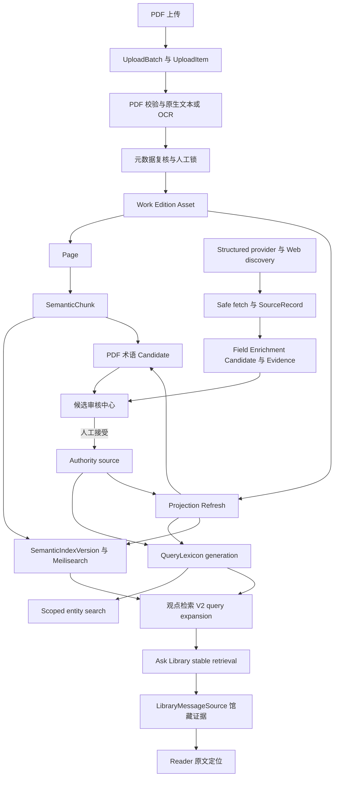

# GPT 项目交接与联动审计

更新日期为 2026-08-24。当前源码与公网生产应用均为 2.9.2。本文件是新 GPT 或 Codex 会话进入项目时的首要入口。它只记录当前结论和继续工作的边界。历史过程仍保留在其他文档中，但不得覆盖这里的较新状态。

## 阅读顺序

1. 根目录 [`AGENTS.md`](../AGENTS.md)，先确认数据、凭据、生产和验证边界。
2. 本文件，取得当前版本、部署快照和功能联动总图。
3. [`ARCHITECTURE.md`](ARCHITECTURE.md)，查看模块、数据职责和服务细节。
4. [`PROGRESS.md`](PROGRESS.md)，查看实现与验证时间线。
5. [`ISSUES.md`](ISSUES.md)，查看仍需处理的问题和不能自动修复的数据缺口。
6. 只有涉及部署时才读取 [`DEPLOYMENT.md`](DEPLOYMENT.md)。

任何会变化的生产状态都要重新检查。文档中的生产信息是 2026-08-24 的已验证快照，不能代替下一次发布前的实时检查。

## 当前结论

| 项目 | 当前状态 |
| --- | --- |
| 源码版本 | 2.9.2，完整本地门槛和生产部署已完成 |
| Git 工作分支 | `codex/v2.9-research-candidates`；基准 HEAD/upstream 为 `1053ff1`，2.9.2 发布树仍未提交，不得 reset 或覆盖 |
| GitHub visibility | Public，是 owner 明确决定；仓库只包含安全源码，不包含 Secret 或运行数据 |
| 正式后台 | Next Admin 是日常编辑入口，Django Admin 是维护后备入口 |
| 生产应用 | API、Worker、Ingestion Worker 与 Beat 使用 `2.9.2-final-3a4733aa-20260824-014228`；Web 使用 `2.9.2-final-34e8e016-20260824-014512` |
| 生产 migration head | catalog 0032、ingestion 0013、reading 0007，pending migration 0 |
| 2.9.2 migration | `catalog.0032_healthcheckrun_healthincident_recoveryaction_and_more` 已完成 rehearsal 并正式应用 |
| 2.8 数据迁移 | Fresh BackupJob 与 disposable PostgreSQL restore rehearsal 已完成；正式迁移已应用 |
| QueryLexicon | revision 3，生产候选聚合只读使用现有 active generation |
| 语义索引 | active UID `semantic_passages_20260818210650_4cf87bc9`，3,005 个已核对文档 |
| 观点检索 | 公共 V2 已在有限真实对照后启用。Ask Library 仍固定 stable retrieval |
| Ask Library | 对注册读者开放。读者自行配置 OpenAI-compatible、Ollama 或 vLLM；服务器 profile 只是可选后备 |
| General Web | 内网 SearXNG 只发现 URL，实际证据必须由 SafeWebFetcher 取得正文 |
| PDF upload staging | Cloudflare R2 已启用，只做临时中转；永久 PDF 仍进入 NAS |
| Candidate | 2.9 在现有工作流内聚合既有候选与证据。没有自动发布 authority，也没有自动 Accept |
| 当前发布判断 | `2.9.2 PUBLIC DEPLOYED / PRODUCTION ACCEPTED` |

生产快照中的主要数量为 Work 8、Edition 8、Asset 16、Page 3,135、SemanticChunk 3,881、Person 7、KnowledgeNode 2。活动语义索引有 3,005 个 ready 文档，数据库记录与 Meilisearch 实测一致。它们是 2026-08-24 的时间点数据，下一次部署前必须重新读取。

本轮已用正常 Winston 管理员会话检查 Maintenance workflow、自动研究、宽版 Entity Picker、共享 Inspector、管理员页面预览和 Processing Center。未保存 Person 值进入了真实生产 ResearchContext 与外部 Provider；没有执行 Candidate decision、保存、发布、下架、Reading Path placement 或 RecommendationOverride mutation。

旧 R2 uploaded 项已经由 2.8.1 recovery 完成导入、正式 pipeline、Asset 建立和 staging cleanup。新 Worker 的 12 个 Beat 周期没有再次出现同类错误。普通非 superuser 管理员公网上传与发布仍因用户明确跳过账户密码测试而属于 `待核实`，不得把 recovery 结果写成该权限路径已经完成真实 E2E。

2.9 在现有九步工作流旁增加社科研究候选层。它只读聚合既有 Candidate、Evidence、QueryLexicon 和当前 PDF 语料；外部研究继续通过 Field Enrichment、SearXNG 和 SafeWebFetcher。搜索摘要不是 Evidence，正式分类、人物和知识关系仍需人工确认。2.9 没有新增 Candidate 表、migration 或互联网 RAG。

2026-08-21 的窄范围续作已部署。非 Person 实体消歧候选按业务对象进入正确步骤，研究按钮读取现有 capability，候选决定后会失效旧 pending 状态，可选 research query 进入有界服务调用。最终 Web 又收敛了匿名 SaveWorkButton 的私人 API 请求。生产证据、备份与回退入口记录在 DEPLOYMENT 和 PROGRESS 顶部。

## 2.9.2 生产实现与验收结果

2.9.2 在现有馆藏策展工作流内增加独立 Research Orchestrator。ResearchContext 同时携带已保存数据、未保存 draft、实体、Candidate decision、FieldLock、PDF/OCR 状态、workflow gap 与 fingerprint。唯一 Research Field Contract Registry 约束字段、实体类型、来源、Evidence 和 mutation；WorkflowGapAnalyzer 只做确定性规划。Universal Entity Discovery 覆盖人、作品、理论、主题、知识节点、学科、子学科、组织、出版社、期刊与 Reading Path，并保留 local、local_draft、authority、external_web 和 unresolved 分组。SearXNG snippet 仍然只是 lead。

ResearchRun 保存幂等键、context revision、计划、结果、诊断与 Celery 状态。HealthCheckRun、HealthIncident 和 RecoveryAction 保存功能探测、事故与安全恢复记录。Processing Center 读取持久化快照，不在页面 GET 时遍历访问外部 Provider。健康调度有全局租约和单批限制，恢复动作复用现有任务服务并写 AuditEvent。

管理员页面预览与公开页面已经分开。`pdf_preview_url`、受保护的 `page_preview_url` 和 published-only `public_url` 各有独立语义。公开 Work queryset 没有放宽。公开作品页与管理员预览复用展示组件，管理员预览不暴露收藏、公共下载、引用或公共 Reader mutation。

前端候选区支持页面加载自动研究、未保存 draft、800ms debounce、依赖字段增量重规划、手动刷新、宽版分组 Entity Picker、显式外部候选动作、键盘和 ARIA。共享操作反馈覆盖 workflow、research、preview、Processing Center 和主要后台任务。

完整后端 pytest 为 678 passed、32 skipped，退出码 0。前端完整 Node 为 118/118，Auth 与 Scoped Search 为 21/21；TypeScript、完整 ESLint、production build、Python compileall、migration drift 和 diff check 通过。catalog 0032 的 PostgreSQL 16 restore rehearsal、2.9.1 compatibility、正式 migration、统一镜像和公网 smoke 已完成。

catalog 0032 只新增 ResearchRun、HealthCheckRun、HealthIncident、RecoveryAction 及索引，没有数据回填、PDF 操作、authority mutation 或索引切换。follow-up BackupJob、最终镜像、deploy-record、回退标签和完整验收见 [DEPLOYMENT.md](DEPLOYMENT.md) 顶部。

最终镜像上的 fresh ResearchRun `e285af7a-4949-4567-b765-60739c44df17` 使用未保存“马克斯·韦伯”，精确绑定 Edition `aaf54876-f563-402f-b244-b14af54614fa`，生成同名 query，以预分配 task ID 调用 Celery 和 SearXNG，并返回 VIAF 与 unresolved 多候选。表单随后被丢弃，没有建立关系、接受候选或覆盖 FieldLock。部署代码探针确认 external_web 与 SearXNG 结果保持 `research_lead`、`lead_only` 且不生成 Evidence。Processing Center 在 2026-08-24 02:09 的 Research Orchestrator 四层状态均为通过。

生产发现 8 条旧 ResearchRun orphan。RecoveryAction `119e7f98-f74b-4a35-9b80-2c05ad3d36a5` 通过完整 ownership inventory 将其安全转为 canceled，并写 8 条 orphan recovery 与 1 条 recovery completed 审计。incident `30d9597f-4f55-4326-9a6e-96640fc53bf3` 已 resolved，当前 nonterminal ResearchRun 为 0。

公开预览的 React #482 根因是客户端预览间接导入异步 Server `SiteFooter`，现由两个 Server page 传入 footer slot。API 404 只转换为不存在，5xx 与网络错误继续抛出。生产浏览器又发现 Entity Picker 右对齐会在责任者两栏表单中被左侧裁切；最终 Web 采用按表单列对齐并解除活动 section 裁切。最终生产页 560px 面板完整位于 1265px 视口内，键盘和 ARIA 状态均通过。

## 系统总图



## 数据职责

| 数据 | 权威来源 | 派生或审核数据 | 重要边界 |
| --- | --- | --- | --- |
| 原始 PDF | NAS 文件和 PostgreSQL Asset identity | OCR PDF、页面图像、索引 | 不覆盖原件，不进入 Git |
| 书目 | Work、Edition、Asset、FieldLock | MetadataCandidate、封面候选 | 人工锁优先，Provider 不直接覆盖 |
| Authority | Person、名称变体、KnowledgeNode、Alias、关系和分类 | QueryLexicon、搜索投影 | draft 不得进入 public scope |
| 阅读文本 | Page | SemanticChunk、Meilisearch 文档 | 索引失败不能删除 Page 或改变出版状态 |
| 候选 | 各领域 Candidate 和 Evidence | 审核视图 | Candidate 不是 authority，也不是 QueryLexiconEntry |
| Reader 私人数据 | PostgreSQL reading 模型 | 浏览器状态 | 只允许资源所有者访问，匿名页不请求私人 API |
| Ask 回答 | 用户会话和真实 LibraryMessageSource | 模型生成答案 | AI 不是来源，回答必须引用馆藏证据 |
| 备份 | PostgreSQL 与 NAS inventory | BackupJob artifact 和 manifest | 正式入口只有 BackupJob，恢复只到 disposable PostgreSQL |

## 功能联动审计

### 登录、权限与后台工作区

- `api/accounts` 用 HttpOnly access/refresh Cookie 建立服务器确认的 session。
- `web/lib/api.ts` 和 `web/lib/runtime-api.ts` 共用 refresh 与错误分类。localStorage 只保存界面提示，不是认证事实。
- 后台导航使用 `api/common/capabilities.py` 的 capability contract。前端只控制可见性，API 每次重新鉴权。
- 网络错误、500 和单次后台探测失败不会被当作 logout。明确 403、跨标签 logout 或后续受保护请求失败仍会重新验证权限。
- 上传工作区不会因为页面进入后台而清空本地待上传队列。

剩余验证是长时间后台标签页、网络短暂中断和真实大 PDF 上传的人工观察。不得用取消鉴权来处理闪烁。

### PDF 上传、处理、复核与出版

- 浏览器建立 UploadBatch，再为每个文件建立 UploadItem。文件选择和拖放进入同一分片上传实现。
- 2.7.1 公网 PDF 二进制通过 presigned UploadPart URL 直接进入 Cloudflare R2 staging，不再先经过 Django、Nginx 或 NAS 临时 chunk 目录。R2 不是永久书库存储。
- UploadItem 保存 owner、multipart upload ID、固定 `staging/<uuid>.pdf` key、part size、已完成 ETag 和 staging 状态。普通 serializer 不返回 object key 或 upload ID。
- CompleteMultipartUpload 后，Ingestion Worker 从 R2 流式写入原有 intake/NAS storage并计算 SHA-256。后续 OCR、书目、Asset、索引与发布流程不变。
- 只有正式 Asset、数据库状态和 pipeline 结果可靠保存后才删除 staging object。删除失败保持书籍 ready，记录 cleanup pending 并由现有 Beat/ProcessingJob 恢复。
- 上传完成后由 ingestion pipeline 进行校验、文本提取或 OCR、页码、元数据候选和发布预检。
- MetadataCandidate 只进入人工复核。FieldLock 和人工决定优先于自动值。
- publish transaction 写入正式 Work、Edition、Asset 关系。后续语义索引和候选发现是独立派生任务。
- 单文件失败不回滚整个 batch。OCR、semantic、candidate 或 provider 失败不得把已出版 Work 标为失败。

主要入口是 `api/ingestion/services/r2_staging.py`、`api/ingestion/views.py`、`web/lib/r2-multipart-upload.ts`、`web/app/admin/uploads` 和 `web/app/admin/review`。完整流程回归位于 `api/tests/test_r2_staging_upload.py`、`test_complete_ingestion_workflow.py`、`test_ingestion_workflow.py` 和 `web/tests/upload-metrics.test.mjs`。

### Authority、QueryLexicon 与 Scoped Search

- Authority 对象是权威来源。QueryLexiconEntry 是可重建投影，不能反向当作人工事实。
- authority mutation 与 QueryLexiconChangeEvent 在同一数据库事务提交。Celery 只负责唤醒，ChangeEvent 是恢复依据。
- 公开搜索使用 `public_active`。后台解析和 enrichment 使用 `admin_resolvable`。draft Person 可以成为后台目标，但不能泄漏到公开结果。
- Task 4 的 SearchService 在 retrieval 层限定 works、scholars、disciplines、subdisciplines、theories、topics、reading_paths 或 global。
- Global Search 必须显式请求 global，并按实体组返回。Entity Search 与 SemanticChunk 观点检索继续分开。

主要入口是 `api/catalog/services/query_lexicon`、`api/catalog/services/scoped_search.py`、`api/catalog/views.py` 和各公开目录页。回归位于 `test_query_lexicon_*`、`test_scoped_search.py` 和 `web/tests/scoped-search.test.mjs`。

### 候选审核与 authority 增长

候选审核中心是跨领域 review queue，不是自更新社会科学词典。

| Candidate 类型 | 产生位置 | 人工接受后的去向 |
| --- | --- | --- |
| MetadataCandidate | PDF metadata pipeline | Work、Edition、Asset 对应字段 |
| QueryLexiconCandidate | PDF 双语术语发现 | PersonNameVariant 或 KnowledgeNodeAlias，再触发 ChangeEvent |
| EnrichmentCandidate | structured provider 或实际网页证据 | FieldMutationRegistry 指定的 source-of-truth |
| NewAuthorityCandidate | 无安全 canonical anchor 的馆藏观察 | 匹配已有实体、创建 draft 或拒绝 |
| TheoryReviewTask | 理论关系和时间线审核 | 对应知识关系或时间线 source-of-truth |

统一页面只统一证据、状态和允许动作。每类 Candidate 仍由自己的事务服务校验和写入。任何接受动作都必须锁记录、重新验证 target 和证据、写 reviewer，再提交 authority mutation。失败应整体回滚。

### Field-aware Web Enrichment

- FieldPolicyRegistry 按 target 和 field 决定允许的来源类别、identity gate、证据数量、冲突策略和 mutation adapter。
- Wikidata、VIAF、LOC、OpenAlex 和书目 Provider 通过现有 adapter 归一化。一个 Provider 失败只返回 partial warning。
- SearXNG 搜索结果及 snippet 只用于 source discovery。它们不能形成 EnrichmentEvidence。
- SafeWebFetcher 对 URL、DNS、redirect、私网地址、content type、大小和超时做限制。只有 fetched page 的 supporting passage 可以成为证据。
- Person 同名不能通过 identity gate。理论关系需要明确关系表达和更强证据。同页共现不足以形成关系事实。

生产已验证 VIAF、内部 SearXNG、实际网页 fetch 和 partial failure。当前存在一条布迪厄 external identifier 候选，保持 pending。Candidate 为 0 也可能是 identity 或证据门槛的正确结果，不能通过降低安全阈值追求正数。

### 语义索引、观点检索与 Ask Library

- SemanticIndexVersion 管理 build、ready、active 和 retired 生命周期。新 UID 验证通过前不会替换 active UID。
- 观点检索公共 V2 在 query time 使用 QueryLexicon public scope、dense/lexical retrieval 和受控融合。它没有更换 embedding，也没有触发全库重建。
- V1 仍是可立即恢复的查询实现。关闭 `SEMANTIC_SEARCH_V2_ENABLED` 并刷新 API/Edge 即可回退，不改变 active UID。
- Ask Library 永远从 persisted LibraryQuery 开始，强制 stable retrieval，并保存 LibraryMessageSource。公共 V2 开关不会改变 Ask 的检索 profile。
- 注册读者可以保存一个个人模型连接。API key 使用现有 private-data key 加密，不进入响应、日志或浏览器存储。

当前 V2 只完成了有限生产对照，没有完成人工 qrels。它已启用但仍属于可回退观察状态。不得把五条 smoke 写成检索质量的最终结论。

### Reader 与私人阅读数据

- 公开 Reader 读取 Asset manifest、PDF Range、页内容和文档内检索。
- 只有 authenticated session 才加载进度、书签、批注、列表和历史。logout 后页面内私人状态会清除。
- Reader 的 PDF 页、印刷页标签和章节定位是三个不同概念。Citation 保存可解释的 PDF page 和 printed label。
- OCR 通知位于文档流，不覆盖 PDF 文本；工具栏为可选纸本页码预留布局。
- Ask 证据链接返回 Reader 的真实 Asset 和页定位，不生成静态示例来源。

### Projection Refresh 与异步失败隔离

- Projection Refresh 复用 ProcessingJob、默认 Celery worker 和现有 recovery，不建立第二套队列。
- 每次请求只接受一个 Work、Edition、Asset 或 authority target，并依据 target 更新时间形成幂等键。
- 它有限协调 QueryLexicon event、该 target 的 semantic job 和 PDF candidate job，不执行全馆扫描。
- 派生任务失败只更新 ProcessingJob，不回滚 Work、Edition、Asset、Page、SemanticChunk 或 publication source state。

### Backup、恢复与发布

- BackupJob 是管理员、API、Worker 和定时任务的唯一正式数据库备份入口。
- runtime 固定 PostgreSQL 16 client，并在导出前比较 server、pg_dump 和 pg_restore major。
- artifact manifest 记录版本、migration head、大小和 checksum，不记录密码。
- restore rehearsal 只允许明确命名且无业务表的 disposable PostgreSQL。
- 生产 migration 必须显式运行 `migrate --plan`、备份和检查。Compose 的 API 启动命令不自动 migrate。

## 已发现的剩余风险

1. 普通 non-superuser 管理员公网上传与发布没有正常账户，仍为 `待核实`。本轮没有创建账户、提升权限或绕过登录。
2. fresh SearXNG 确认被调用，但两次一般 Web 查询均为零结果。VIAF 返回真实 structured 候选；本轮不能写成 fresh SafeWebFetcher supporting passage 已通过。Processing Center 当前把 OpenAlex 未配置、Wikidata timeout、SafeWebFetcher 与部分 metadata provider 记录为外部来源降级。
3. Universal Entity Discovery 后端支持 12 类，共享 Picker 已进入九步 workflow 和当前实际维护输入。没有 canonical 模型的类型仍不能写成拥有独立创建编辑器，创建与关联继续受原模型和权限限制。
4. Interaction Feedback 已覆盖本轮关键 workflow、research、preview、Processing Center 和 health 动作，但没有逐一重写全站所有普通导航、同步按钮和文本链接。
5. Authority coverage 仍偏低。公开 QueryLexicon 中 Person coverage 低，导致跨语言扩展和 PDF 术语候选数量受限。这是数据治理问题，不能通过自动发布 draft 或放宽 identity gate 解决。
6. 生产 Person 数据存在待人工复核的异常与疑似 OCR 噪声。只记录问题，不自动改 authority。
7. 公共 V2 尚未完成盲化人工 qrels。当前 enable 基于有限真实 smoke，必须保留 V1 回退。
8. 注册读者的个人 AI 连接、弱网大 PDF、后台标签页和不同模型流式格式仍需长期真实用户观察。
9. 前端依赖审计仍有高风险依赖项。没有使用强制升级破坏 Vinext/Next runtime，需要独立兼容性处理。
10. 无状态匿名浏览器会用 `/api/auth/me/` 401 和缺少 refresh cookie 的 400 判断没有登录，因此 Chromium 控制台存在预期资源状态；没有 pageerror、requestfailed 或主要功能失效。后续可增加返回 200 的专用匿名会话探测接口。
11. 历史文档包含旧 2.6.1、SSH blocker、V2 disabled 与 2.9.2 NOT DEPLOYED 等时间点结论。读取时必须以本文件和各文档顶部的当前状态为准。

## 2.9.2 下一轮 review 入口

本节供 2.9.2 完成部署和安全 Git 交接后的下一轮 GPT 使用。公网 ready、最终镜像和远端分支都属于可变化状态，下一轮仍需实时复核，不能只沿用本文件。

1. 先执行 `git status --short --branch`，核对本地 HEAD、远端分支 SHA、Public visibility 与工作树。再实时读取公网 ready、生产镜像、migration heads、队列和活动语义 UID。四类证据分别标记为源码已实现、本地已验证、生产已验证、设计或待核实。
2. 按顺序阅读 `docs/v2.9.2-requirements-matrix.md`、`docs/PROGRESS.md`、`docs/ISSUES.md`、`docs/ARCHITECTURE.md` 和 `docs/DEPLOYMENT.md` 顶部。`task_plan.md`、`findings.md` 与 `progress.md` 只补充执行过程，不能覆盖较新的源码和生产证据。
3. Research review 从 `api/catalog/services/research/`、`api/catalog/research_views.py`、`api/catalog/tasks.py`、`web/components/admin/research/` 和 `web/components/admin/workflow/workflow-editor.tsx` 进入。重点检查 draft fingerprint、deterministic plan、contract coverage、local-first、幂等、partial failure、显式实体决定、FieldLock 和人工确认边界。
4. Functional Health review 从 `api/catalog/services/system_health.py`、catalog 0032 migration、Beat 配置、`web/components/functional-health-panel.tsx` 和 Processing Center 进入。重点检查持久化 snapshot、租约、probe 批量限制、incident 生命周期、恢复次数、退避、AuditEvent 和页面 GET 不做实时 Provider 扫描。
5. Preview 与交互 review 从 `admin_workspace`、preview serializer/view、`web/app/admin/preview/`、`work-detail-view.tsx` 和 `action-feedback.tsx` 进入。证明 draft/ready public 404、管理员 preview 有权限、published 页面不回归，并核对 pending、success、error、disabled、键盘、ARIA 和 reduced motion。
6. 对核心书库做回归审计。范围包括登录与权限、R2 staging 到 NAS、OCR 与入库失败隔离、Candidate 与 Evidence、QueryLexicon、公开搜索和观点检索、Reader Range、引用、下载、私人阅读数据、Ask、策展、发布、备份和恢复。2.9.2 不应建立平行数据源，也不应改变活动索引或公开访问边界。
7. 最后核对 release record。当前 API image ID 是 `235d9906...`，最终 Web image ID 是 `bcc0f0c7...`，catalog 0032 与 pending 0、BackupJob `965c6431-5d45-4ba2-b4a1-e7f7b263ddde`、`pre-v292-final` 标签、核心对象 hash、公网 smoke 和 `final-verification-20260824-021518` 均有记录。Git 的精确远端 SHA 必须从实时分支读取。

下一轮 review 不得为了取得正数候选而降低 identity 或 Evidence 门槛，不得用静态 mock 掩盖 Provider/API 故障，也不得对真实馆藏做试探性 merge、发布、下架、索引重建或直接数据库修改。Public GitHub 是 owner 的决定，但 Public 不允许 Secret、运行环境、PDF、数据库、备份、用户数据、日志、模型、embedding 或索引进入仓库。

## 下一位 GPT 的工作约束

- 开始前执行 `git status --short --branch`，不要覆盖未提交修改。
- 把源码、本地测试、生产快照和推断分开。不能用文档中的历史成功替代当前环境检查。
- 不提交 `.env`、Secret、PDF、OCR、数据库、备份、用户数据、模型、embedding、索引、日志、cache 或 build artifact。
- 不直接修改生产数据库，不删除 volume，不覆盖原始 PDF，不自动发布 draft authority，不自动 Accept Candidate。
- 修复联动问题时先找 source-of-truth 和现有 service。不得建立重复上传、搜索、候选、AI 或任务系统。
- 生产操作前必须重新确认仓库 revision、统一 image、fresh BackupJob、migration plan、队列、active semantic UID 和回退入口。

## 最小验证集合

后端：

```powershell
Set-Location api
..\.venv\Scripts\python.exe -m pytest -q --reuse-db --disable-warnings
..\.venv\Scripts\python.exe manage.py check
..\.venv\Scripts\python.exe manage.py makemigrations --check --dry-run
```

前端：

```powershell
Set-Location web
npm.cmd test
npm.cmd exec -- tsc --noEmit
npm.cmd run lint
npm.cmd run build
```

仓库：

```powershell
git diff --check
git status --short --branch
```

环境型 PostgreSQL、Redis/Celery、Provider、OCR、NAS、Meilisearch 和公网检查只有在真实运行后才能记为通过。

## 历史仓库交接验证

2026-08-19 曾在当时的 2.7 工作树执行完整本地门槛。以下是历史证据，不代表 2.9.2 当前结果：

- 后端完整 pytest 退出码为 0。
- `manage.py check` 通过，migration drift 检查显示 `No changes detected`，compileall 通过。
- 前端 Vinext production build 通过，68 项通用 Node 测试和 19 项 Auth / Scoped Search 测试通过。
- TypeScript 与 ESLint 通过。
- `git diff --check` 通过。
- 当次交接只修改文档，没有新增 migration，也没有连接或修改生产环境。
