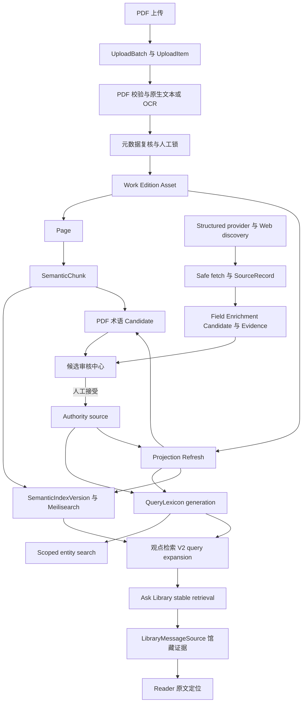

# GPT 项目交接与联动审计

更新日期为 2026-08-19。当前源码版本为 2.7。本文件是新 GPT 或 Codex 会话进入项目时的首要入口。它只记录当前结论和继续工作的边界。历史过程仍保留在其他文档中，但不得覆盖这里的较新状态。

## 阅读顺序

1. 根目录 [`AGENTS.md`](../AGENTS.md)，先确认数据、凭据、生产和验证边界。
2. 本文件，取得当前版本、部署快照和功能联动总图。
3. [`ARCHITECTURE.md`](ARCHITECTURE.md)，查看模块、数据职责和服务细节。
4. [`PROGRESS.md`](PROGRESS.md)，查看实现与验证时间线。
5. [`ISSUES.md`](ISSUES.md)，查看仍需处理的问题和不能自动修复的数据缺口。
6. 只有涉及部署时才读取 [`DEPLOYMENT.md`](DEPLOYMENT.md)。

任何会变化的生产状态都要重新检查。文档中的生产信息是 2026-08-19 的已验证快照，不能代替下一次发布前的实时检查。

## 当前结论

| 项目 | 当前状态 |
| --- | --- |
| 源码版本 | 2.7 |
| Git 工作分支 | `codex/release-2.7`。实际 commit 以 `git rev-parse HEAD` 为准 |
| 正式后台 | Next Admin 是日常编辑入口，Django Admin 是维护后备入口 |
| 生产应用 | API、Worker、Ingestion Worker、Beat 和 Web 使用同一 `2.7-87251cb` image family |
| 生产 migration head | catalog 0030、ingestion 0012、reading 0007 |
| QueryLexicon | revision 1，generation `af302b64-1b3f-447d-88ca-5ed505bc87e9` |
| 语义索引 | active UID `semantic_passages_20260818210650_4cf87bc9`，3,005 个已核对文档 |
| 观点检索 | 公共 V2 已在有限真实对照后启用。Ask Library 仍固定 stable retrieval |
| Ask Library | 对注册读者开放。读者自行配置 OpenAI-compatible、Ollama 或 vLLM；服务器 profile 只是可选后备 |
| General Web | 内网 SearXNG 只发现 URL，实际证据必须由 SafeWebFetcher 取得正文 |
| Candidate | 只产生待审核记录。没有自动发布 authority，也没有自动 Accept |
| 当前发布判断 | `PUBLIC DEPLOYED / READY FOR MANUAL VALIDATION` |

生产快照中的主要数量为 Work 5、Edition 5、Asset 10、Page 1,989、SemanticChunk 3,881、Person 6、KnowledgeNode 2。它们是时间点数据，下一次部署前必须重新读取。

## 系统总图



## 数据职责

| 数据 | 权威来源 | 派生或审核数据 | 重要边界 |
| --- | --- | --- | --- |
| 原始 PDF | NAS 文件和 PostgreSQL Asset identity | OCR PDF、页面图像、索引 | 不覆盖原件，不进入 Git |
| 书目 | Work、Edition、Asset、FieldLock | MetadataCandidate、封面候选 | 人工锁优先，Provider 不直接覆盖 |
| Authority | Person、名称变体、KnowledgeNode、Alias、关系和分类 | QueryLexicon、搜索投影 | draft 不得进入 public scope |
| 阅读文本 | Page | SemanticChunk、Meilisearch 文档 | 索引失败不能删除 Page 或改变出版状态 |
| 候选 | 各领域 Candidate 和 Evidence | 审核视图 | Candidate 不是 authority，也不是 QueryLexiconEntry |
| Reader 私人数据 | PostgreSQL reading 模型 | 浏览器状态 | 只允许资源所有者访问，匿名页不请求私人 API |
| Ask 回答 | 用户会话和真实 LibraryMessageSource | 模型生成答案 | AI 不是来源，回答必须引用馆藏证据 |
| 备份 | PostgreSQL 与 NAS inventory | BackupJob artifact 和 manifest | 正式入口只有 BackupJob，恢复只到 disposable PostgreSQL |

## 功能联动审计

### 登录、权限与后台工作区

- `api/accounts` 用 HttpOnly access/refresh Cookie 建立服务器确认的 session。
- `web/lib/api.ts` 和 `web/lib/runtime-api.ts` 共用 refresh 与错误分类。localStorage 只保存界面提示，不是认证事实。
- 后台导航使用 `api/common/capabilities.py` 的 capability contract。前端只控制可见性，API 每次重新鉴权。
- 网络错误、500 和单次后台探测失败不会被当作 logout。明确 403、跨标签 logout 或后续受保护请求失败仍会重新验证权限。
- 上传工作区不会因为页面进入后台而清空本地待上传队列。

剩余验证是长时间后台标签页、网络短暂中断和真实大 PDF 上传的人工观察。不得用取消鉴权来处理闪烁。

### PDF 上传、处理、复核与出版

- 浏览器建立 UploadBatch，再为每个文件建立 UploadItem。文件选择和拖放进入同一分片上传实现。
- 上传完成后由 ingestion pipeline 进行校验、文本提取或 OCR、页码、元数据候选和发布预检。
- MetadataCandidate 只进入人工复核。FieldLock 和人工决定优先于自动值。
- publish transaction 写入正式 Work、Edition、Asset 关系。后续语义索引和候选发现是独立派生任务。
- 单文件失败不回滚整个 batch。OCR、semantic、candidate 或 provider 失败不得把已出版 Work 标为失败。

主要入口是 `api/ingestion/services`、`api/ingestion/views.py`、`web/app/admin/uploads` 和 `web/app/admin/review`。完整流程回归位于 `api/tests/test_complete_ingestion_workflow.py`、`test_ingestion_workflow.py` 和 `web/tests/reader-upload-layout.test.mjs`。

### Authority、QueryLexicon 与 Scoped Search

- Authority 对象是权威来源。QueryLexiconEntry 是可重建投影，不能反向当作人工事实。
- authority mutation 与 QueryLexiconChangeEvent 在同一数据库事务提交。Celery 只负责唤醒，ChangeEvent 是恢复依据。
- 公开搜索使用 `public_active`。后台解析和 enrichment 使用 `admin_resolvable`。draft Person 可以成为后台目标，但不能泄漏到公开结果。
- Task 4 的 SearchService 在 retrieval 层限定 works、scholars、disciplines、subdisciplines、theories、topics、reading_paths 或 global。
- Global Search 必须显式请求 global，并按实体组返回。Entity Search 与 SemanticChunk 观点检索继续分开。

主要入口是 `api/catalog/services/query_lexicon`、`api/catalog/services/scoped_search.py`、`api/catalog/views.py` 和各公开目录页。回归位于 `test_query_lexicon_*`、`test_scoped_search.py` 和 `web/tests/scoped-search.test.mjs`。

### 候选审核与 authority 增长

候选审核中心是跨领域 review queue，不是自更新社会科学词典。

| Candidate 类型 | 产生位置 | 人工接受后的去向 |
| --- | --- | --- |
| MetadataCandidate | PDF metadata pipeline | Work、Edition、Asset 对应字段 |
| QueryLexiconCandidate | PDF 双语术语发现 | PersonNameVariant 或 KnowledgeNodeAlias，再触发 ChangeEvent |
| EnrichmentCandidate | structured provider 或实际网页证据 | FieldMutationRegistry 指定的 source-of-truth |
| NewAuthorityCandidate | 无安全 canonical anchor 的馆藏观察 | 匹配已有实体、创建 draft 或拒绝 |
| TheoryReviewTask | 理论关系和时间线审核 | 对应知识关系或时间线 source-of-truth |

统一页面只统一证据、状态和允许动作。每类 Candidate 仍由自己的事务服务校验和写入。任何接受动作都必须锁记录、重新验证 target 和证据、写 reviewer，再提交 authority mutation。失败应整体回滚。

### Field-aware Web Enrichment

- FieldPolicyRegistry 按 target 和 field 决定允许的来源类别、identity gate、证据数量、冲突策略和 mutation adapter。
- Wikidata、VIAF、LOC、OpenAlex 和书目 Provider 通过现有 adapter 归一化。一个 Provider 失败只返回 partial warning。
- SearXNG 搜索结果及 snippet 只用于 source discovery。它们不能形成 EnrichmentEvidence。
- SafeWebFetcher 对 URL、DNS、redirect、私网地址、content type、大小和超时做限制。只有 fetched page 的 supporting passage 可以成为证据。
- Person 同名不能通过 identity gate。理论关系需要明确关系表达和更强证据。同页共现不足以形成关系事实。

生产已验证 VIAF、内部 SearXNG、实际网页 fetch 和 partial failure。当前存在一条布迪厄 external identifier 候选，保持 pending。Candidate 为 0 也可能是 identity 或证据门槛的正确结果，不能通过降低安全阈值追求正数。

### 语义索引、观点检索与 Ask Library

- SemanticIndexVersion 管理 build、ready、active 和 retired 生命周期。新 UID 验证通过前不会替换 active UID。
- 观点检索公共 V2 在 query time 使用 QueryLexicon public scope、dense/lexical retrieval 和受控融合。它没有更换 embedding，也没有触发全库重建。
- V1 仍是可立即恢复的查询实现。关闭 `SEMANTIC_SEARCH_V2_ENABLED` 并刷新 API/Edge 即可回退，不改变 active UID。
- Ask Library 永远从 persisted LibraryQuery 开始，强制 stable retrieval，并保存 LibraryMessageSource。公共 V2 开关不会改变 Ask 的检索 profile。
- 注册读者可以保存一个个人模型连接。API key 使用现有 private-data key 加密，不进入响应、日志或浏览器存储。

当前 V2 只完成了有限生产对照，没有完成人工 qrels。它已启用但仍属于可回退观察状态。不得把五条 smoke 写成检索质量的最终结论。

### Reader 与私人阅读数据

- 公开 Reader 读取 Asset manifest、PDF Range、页内容和文档内检索。
- 只有 authenticated session 才加载进度、书签、批注、列表和历史。logout 后页面内私人状态会清除。
- Reader 的 PDF 页、印刷页标签和章节定位是三个不同概念。Citation 保存可解释的 PDF page 和 printed label。
- OCR 通知位于文档流，不覆盖 PDF 文本；工具栏为可选纸本页码预留布局。
- Ask 证据链接返回 Reader 的真实 Asset 和页定位，不生成静态示例来源。

### Projection Refresh 与异步失败隔离

- Projection Refresh 复用 ProcessingJob、默认 Celery worker 和现有 recovery，不建立第二套队列。
- 每次请求只接受一个 Work、Edition、Asset 或 authority target，并依据 target 更新时间形成幂等键。
- 它有限协调 QueryLexicon event、该 target 的 semantic job 和 PDF candidate job，不执行全馆扫描。
- 派生任务失败只更新 ProcessingJob，不回滚 Work、Edition、Asset、Page、SemanticChunk 或 publication source state。

### Backup、恢复与发布

- BackupJob 是管理员、API、Worker 和定时任务的唯一正式数据库备份入口。
- runtime 固定 PostgreSQL 16 client，并在导出前比较 server、pg_dump 和 pg_restore major。
- artifact manifest 记录版本、migration head、大小和 checksum，不记录密码。
- restore rehearsal 只允许明确命名且无业务表的 disposable PostgreSQL。
- 生产 migration 必须显式运行 `migrate --plan`、备份和检查。Compose 的 API 启动命令不自动 migrate。

## 已发现的剩余风险

1. Authority coverage 仍偏低。公开 QueryLexicon 中 Person coverage 低，导致跨语言扩展和 PDF 术语候选数量受限。这是数据治理问题，不能通过自动发布 draft 或放宽 identity gate 解决。
2. 生产 Person 数据存在待人工复核的异常。例如 George Herbert Mead 的生卒年顺序不可能成立，另有疑似 OCR 噪声姓名。只记录问题，不自动改 authority。
3. 公共 V2 尚未完成盲化人工 qrels。当前 enable 基于有限真实 smoke，必须保留 V1 回退。
4. General Web 的当前生产出口只验证了 Baidu discovery。上游限流、页面变化和地区网络仍会形成 partial failure。
5. 注册读者的个人 AI 连接已部署，但不同模型的流式格式、超时和引用遵从仍需真实用户配置后的人工验证。
6. 大 PDF 拖放、后台标签页和弱网恢复需要继续做长期浏览器测试。源码已有非破坏 session probe 和 chunk resume，但这不是所有浏览器环境的最终证明。
7. 前端依赖审计仍报告 3 个 high severity 项。没有使用强制升级破坏 Vinext/Next runtime，需要独立兼容性处理。
8. 历史文档包含旧 2.6.1、SSH blocker、V2 disabled 等时间点结论。读取时必须以本文件和各文档顶部的当前状态为准。

## 下一位 GPT 的工作约束

- 开始前执行 `git status --short --branch`，不要覆盖未提交修改。
- 把源码、本地测试、生产快照和推断分开。不能用文档中的历史成功替代当前环境检查。
- 不提交 `.env`、Secret、PDF、OCR、数据库、备份、用户数据、模型、embedding、索引、日志、cache 或 build artifact。
- 不直接修改生产数据库，不删除 volume，不覆盖原始 PDF，不自动发布 draft authority，不自动 Accept Candidate。
- 修复联动问题时先找 source-of-truth 和现有 service。不得建立重复上传、搜索、候选、AI 或任务系统。
- 生产操作前必须重新确认仓库 revision、统一 image、fresh BackupJob、migration plan、队列、active semantic UID 和回退入口。

## 最小验证集合

后端：

```powershell
Set-Location api
..\.venv\Scripts\python.exe -m pytest -q --reuse-db --disable-warnings
..\.venv\Scripts\python.exe manage.py check
..\.venv\Scripts\python.exe manage.py makemigrations --check --dry-run
```

前端：

```powershell
Set-Location web
npm.cmd test
npm.cmd exec -- tsc --noEmit
npm.cmd run lint
npm.cmd run build
```

仓库：

```powershell
git diff --check
git status --short --branch
```

环境型 PostgreSQL、Redis/Celery、Provider、OCR、NAS、Meilisearch 和公网检查只有在真实运行后才能记为通过。

## 本次仓库交接验证

2026-08-19 在当前 2.7 工作树重新执行了完整本地门槛：

- 后端完整 pytest 退出码为 0。
- `manage.py check` 通过，migration drift 检查显示 `No changes detected`，compileall 通过。
- 前端 Vinext production build 通过，68 项通用 Node 测试和 19 项 Auth / Scoped Search 测试通过。
- TypeScript 与 ESLint 通过。
- `git diff --check` 通过。
- 本次交接只修改文档，没有新增 migration，也没有连接或修改生产环境。
