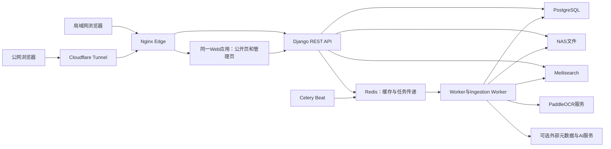

# 给GPT的实际架构与应用场景

更新于2026-09-13，针对3.0.5源码和同日交付记录。此文的目的，是让后续设计者理解这座真实书库，再重新设计整体架构与后台，不是证明当前结构已经理想。

## 1. 先分清现状、证据和目标

| 类别 | 本文如何使用 | 依据 |
| --- | --- | --- |
| 当前实现 | 可以从仓库函数、模型、路由核对 | 下文各节的源码路径 |
| 最近上线事实 | 2026-09-13已部署，之后可能变化 | [CURRENT_STATE](CURRENT_STATE.md)、[DEPLOYMENT](DEPLOYMENT.md) |
| 已验证范围 | 本地、恢复副本、公网分别记录 | [V3.0.5_VERIFICATION](V3.0.5_VERIFICATION.md) |
| 现有问题 | 已确认的代码行为或尚缺覆盖 | 下文第8节及[ISSUES](ISSUES.md)最新摘要 |
| 未来目标 | 用户要求重新设计，尤其后台和上架过程 | [REDESIGN_BRIEF](REDESIGN_BRIEF.md)，不代表方案已确定 |

阅读本文后，继续读[上架与发布流程](INGESTION_AND_PUBLICATION.md)。不要仅凭README、旧版设计文档或一个`published`字段推断系统行为。`GPT-HANDOFF.md`是2.9.2历史记录；`ARCHITECTURE.md`仍保留演变过程。冲突时核对当前源码与有日期的运行证据。

当前基线应用为3.0.5。最后API功能提交`a829bb8`，Web功能提交`fa6b3bc`，两者Web源文件相同。后续文档提交不代表又部署一次应用。本次仓库同步不连接或更改生产，也不重跑已交付的整套验收。

## 2. 书库究竟服务什么人

这是一座面向社会科学阅读和研究的数字书库。它同时提供书目发现、原文阅读、证据定位、知识导航和馆员整理。前台质量依赖后台的书目、作者、版本、关系、文档与发布决定，不能把后台只看成上传文件的表单。

| 角色 | 实际用途 | 当前权限事实 |
| --- | --- | --- |
| 公开访客 | 找书、查看学者/理论/主题、阅读获准PDF、下载、复制、引用和观点原文检索 | 不需要登录；文件本身仍受访问策略限制 |
| 登录读者 | 上述功能，加私人进度、收藏、书单、笔记、批注、书签、历史及书库问答 | 私人对象按当前用户过滤，不成为公共策展 |
| Editor | 上传、手工编目、人工采用候选、编辑书目和知识、明确发布 | **目前可以发布作品和Authority**，不是只能填写的待审核角色 |
| Administrator | Editor工作，加系统查看、部分重试、用户管理和运行配置 | 不自动获得敏感恢复、索引切换或人物合并权限 |
| System Owner | 敏感恢复、备份、人物合并、全局投影与索引管理等 | 由配置身份认定，普通`is_superuser`不能代替Owner判断 |

权限以[capabilities.py](../api/common/capabilities.py)、[permissions.py](../api/common/permissions.py)和[ownership.py](../api/accounts/ownership.py)为准。导航隐藏、按钮禁用和DRF最终授权不是同一层。现有流程没有强制双人审核制度，不要擅自把“复核”解释为另一位管理员审批。

## 3. 实际前后台使用场景

| 场景 | 真实页面 | 关键组件或服务 | 所涉及的数据与结果 |
| --- | --- | --- | --- |
| 先找相关书，再读原文 | `/explore`，含精确/全文与语义模式 | `web/app/explore/page.tsx`、`web/lib/api/search.server.ts` | 书目、作者、分类及正文检索结果；索引命中仍需访问与正式版本核对 |
| 看某本书及其引用 | `/works/[slug]` | `web/components/work-detail-view.tsx`、`work-citation-panel.tsx` | 公开版本、责任者、关联知识、目录、引用和文件入口 |
| 打开PDF，翻页并定位证据 | `/reader/[assetId]` | `reader-shell.tsx`、`pdf-continuous-viewer.tsx`及`components/reader/` | PDF.js、页码映射、目录、文本层、正文搜索和证据锚点 |
| 保存自己的阅读工作 | `/account`、`/account/notes/[assetId]`及Reader | `reader-center.tsx`、`reader-book-notes.tsx`、`api/reading/views.py` | 私人ReadingProgress、Annotation、Bookmark、SavedItem、ReadingList等 |
| 用馆藏证据回答问题 | `/explore/ask`，复用Explore的问答模式 | `explore-ask-client.tsx`、`api/reading/library_views.py` | 登录读者的对话、流式回答、原文来源；依赖真实模型配置 |
| 寻找不同立场原文 | `/explore/opinions` | `web/app/explore/opinions/page.tsx`、`api/catalog/viewpoint_views.py` | 分组证据及Reader定位，不是聊天模型自由生成的观点列表 |
| 上传后整理一本书 | `/admin/uploads`、`/admin/intake/[itemId]` | `admin-upload.tsx`、`admin/workflow/workflow-editor.tsx` | 上传、文件处理、版本身份、字段复核、候选、预览和发布 |
| 没有PDF，先建书目 | `/admin/cataloging/new`、`/admin/cataloging/[sessionId]` | `admin/workflow/cataloging-session.tsx`、`api/catalog/cataloging_views.py` | 真实CatalogingSession/Work/Edition，不伪造UploadItem或Asset |
| 修改已经公开的版本 | `/admin/library/works/[workId]?edition=...` | 同一WorkflowEditor、`work_editor.py`、`publication_commands.py` | 保存草稿、查看当前公开版本、比较差异、发布新修订或恢复历史 |
| 整理学者、理论和策展 | `/admin/knowledge`及对象专用编辑页 | `knowledge-workspace.tsx`、`theory-system-admin.tsx`、相关API | Person、ScholarProfile、KnowledgeNode、Topic、ReadingPath等有各自身份及发布条件 |
| 改封面、肖像或横幅 | `/admin/media`和各编辑页媒体面板 | `admin/media/media-library.tsx`、`api/catalog/services/media.py` | MediaAsset/Rendition、选择草稿、正式发布、历史引用保护 |
| 查任务和处理异常 | `/admin/processing`、`/admin/system-health`、`/admin/people`等 | `processing-center.tsx`、`person-resolution-workspace.tsx`、恢复服务 | 真实任务、质量、Provider、能力等待、投影和人工合并，不是第二套编目事实 |

上表中的组件短名位于`web/components/`，服务短名位于`api/catalog/services/`。`/admin/review/[itemId]`和`/admin/publication/[itemId]`目前重定向到同一工作台的对应栏目。旧MetadataReview API仍保留，但不能因为有多个URL就推断存在三个独立审核系统。

后台仍有多个导航分组和对象编辑器。CSS、API客户端及Reader内部职责已经拆分，这些是维护性改进，**不代表馆员的任务组织、信息架构与上架流程已整体重设计**。

## 4. 实际部署关系

- 公开前台与管理后台是同一个React/Next兼容路由应用。生产用Vinext/Vite构建并在NAS容器运行，并非另有一个独立后台网站。
- 浏览器使用同源`/api/`。Web服务端使用Docker内部`http://api:8000/api`，由`web/lib/api/server-request.ts`统一设置内部请求头与`no-store`。内部Token不送到浏览器。
- `compose.public.yaml`和`compose.cloudflare.yaml`是当前生产组合。Nginx处理同源路由、限流及受保护文件传输。Cloudflare公网健康与NAS内部健康需要分别判断。
- API、Worker、Ingestion Worker、Beat使用同一API源码。专业OCR是独立服务，不能把每个业务模块误读成微服务。
- R2支持浏览器分片上传临时中转，导入后永久文件仍进NAS；它也有独立配置和恢复状态。仓库含通用分发适配，不表示每个Cloud Provider都已经启用。
- `web/worker/`、`.openai/hosting.json`、Sites构建插件、Drizzle等兼容文件存在，**不能据此认定生产用了D1、另一套数据库或Cloudflare Workers托管**。以运行Compose和部署记录为准。

这些事实不排除未来提出其他结构，但更换技术栈或存储必须单独说明动机、数据迁移和回退，不在本次Git同步中实施。

## 5. 核心对象和写入职责

| 对象 | 表达什么 | 不应混淆为 |
| --- | --- | --- |
| Work | 作品身份与作品层信息 | 某次上传、某个PDF或某个出版版本 |
| Edition | 具体版本的出版信息、公开slug、主版本和活动发布指针 | Work本身或文件字节 |
| Asset | 归属Edition的文件、类型、校验、版本、来源和当前选择 | 公开书目或OCR解释版本；ORIGINAL不能被覆盖 |
| Page | Asset的物理页面、尺寸和页序/页码信息 | 一段AI知识或可以随OCR整体删掉重建的记录 |
| DocumentRevision | 同一Asset的一版文本/结构解释 | 新PDF文件、Edition或公开馆藏快照 |
| DocumentQualityAssessment、EvidenceSpan | 文档质量以及带原文和定位的证据单元 | 任意网页摘要或AI声称的依据 |
| UploadBatch、UploadItem | 批次和单文件的上传、导入、处理过程 | 所有手工编目必须依赖的书目实体 |
| CatalogingSession | 上传、手工、导入或已建馆藏的一次编辑过程 | 第二套Work；作品身份从Edition推导 |
| CatalogFieldDecision、FieldLock | 字段确认、冲突、失效及人工优先约束 | 已向公众发布的证据 |
| MetadataCandidate、EntityResolutionCandidate等 | 有来源、范围和人工决定的建议 | 可以直接覆盖人工字段的正式值 |
| EditorialRevision | 对已建对象待发布的编辑草稿和物化预览 | 已公开的CatalogPublicationRevision |
| PublicationBundle | 同次编目中建立并人工确认的关联草稿对象集合 | 可以自动发布所有候选的容器 |
| CatalogPublicationRevision | 不可变的正式书目快照及其精确Reader Asset/DocumentRevision | 只靠Work当前字段拼出的实时页面 |
| KnowledgePublicationEvent、Delivery | 持久发布事件和逐消费者结果 | 所有消费者必须无条件成功的一个Boolean |
| CanonicalObjectRevision、DomainChangeEvent | 对规范对象变化的版本和持久通知 | 网络临时消息本身 |
| ProjectionState、QueryLexicon、SemanticIndexVersion | 派生结果的新鲜度、查询词典和搜索版本 | 不可替代的馆藏事实或原件 |
| Person、ScholarProfile | 人物身份与独立学者展示档案 | 有学者页才算存在的人，或任何重名都应合并 |
| KnowledgeNode、Topic、Discipline、Subdiscipline | 理论/概念/争论等节点与独立主题、学科身份 | 一个万能类别表 |
| CuratedClaim、ReadingPath、Recommendation | 人工确认的观点策展、阅读路线和推荐安排 | 读者私人笔记，或未经确认的模型输出 |
| MediaAsset、MediaRendition | 图片原件和有来源/用途的衍生图 | 可原地覆盖、删除历史引用的临时附件 |
| reading中的用户对象 | 私人阅读记录、对话、模型连接等 | 管理员编目草稿或公共知识 |

主要模型定义在[api/catalog/models.py](../api/catalog/models.py)、[api/ingestion/models.py](../api/ingestion/models.py)、[api/reading/models.py](../api/reading/models.py)。这些文件仍集中较多职责，表名相近也不意味着可以自动归并。

PostgreSQL保存业务事实、人工决定、证据版本和持久任务状态。Redis承担传递、缓存和租约相关能力；Meilisearch是可重建检索数据。NAS保存原件与文件版本。OCR和AI可以产生派生材料或候选，不能自行发布人物或覆盖人工确认的知识。

## 6. 前台究竟读取什么

1. 公开作品入口使用Edition的有效`active_catalog_revision`。该修订必须属于同一Edition、状态为active且metadata_ready；公开列表还受主版本条件影响。
2. 公开书目可用与全文可检索分开。带PDF版本还要确认可访问且符合当前修订的Reader Asset；纯书目不虚构阅读文件。
3. 正文、Semantic、观点及问答证据需要相应活动Catalog/Document修订和访问条件。尚未合格的OCR不是公开原文。
4. 新修订在准备期间，旧合法公开修订继续服务。后台预览与公开展示可以复用组件，但预览接口和文件受权限保护。
5. 作品的公开快照不能使关联的草稿或已撤回分类自动公开；分类端点当前资格仍需核对。
6. 更换Reader文件不能悄悄改变旧书签、批注和Evidence的位置身份。相同页面的OCR重做不应重建Page身份。

核心依据为[publication_eligibility.py](../api/catalog/services/publication_eligibility.py)、[publication_commands.py](../api/catalog/services/publication_commands.py)、[distribution/views.py](../api/distribution/views.py)及公开serializer。书目发布后“同步到前端”实质上是合法活动修订及派生结果是否可读，不是向第二个前台数据库复制一份书。

## 7. 给后续代码审计的入口

| 要看什么 | 首读源码 |
| --- | --- |
| 浏览器请求、登录与内部服务请求 | `web/lib/api.ts`、`web/lib/api/server-request.ts`、`api/accounts/`、`api/common/permissions.py` |
| 场景领域客户端 | `web/lib/api/*.server.ts`、`*.types.ts`；`server-api.ts`只作旧导出兼容 |
| 自动API契约 | `api/config/schema_urls.py`、`api/catalog/public_response_serializers.py`、`web/scripts/generate-api-contracts.mjs`、`web/lib/api/generated/` |
| 编目过程与工作台读模型 | `cataloging_views.py`、`services/cataloging_sessions.py`、`services/admin_workspace.py` |
| 字段保存、决定与候选 | `services/work_editor.py`、`contracts/fields.py`、`contracts/validation.py`、`services/field_decisions.py`、`services/field_assistant/` |
| 发布和事件消费 | `services/publication_commands.py`、`services/knowledge_publication.py`、`services/dependency_engine.py`、`services/projection_refresh.py` |
| 原文件导入和文档处理 | `api/ingestion/services/r2_staging.py`、`pipeline.py`、`processing.py`、`api/catalog/services/document_intelligence.py` |
| 检索与问答 | `api/catalog/services/retrieval/`、`services/query_lexicon/`、`services/viewpoint_search.py`、`api/reading/library_retrieval.py`和`library_assistant.py` |
| 人物、图片和编辑草稿 | `api/catalog/services/person_resolution.py`、`person_merges.py`、`media.py`、`editorial_drafts.py`及人物专项测试 |
| 前端基本结构 | `web/app/layout.tsx`、`web/components/ui/`、`web/styles/`、`web/components/admin/` |
| 运行和恢复 | `api/config/celery.py`、`api/common/task_runtime.py`、`api/ingestion/services/system_health.py`、`compose.public.yaml`、`deploy/nginx/default.conf.template` |

表内`services/...`在`api/catalog/`下；同格省略目录的文件沿用前一个文件的目录。自动契约只覆盖明确登记端点，历史复杂JSON还有兼容类型。不要手写generated文件，也不要把生成成功等同于全仓接口已核准。

样式基础已按职责拆分，旧`editorial-v2.css`、`editorial-workspaces.css`仍在layout后置导入。不要只查`globals.css`的行数就判断所有样式均已彻底重构。Reader内部已拆分，但WorkflowEditor、部分管理组件和后端大模型/视图仍有较高复杂度。

## 8. 可以据此讨论的真实问题

- 同一书的文件导入、编目、编辑草稿、发布、正文质量和派生结果各有状态。目前后台要在多个入口中解释它们；怎样减少馆员的判断负担需要重新设计，不能只新增一层汇总标签。
- 旧Review API、新工作台与手工会话并存。它们有复用也有差别，应该定义一个清楚的命令边界及有期限的兼容策略。
- 同样撤回，旧ingestion入口要求Administrator，维护发布入口使用CanPublishWork，Editor可以执行。这个差异应成为权限设计决策，不应在文档中假装完全统一。
- `web/lib/api/reader.server.ts`目前把manifest异常统一转成null，页面不能准确区分不存在、无权、API故障或处理中。该错误语义是重设计候选，本次资料整理没有改代码。
- 核心公开与新增管理API已生成类型，旧知识、策展、工作台等复杂响应仍有手写或宽类型。领域文件拆开不等于这些契约已经完整。
- Person合并目前只支持明确的非冲突情况。双ScholarProfile、唯一关系冲突和后续变更保护需要显式选择界面，不能自动取舍。
- 旧TheorySchool/Concept/WorkKnowledgeRelation等仍有兼容读取；存在读统计不等于已经证明连续零使用，不能直接删表。
- 2026-09-13已修复的一例发布故障同时涉及漏捕获投影、PostgreSQL可空连接锁和误报状态。它说明“已保存”“人工批准”“前台可见”“任务完成”必须分别可核验。

这些是源码观察与设计问题，不是已做用户研究的结论。首次规划应请用户补充实际高频操作、馆藏增长规模、编辑协作方式和最困扰的操作，再作取舍。

## 9. 运行资料与验证边界

仓库不含生产PDF、数据库、模型、Provider密钥或私人记录。全新clone只有代码，不能期待立刻出现真实馆藏。`.env.example`是配置格式示例；直接`manage.py`读取进程环境，Compose才按配置加载`.env`。测试SQLite不能代表生产PostgreSQL锁和并发。

本版已有前端212项、最终发布专项17项及真实恢复副本/公网检查，详见验证记录。没有在最终源码重新跑全后端套件，不能把过去全量结果或本次文档检查说成所有功能全通过。GPU能力、真实Provider、OCR吞吐和登录私人写入有明确未实测范围。7本公开馆藏、9个原件等是交付时数据，不是未来容量设计目标。

请用这些事实提出新的产品和领域设计。现有实现可以被改进甚至替换，但原件、人工确认、私人数据、历史文件、现有URL与回退能力必须有明确保留或迁移方案。
