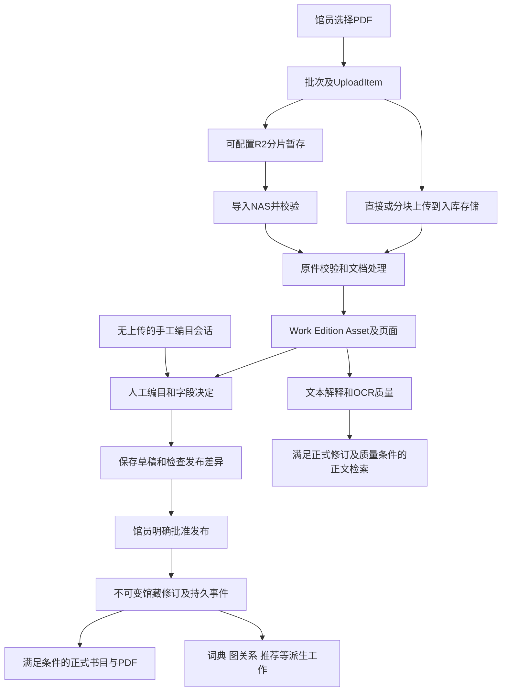

# 当前上架与发布流程

更新于2026-09-13，说明3.0.5真实行为。供重设计后台和上架过程使用，不把现有步骤当作未来必选界面。完整产品背景见[实际架构](GPT_ARCHITECTURE_CONTEXT.md)。

## 1. 一个用户任务，四种入口

| 馆员要做什么 | 页面和起点 | 当前事实 |
| --- | --- | --- |
| 上传一份或一批PDF | `/admin/uploads`，UploadBatch/UploadItem | 文件先有自己的传输与处理过程，尚不等于书目已公开 |
| 给已导入PDF补齐信息并上架 | `/admin/intake/[itemId]`，WorkflowEditor | 绑定真实Edition，编辑、候选、文件证据、预览及发布在同一工作台协调 |
| 没有PDF，先手工建馆藏 | `/admin/cataloging/new`，CatalogingSession | 新manual/import会话建立真实Work与bibliographic Edition；不补造上传记录 |
| 修改已公开的某个版本 | `/admin/library/works/[workId]?edition=...` | 明确Edition上下文，先草稿，再比较和发布；新版本准备期间保留旧公开内容 |

旧`/admin/review/[itemId]`和`/admin/publication/[itemId]`是重定向入口。旧`/api/ingestion/items/{id}/review/`仍有实际PUT实现，所以页面入口合并不代表兼容写API已经删除。

## 2. 文件上传不等于上架

图是职责关系，不是必须顺序点完的页面向导。OCR与候选研究可以延后或等待能力；纯书目没有文件，不会进入伪造的PDF处理。

R2实际函数位于[services/r2_staging.py](../api/ingestion/services/r2_staging.py)。`create_r2_upload`建立暂存上下文，签名/确认分片后`complete_r2_upload`核对对象并派发导入。`import_r2_staging_object`进入NAS入库过程，`mark_r2_cleanup_ready`、`cleanup_r2_staging_object`管理临时对象清理。重试/恢复使用原ProcessingJob和任务服务，不是复制一条已发布书目。

更精确地说，完成上传仅置`staging_status=uploaded`，提交后排R2_STAGING导入任务。导入流式检查大小、PDF签名与SHA256，成功才置`imported`、业务`received`并调用`schedule_upload_item`。普通新上传处理和复核续跑最终停在ready，等待人工发布；不能因为旧函数名`resume_reviewed_item_publication`带publication就认定自动上架。

NAS文件及Asset存在、业务状态已到needs_review/ready/published时可清理R2中转对象，不必等公开。通用`recover_stalled_processing_jobs`和R2专项恢复共同处理超时或漏派；普通import_failed仍有人工重试，过期对象要求重新上传。重试有最大次数，当前force重派不重置attempt，不能承诺所有故障自动恢复或无限重试。

直接上传、chunks与R2端点见[ingestion/urls.py](../api/ingestion/urls.py)，任务入口见[tasks.py](../api/ingestion/tasks.py)。实际处理在[pipeline.py](../api/ingestion/services/pipeline.py)、[processing.py](../api/ingestion/services/processing.py)及文件校验服务。去重、来源复用、替换和重新处理必须依据现有身份与人工决定，不能只按文件名覆盖原件。

## 3. 元数据、身份与人工确认

Work和Edition分工不同。作品题名、原文语言、作品关系等属于Work；出版年月、出版社、版本、ISBN/DOI等在Edition。Asset属于Edition，Person通过贡献角色关联，不是题名框旁的一段不可追踪作者字符串。

当前工作台有文件、作品、版本、作者与贡献者、学科、知识、阅读、策展和发布等工作内容。字段规则来自[contracts/fields.py](../api/catalog/contracts/fields.py)，校验与标识符来自同目录validation/identifiers，依赖与派生影响来自projections。确切步骤以[admin_workflow.py](../api/catalog/services/admin_workflow.py)为准。

- 手工填写与采用候选是明确写操作。保存成功后记录字段决定和适用的人工锁，失效的机器建议不能覆盖已确认值。
- Provider、原生文本、OCR和AI建议是候选。网页搜索摘要只用于发现资料，不能当作原文Evidence直接发布。
- 新建并关联人物或知识实体先作为当前编目包中的草稿，父书批准发布时也只发布经过确认、范围匹配的对象。
- `MetadataReview`是视图/序列化与过程名称，不是另一张名为MetadataReview的馆藏模型。
- 手工会话建立时非空题名、类型、语言被记录为人工确认；import来源不会因此自动算人工确认。已有开放会话复用原source和base_public_revision，不由另一上传抢占。
- 旧Review在未发布阶段可以保存，已发布Work被409引导到维护草稿。`record_cataloging_edit`让旧成功保存与新工作台共用真实会话，GET不会偷偷开会话。

主要入口为[work_editor.py](../api/catalog/services/work_editor.py)的`save_workflow_section`、`save_editorial_workflow_section`，以及[field_assistant/service.py](../api/catalog/services/field_assistant/service.py)。`CatalogingSession`的创建、复用、放弃和请求幂等在[cataloging_sessions.py](../api/catalog/services/cataloging_sessions.py)。

## 4. 保存、预览与发布分别做什么

| 动作 | 写入结果 | 公众此时看到什么 |
| --- | --- | --- |
| 保存未发布书目字段 | 工作字段、人工决定、会话及审计 | 不因保存自动出现公开书目 |
| 修改已发布对象 | EditorialRevision草稿与预览 | 仍是旧正式版本 |
| 打开发布准备 | 读取已保存值、活动快照、差异、阻断与警告，生成指纹 | 不产生新发布、不改活动指针 |
| 明确发布 | 在事务中核对身份、指纹和资格，建立正式修订及事件 | 满足激活条件后才显示新公开版本 |
| 后台处理完成 | 消费者结果与投影版本更新 | 对应派生能力可用，不改人工事实 |
| 撤回 | 撤回状态及相应事件 | 不再公开；文件、记录和历史仍在 |
| 恢复历史公开版本 | 用合法旧快照生成序号更高的恢复发布 | 准备完成前仍保留当前稳定公开版本 |

差异入口为[publication_commands.py](../api/catalog/services/publication_commands.py)的`prepare_revision`，命令层包含`activate_revision`、`withdraw_revision`及`rollback_revision`，具体导出以源码为准。旧ingestion的publish/withdraw服务是同一领域命令的兼容适配。维护页的发布事务还需合并应用原EditorialRevision，不能只单独改`Edition.state`。

发布校验分阻断、警告与后台任务。document版本必须有合格、可读且归属一致的Reader文件；bibliographic只有真正无Asset时才可按纯书目发布，不能将损坏文件改个模式绕过检查。准备指纹过期时应让用户重新核对，不能覆盖另一页面刚保存的内容。

## 5. 正式公开和智能处理的分界

发布事务产生`CatalogPublicationRevision`、`KnowledgePublicationEvent`和逐消费者`KnowledgeProjectionDelivery`。规范对象变化还有`DomainChangeEvent`与`ProjectionState`，调度复用专业ProcessingJob、QueryLexicon与Semantic任务，不是新增一个包揽所有状态的队列。

公开读取必须满足同一Edition的活动修订资格。首次仅发布元数据的文献，在真实书目/公开消费者完成、快照合法且文件可读时，可以先公开书目和PDF，图关系等任务仍如实显示等待。它不意味着所有旧版本更新或全文发布都能跳过完整条件，也不把失败消费者假记为成功。

正文需要精确DocumentRevision与质量条件。`metadata_ready`与`fulltext_ready`是独立事实。页面尺寸、页码和合法PDF阅读可以存在于没有公开OCR正文的时候。新OCR解释在准备期间，旧活动正文及证据仍可服务。

核心实现在[knowledge_publication.py](../api/catalog/services/knowledge_publication.py)、[publication_eligibility.py](../api/catalog/services/publication_eligibility.py)、[projection_refresh.py](../api/catalog/services/projection_refresh.py)和[dependency_engine.py](../api/catalog/services/dependency_engine.py)。

## 6. 多种状态为什么同时存在

| 所属对象 | 状态回答的问题 | 常见误读 |
| --- | --- | --- |
| UploadItem.staging_status | 浏览器字节是否到暂存、是否导入NAS | uploaded就当整本书已入库 |
| UploadItem.status/workflow_state/dispatch_status | 文件处理进度、工作流位置、任务派发状态 | 任一完成就当人工已经审核 |
| CatalogingSession.status | 这次编目过程做到哪里 | published会话就当所有智能功能可用 |
| CatalogFieldDecision/FieldLock | 哪个字段已确认或仍需处理 | 页面访问过就当字段确认 |
| EditorialRevision.status | 草稿变更是否已明确提交 | 草稿保存就当公众看到新值 |
| Edition.state | 馆员是否批准发布或撤回 | published就当存在合法活动修订 |
| CatalogPublicationRevision | 当前服务哪一份快照与正文 | 准备中的最新修订覆盖旧活动修订 |
| Event/Delivery/ProjectionState | 发布及派生处理是否完成、失败或过时 | 图关系任务失败就必须隐藏可读PDF |
| ProcessingJob/CapabilityDemand | 是否有执行者、是否排队/运行/暂停 | 有queue message就表示有真实Worker消费 |

对用户的简明状态可以重新设计，但内部不能靠一个总状态覆盖以上事实。遇到显示不同步，应先指出哪一层不一致，而不是强行把每张表改为completed。

## 7. 维护、撤回、替换及历史保护

- 维护入口必须携带准确Edition。一个Work可能有多个版本，不能通过“第一条关联”猜当前正在改哪一本。
- 回滚公开版本不是数据库回档。只可选曾合法激活、属于当前Edition且历史文件仍可读的修订；新恢复发布递增，原不可变快照不改。
- 回滚保留之后的人工作品编辑值。若与恢复的公开快照不同，要明确告知待发布差异，不能暗中覆盖编辑。
- 撤回不删除PDF、批注或历史。已经撤回的书不能借一个回滚动作悄悄重新公开。
- 替换文件、局部OCR和重新提取文本必须区分Asset版本、DocumentRevision与Page身份，保留人工页码和私人锚点。
- replacement分支以新正文Asset建立catalog_updated事件；OCR完成只在文档解释ready且存在DocumentRevision时发起正文更新。`system_content_update`隔离未发布的人工元数据草稿，不能让OCR顺带发布正在编辑的题名或作者。
- 图片选中进入草稿，人工发布才改变正式引用；Media原件、衍生图及历史引用不能就地删除。

当前撤回权限仍有入口差异。旧`/api/ingestion/items/{id}/withdraw/`使用`IsLibraryAdmin`；维护`/api/catalog/admin/library/works/{work_id}/publication/`的withdraw分支使用`CanPublishWork`。重设计时应明确统一规则，本次文档不会擅自扩大或收紧权限。

## 8. 已修复的发布故障作为设计样本

2026-09的《质的研究方法与社会科学研究》被人工发布后，旧版显示published，活动公开修订却为空。调度没有捕获graph/timeline；完成查询又因PostgreSQL对可空连接加锁而异常；最后同值日期的Python对象与JSON字符串比较还会误报待更新。

3.0.5已修复实际投影计划、首次元数据公开条件、PG锁范围、公开状态提示和日期比较，通过原服务恢复原发布记录。最终event为completed、健康状态ready/ready/published、变化为空，公开列表6增7，544页PDF实读与Range通过。没有重传文件或手工SQL改活动指针。

这不证明未来所有故障都解决了。它说明新的上架设计至少应让馆员看见可追踪的保存结果、公开版本、待处理项目和可用恢复动作，且重试不能重复创建书目或清空失败证据。

## 9. 后续设计前值得补充的真实场景

请和用户核对批量规模、最常见资源类型、外文/译本/期刊关系、多人同时编辑频率、是否希望双人审核、OCR资源和NAS性能预算。还要核对手工建书后补PDF、替换主版本、发布途中继续编辑、仅改封面、跨对象关系更新等完整旅程。

这些需要从现有API和生产样本验证，不能因为有模型或按钮就宣布每个组合场景均已打通。当前未实测项见[CURRENT_STATE](CURRENT_STATE.md)。
