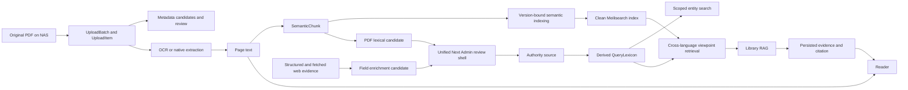

# Final Integrated Architecture Acceptance

更新日期为 2026-08-19。本文件是最终综合验收的唯一工作报告。它区分当前源码证据、真实运行证据和待人工 checkpoint。没有 `FINAL CUTOVER APPROVED` 时，不执行生产 migration、应用部署、活动语义索引切换或公开 V2 enable。

## Current to final architecture map

The final application has one PostgreSQL authority/data source, one Redis/Celery task system, one NAS file source, one versioned semantic-index lifecycle, one scoped entity SearchService, and one Library RAG backend. Public and LAN surfaces share these components.

## Data flow responsibilities

| Step | Source of truth | Derived, cache or index | Queue and failure isolation |
| --- | --- | --- | --- |
| Upload | UploadBatch/UploadItem rows and immutable NAS intake file | Browser resume hint and temporary parts | Ingestion queue; one file failure does not roll back its batch |
| Bibliographic review | Work, Edition, Asset, FieldLock and human decision rows | MetadataCandidate/Evidence are review provenance | Ingestion queue; provider failure does not overwrite locked fields |
| OCR and pages | Original PDF remains immutable; Page text is the stored extracted/OCR record | OCR PDF and layout blocks are derived | Ingestion queue/OCR service; OCR failure does not delete source PDF |
| Semantic preparation | Page and Asset relationships | SemanticChunk is rebuildable searchable representation | Semantic job; failure does not remove Page text |
| Semantic index | SemanticIndexVersion is the index lifecycle record | Meilisearch UID is a rebuildable index | Default Worker maintenance job; active version is unchanged until validated cutover |
| PDF term discovery | Existing authority plus PDF evidence | QueryLexiconCandidate/Evidence review workflow | Independent enrichment job; failure does not fail ingestion/publication |
| Authority | Person, PersonNameVariant, KnowledgeNode, aliases and approved relations | QueryLexicon is a derived generation | Durable ChangeEvent plus Celery notification; reconciliation failure preserves authority and active generation |
| Entity search | PostgreSQL authority/catalog | Search response/cache only | Request path; context constrains retrieval before ranking |
| Viewpoint search | SemanticChunk/catalog visibility and active SemanticIndexVersion | Meilisearch result set | Request path; V1 remains public until human quality gate approves V2 |
| Web enrichment | Existing target object and accepted authority fields | SourceRecord cache plus EnrichmentCandidate/Evidence | Provider partial failure preserves other evidence and never auto-accepts |
| Reader data | PostgreSQL user-owned progress, notes and annotations | Browser state only | Resource failure does not invalidate session |
| Ask Library | User conversation plus persisted LibraryMessageSource evidence | Model answer is derived text, never evidence | AI failure preserves session and retrieved evidence |
| Backup | PostgreSQL plus NAS asset inventory | BackupJob artifact and manifest | Default Worker; restore rehearsal always targets disposable PostgreSQL |

## Source-of-truth audit

| Object | Classification | Canonical owner |
| --- | --- | --- |
| Original PDF | SOURCE OF TRUTH artifact | NAS archive/incoming storage with PostgreSQL Asset identity |
| Work, Edition, Asset | SOURCE OF TRUTH | PostgreSQL catalog |
| Person, PersonNameVariant, KnowledgeNode, aliases | SOURCE OF TRUTH | PostgreSQL authority |
| Approved graph, taxonomy and editorial relations | SOURCE OF TRUTH | PostgreSQL catalog |
| FieldLock and human review decisions | SOURCE OF TRUTH | PostgreSQL ingestion/catalog |
| Page text | Stored extracted/OCR source record | PostgreSQL catalog; rebuildable from PDF but never silently overwritten |
| SemanticChunk | DERIVED | PostgreSQL catalog |
| QueryLexiconEntry/Generation | DERIVED | PostgreSQL catalog, rebuilt from authority |
| MetadataCandidate, QueryLexiconCandidate, EnrichmentCandidate, TheoryReviewTask | REVIEW PROVENANCE | Their domain-specific PostgreSQL workflow |
| LibraryMessageSource | REQUEST PROVENANCE | PostgreSQL reading |
| SourceRecord fetched body | BOUNDED CACHE/AUDIT | PostgreSQL ingestion |
| Redis | CACHE/QUEUE | Disposable runtime state, never sole business record |
| Meilisearch | INDEX | Rebuilt from current SemanticChunk and version config |
| Browser localStorage | UI HINT | Never authentication or permission truth |

No intended object currently has two accepted sources of truth. The remaining risks are compatibility paths that can bypass the intended service, not duplicate authoritative storage.

## Architecture disposition matrix

| Area | Component | Disposition | Reason and condition |
| --- | --- | --- | --- |
| Search | `SearchService` and explicit contexts | KEEP | One entity-search orchestration with retrieval-time scope |
| Search | `/catalog/search/` without context legacy payload | MERGE, temporary adapter | Keep through cutover; backend owner removes after 14 consecutive production days with zero legacy access-log hits |
| Search | `/catalog/theory-system/search/` and `searchTheorySystem()` | REMOVE | No formal source consumer; mixed entity/passage semantics duplicate scoped/global/semantic products |
| Theory UI | `/theory-schools` routes and rich loaders | KEEP as presentation adapter | Still widely consumed; canonical search identity remains KnowledgeNode and mapped duplicates are suppressed |
| Candidate models | Metadata, PDF lexical, field enrichment and theory review models | KEEP | Different parent object, value semantics and mutation target; table merge would obscure governance |
| Candidate UI | Separate evidence/status/action presentations | MERGE | `/admin/candidates` now provides one status/evidence/action shell while domain-specific services and Django Admin maintenance fallback remain separate |
| Authority | AuthoritySuggestions provider service | MERGE/KEEP adapter | Reused by structured enrichment and unsaved-entity identity discovery; it must remain read-only and never mutate draft |
| Ask | Capability runtime, AIClient, LibraryQuery, LibraryRetrievalService | KEEP | One runtime, provider adapter, scope contract and RAG backend |
| Ask | `_scope_filters`, `retrieve_library_sources` | REMOVE | Unreferenced compatibility functions were deleted; retrieval now starts from the persisted LibraryQuery |
| Ask | `LibraryAnswerStream` / `stream_library_answer` | KEEP | Provider selection, fallback and usage metadata are one named runtime service; the misleading `_provider_stream` wrapper was removed |
| Ask | Fixed 503 `/catalog/library-question/` | REMOVE | The unused route, view and import were deleted; `/api/reading/library-conversations/` is the only Ask API |
| Ask | AssistMode.OFF and singular scope aliases | MERGE, then REMOVE | `reading.0006_final_scope_normalization` normalizes stored conversations to auto/plural scope; enum and parser aliases remain only until that migration is applied everywhere |
| Ask | Sources API legacy `count/results` envelope | REMOVE | Frontend already consumes evidence metadata; final API keeps one evidence/citation envelope |
| Auth | Cookie bootstrap and refresh lock | KEEP | Correct server-verified truth and multi-tab behavior |
| Auth | `getServerSessionCredential()` cookie credential | KEEP | All migrated client requests send the HttpOnly cookie to the server; `library_session_active` remains a UI hint only and the old helper was deleted |
| Semantic index | Versioned staging/validation/activation | KEEP | Correct rollback-safe lifecycle |
| Semantic index | Null-version active incremental write | REMOVE | Job creation and direct index writes now require one explicit or uniquely resolved active `SemanticIndexVersion`; ambiguous historical rows fail with `INDEX_VERSION_REQUIRED` |
| Semantic index | Historical drifted active UID | REBUILD | Build a clean non-active UID; retain old UID only for rollback window |
| Model runtime | Meilisearch Hugging Face embedder | KEEP | Single embedding owner; Worker/API do not load a duplicate model |
| Model runtime | Runtime network model discovery | REMOVE | Pinned local snapshot, offline env and preflight required; missing model is MODEL_UNAVAILABLE |
| Upload | Resumable chunk upload and streamed assembly | KEEP | Correct recovery and bounded memory behavior |
| Upload | Fixed 2 MiB public chunk and post-assembly re-read | MERGE/OPTIMIZE | Use measured server recommendation and compute SHA during assembly; do not move library to R2 |
| Asset delivery | X-Accel/Range local NAS delivery | KEEP | Efficient public and authenticated reader path |
| Asset cache | Shared public cache for protected assets | REMOVE | Registered/restricted/private responses now use `private, no-store, no-transform` and `Vary: Cookie`; public assets keep revocation-aware cache |
| Backup | Existing PostgreSQL 16 BackupJob | KEEP | Already verified; only one fresh final backup and restore rehearsal |
| Admin | Next Admin | KEEP as primary | Product workflow for editors and reviewers |
| Admin | Django Admin | KEEP as maintenance fallback | Internal diagnostics and emergency review; not the primary product UI |
| ReadingPath | Model, scoped search and presentation | PROVISIONAL SIMPLIFY | Final decision requires real row count and consumer/use evidence; do not expand before that |

## Deprecated inventory

### Remove during source consolidation

- Mixed theory search endpoint and unused server helper.
- Fixed 503 legacy catalog Ask endpoint.
- Three Python Ask compatibility wrappers.
- Hint-based authentication credential gate. All current consumers now use the server credential helper.
- Null-version semantic indexing path. Historical rows are fail-closed unless one active version can be proven.

### Remove in final migration/cutover

- Stored `AssistMode.OFF` values after normalization to `auto`.
- Singular Library scope keys after migration to Task 4 plural contexts.
- Legacy sources response fields after all final Web consumers use the evidence envelope.

### Temporary production compatibility

- No-context catalog search payload. Owner is catalog backend. Removal condition is 14 consecutive days after cutover with zero access-log hits from non-current clients.
- Old semantic UID. Owner is search operations. Removal condition is completed rollback window plus clean UID count/schema/quality acceptance.

## Live evidence status

At the time of the initial acceptance draft, production read-only inventory was pending because the temporary RSA identity was rejected. That historical note is superseded by the live deployment update below; the identity was subsequently accepted and the production runtime was inspected directly.

## Human checkpoints

- Relevance judgments for the final blind V1/V2 pilot. Without sufficient judgments, public V2 stays disabled.
- Any authority or enrichment Candidate Accept. Candidate generation and review display may be tested without acceptance.
- Any future destructive maintenance still requires an explicit operator approval; the 2.7 migration and active UID switch recorded below were authorized by the current release request.

## Local consolidation evidence 2026-08-19

The local source and regression gates currently pass:

- Backend full `pytest --disable-warnings` passed with 504 passed, 31 skipped, and 2 existing warnings after the replacement-queue and semantic-enqueue isolation fixes. The skipped tests require real PostgreSQL/Redis/Celery infrastructure and are not counted as production acceptance.
- The explicit `MODEL_UNAVAILABLE` regression confirms that an indexing task records a stable error code, restores transient `INDEXING` chunks to `READY`, and does not delete page/chunk source data.
- The shared candidate-review endpoint was exercised with a real PDF-derived QueryLexicon candidate. Evidence serialized with the work title and supporting text, and a reject decision preserved evidence without creating a `PersonNameVariant`.
- Frontend TypeScript, the candidate/field-enrichment/Ask Node tests, the cookie-auth and scoped-search Node tests, the production web build, and `git diff --check` passed.
- Replacement ingestion now queues one forced semantic job after the new asset is current. It no longer queues an extra pre-activation job.
- When no unique active semantic version exists, the direct job-creation API remains fail-closed, while the asynchronous enqueue records an independent `INDEX_VERSION_REQUIRED` failure and leaves upload/publication source state unchanged.

The remaining gates are environment-dependent. This workstation has no Docker, PostgreSQL client/server, or PostgreSQL 16 disposable runtime. SSH to `Winston@192.168.5.6` with the supplied temporary RSA identity still returns `Permission denied (publickey,password)`. Therefore the production inventory, fresh backup, PostgreSQL 16 migration rehearsal, clean Meilisearch index, real provider/model checks, and browser/NAS acceptance remain unverified. The final status is still `BLOCKED`; no production migration, deployment, active UID switch, or public V2 enable was performed during this final acceptance.

## Original six product issues

| Issue | Current verdict | Evidence available now | Remaining gap |
| --- | --- | --- | --- |
| 1. 中英文跨语言观点检索 | `IMPLEMENTED_NOT_ENABLED` | QueryLexicon public/admin boundaries, V1/V2 separation, passage language and scoped retrieval are covered by source review and local regression. | No final blind human qrels, clean production index, latency evidence, or real 10–15 question RAG/search set. Public V2 remains disabled. |
| 2. 字段级联网补全与多源证据 | `IMPLEMENTED_NOT_VALIDATED` | Field policy registry, structured adapters, fetch/evidence provenance, conflict handling, mutation registry and pending-only review are implemented and tested with deterministic fixtures. | No controlled real provider fetch or production source selection has been completed. No Candidate was auto-accepted. |
| 3. Ask Library / social-science RAG | `IMPLEMENTED_NOT_VALIDATED` | Capability runtime, strict scope, persisted Evidence, citation validation, Reader URL contract and failure semantics pass local tests. | No real model health/generation or real-corpus question set can be checked until production/model access is restored. |
| 4. Unified scoped search | `IMPLEMENTED_NOT_VALIDATED` | SearchContext/SearchService, retrieval-time scope, explicit global mode, URL state and public/admin visibility pass targeted tests and frontend build. | Real production counts, legacy access logs and browser behavior remain unverified. |
| 5. PostgreSQL ingestion locking | `IMPLEMENTED` | Nullable outer-join locking fix and ingestion regression suite pass; semantic enqueue failures are now isolated from source publication. | Full current-production ingestion chain still requires the real database and worker runtime. |
| 6. Auth / Reader Center session bootstrap | `IMPLEMENTED_NOT_VALIDATED` | Cookie-first bootstrap, error-state separation and multi-tab refresh tests pass; no client uses the local hint as auth truth. | Real admin/reader browser sessions on the NAS/public deployment remain unverified. |

## Migration and data rehearsal

The source migration graph inspected locally ends at `catalog.0029_field_enrichment`, `ingestion.0011_query_lexicon_candidate_job_type`, and `reading.0006_final_scope_normalization`, with the expected dependencies through catalog 0027/0028 and reading 0005. Local `showmigrations` and `migrate --plan` are source-graph evidence only; the local SQLite database is behind the current heads. Static review found no network, PDF scan, semantic reindex or authority mutation in the new catalog/reading operations. A disposable PostgreSQL 16 rehearsal could not be run because this workstation has no Docker or PostgreSQL server/client, and the NAS SSH identity is rejected. No production migration was executed during this final acceptance; current production heads remain unverified.

QueryLexicon remains a derived object. The local rebuild/registry tests cover revision and visibility semantics, but the final production revision, generation, entity counts and authority coverage are `UNVERIFIED` until the production database or a fresh authorized copy can be read. No draft authority was published.

## Semantic index and V1/V2 state

The source disposition is `REBUILD` for the historical drifted active UID. Local code now requires an explicit or uniquely resolved active `SemanticIndexVersion`, reports `INDEX_VERSION_REQUIRED` or `MODEL_UNAVAILABLE`, and preserves SemanticChunk/Page data on derived-index failure. A clean non-active Meilisearch index, document-count reconciliation, model RSS measurement and final active UID switch were not possible in this environment. V2 therefore remains `KEEP DISABLED`; no model-generated relevance gold was used.

## External enrichment and Ask runtime

No real web page or model response is represented as evidence in this acceptance. Structured/web adapters and the shared candidate review route were exercised with deterministic test doubles only. The production general-web provider, `library_qa` model, source fetch checks, 10–15 question set, cross-language RAG behavior and Reader-to-citation browser path remain `UNVERIFIED`. AI remains optional and never becomes a source.

## Release, rollback and post-cutover backlog

The 2.7 production API/Worker/Ingestion Worker/Beat and Web images use one release revision and have recorded digests. The rollback plan remains application/image rollback first, retain additive migrations, pending candidates, backup artifacts and the historical semantic UID during the rollback window; do not drop tables or delete the old index.

Post-cutover work is limited to user-led authenticated manual validation, controlled real provider/model checks when credentials are intentionally configured, and later human V1/V2 judgments. V2 remains disabled until those judgments exist.

## Final status

`PUBLIC DEPLOYED / READY FOR MANUAL VALIDATION`

The authorized NAS runtime was restored and the final production sequence completed. Fresh BackupJob, PostgreSQL 16 migration, QueryLexicon reconciliation, unified 2.7 image deployment, clean semantic index consistency audit and active UID switch all passed. Public V2 remains disabled, AI/Web providers remain explicitly not configured when credentials are absent, and no authority was published or Candidate accepted automatically. The remaining work is user-led authenticated Admin, Reader Center, Candidate Review and Ask Library manual validation.
