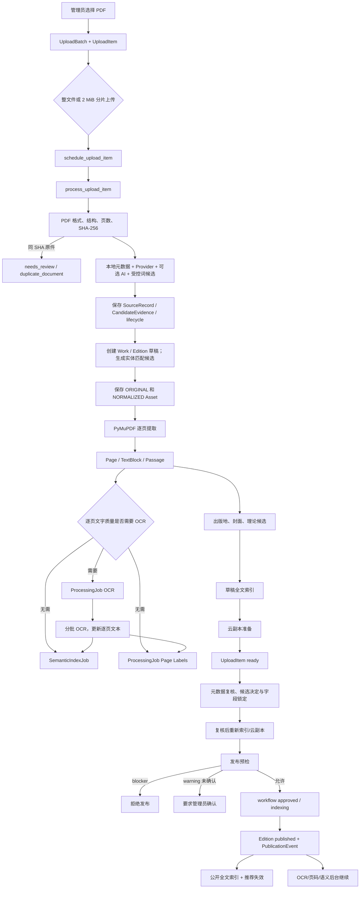
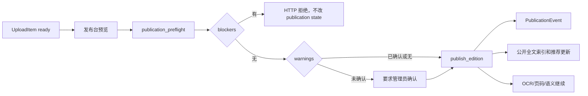

# PDF 入库、处理与发布流程

更新日期：2026-08-15
适用源码快照：`2.6.1`

## 1. 文档范围

- [SOURCE] 本文描述当前源码中的真实执行顺序，不把目标设计写成已实现功能。
- [SOURCE] 当前目录没有 Git 历史。文件位置和行号以本次源码快照为准。
- [SOURCE] 当前快照包含 `ingestion.0008`、`catalog.0019`、`catalog.0020` 和 `catalog.0021`。主 pipeline 已接入其中一部分能力；本文逐项区分模型、服务、API、界面和仍未完成部分。
- [UNKNOWN] 生产环境当前队列深度、正在执行的任务和数据库记录不在本次只读审计范围内。
- [USER] 本轮不自动部署、不执行生产迁移、不触碰真实 PDF 和生产数据。

## 2. 入口与核心记录

| 阶段 | API / 任务 | 数据对象 | 代码位置 |
| --- | --- | --- | --- |
| 创建批次 | `POST /api/ingestion/batches/create/` | UploadBatch | `api/ingestion/views.py:296` |
| 整文件上传 | `POST /api/ingestion/batches/<batch>/items/` | UploadItem | `api/ingestion/views.py:326` |
| 分片上传 | `POST /api/ingestion/batches/<batch>/chunks/` | UploadItem、临时分片 | `api/ingestion/views.py:404` |
| 派发 | `schedule_upload_item()` | dispatch_* 字段 | `api/ingestion/services/dispatch.py` |
| 首次处理 | `process_upload_item()` | ProcessingAttempt、Work、Edition、Asset | `api/ingestion/tasks.py:84-85` |
| 人工复核 | `PUT /items/<item>/review/` | FieldLock、MetadataCandidate、DecisionLog、Edition | `api/ingestion/views.py:1240` |
| 复核后继续 | `process_reviewed_upload_item()` | 草稿索引、云副本 | `api/ingestion/tasks.py:96-97` |
| 最终发布 | `POST /items/<item>/publish/` | Edition、PublicationEvent、公开索引 | `api/ingestion/views.py:1877` |
| 下架 | `POST /items/<item>/withdraw/` | Edition、PublicationEvent、索引清理 | `api/ingestion/views.py:2027` |

- [SOURCE] UploadBatch 接收 label、access policy、OCR strategy、duplicate policy、外部补充开关和 AI 建议开关。上传页已提交这些值，pipeline 已实际消费。
- [SOURCE] 公网大文件采用 2 MiB 分片、浏览器本地断点记录和最多两个文件并行；界面显示当前速率、平均速率和预计剩余时间。该能力改善可观察性，不证明特定公网带宽已提升。
- [SOURCE] 当前浏览器在上传前只知道本地文件名、大小和 MIME。页数、文本型/扫描型、语言和服务端重复结果要等文件到达服务器后才产生，尚无上传前轻量预检接口。

## 3. 当前端到端执行图



- [SOURCE] 上图描述现有 `run_pipeline()` 的实际业务顺序。`set_stage()` 先通过 transition service 更新 `workflow_state`，再写兼容 `UploadItem.status`。
- [SOURCE] Provider 调用会写 SourceRecord；候选持久化会写 MetadataCandidate 和 CandidateEvidence；Work、作者、出版社会生成 EntityResolutionCandidate，作者消歧会建立 ReviewTask。保存复核时会接受匹配候选并写 DecisionLog。
- [SOURCE] 实体消歧决定仍未接入。生成候选后，新题名仍会立即创建 Work/Edition，人物候选不会自动创建 Person 或公开 ScholarProfile。

## 4. 首次处理的真实顺序

以下步骤来自 `api/ingestion/services/pipeline.py:685-1000` 附近的 `run_pipeline()`。行号以当前快照为准。

### 4.1 校验和精确查重

1. [SOURCE] `set_stage(... VALIDATING, 5)`。
2. [SOURCE] `is_pdf()` 检查文件内容，`validate_pdf_structure()` 检查 PDF 结构和页数。
3. [SOURCE] `sha256_file()` 计算 SHA-256 和 byte_size。
4. [SOURCE] 查询相同 `sha256 + Asset.Kind.ORIGINAL`。命中时抛出 `DuplicateDocument`，UploadItem 转为 needs_review。
5. [INFERRED] 当前只解决完全相同文件。没有近重复、同版本不同扫描件或同作品不同版本匹配。

### 4.2 元数据候选和初始目录对象

1. [SOURCE] `extract_local_candidates()` 读取 PDF 属性和前部文本。
2. [SOURCE] 批次开启外部补充时，`enrich_candidates_with_gateway()` 调度 Crossref、Open Library、Google Books 和可选 GROBID。调用受 allowlist、有限重试、缓存、最小间隔、熔断和响应大小限制，并写 SourceRecord。关闭时只保留本地解析。
3. [SOURCE] 批次开启 AI 建议时，`metadata_candidates_from_ai()` 用严格 JSON schema 从截断文本产生 review-only Candidate。默认 AI provider 为 none；失败返回 unavailable，不阻断入库。
4. [SOURCE] `controlled_vocabulary_candidates()` 根据现有学科、子学科、流派和主题的名称/别名生成复核候选。
5. [SOURCE] `select_best()` 通过 `metadata_scoring.ranked_candidates()` 使用来源可靠度、独立来源一致、证据、强标识符和冲突惩罚排序。AI 自报 confidence 不被采用。
6. [SOURCE] `candidate_store.persist_metadata_candidates()` 按 field/source/normalized value upsert，保存校准分数、score_factors、SourceRecord 和 CandidateEvidence。accepted、rejected、locked 被保留；失效 proposal 标为 superseded。
7. [SOURCE] `_create_or_update_catalog()` 对新文件仍立即建立 Work/Edition 草稿，同时为 Work、作者和出版社保存解释性实体匹配候选。自动 pipeline 不创建 Person、Contribution 或 ScholarProfile。

[INFERRED] 已实现 parser、Provider、规则和可选 AI 只生成元数据候选。仍需在新 Work/Edition 建立前加入作品/版本决定点，防止同作品不同版本产生重复 Work。

### 4.3 原始文件与阅读锚点

1. [SOURCE] `_copy_asset()` 建立 ORIGINAL Asset。
2. [SOURCE] 再建立 NORMALIZED Asset，并把 `source_asset` 指向 ORIGINAL。
3. [SOURCE] 原件和规范阅读文件分别记录 SHA、页数、状态和 validation_details。
4. [SOURCE] OCR 不覆盖 ORIGINAL。
5. [SOURCE] 派生 OCR PDF 使用独立 `Asset.Kind.OCR_PDF`，并通过版本、source_asset 和 validation_status 管理。
6. [SOURCE] `_copy_asset()` 把 UploadBatch.access_policy 映射为 Asset 的 public、registered 或 restricted。`distribution.views` 在文件分发时实际检查 registered/restricted。

### 4.4 文本提取与 OCR 决策

- [SOURCE] `extract_native_pages()` 使用 PyMuPDF 生成逐页 `ExtractedPage`。
- [SOURCE] `ocr_required_page_indexes()` 根据每页文本量、图片覆盖和字体映射问题决定 OCR 页，见 `api/ingestion/services/extract.py:169-198`。
- [SOURCE] `persist_pages()` 写入 Page、TextBlock 和 Passage，保留 bbox、置信度、文本来源、印刷页码和 PDF 页序。
- [SOURCE] `ocr_strategy=auto` 使用逐页判定；force 强制把全部页纳入 OCR；skip 不排 OCR，并同时禁止出版地识别触发 targeted OCR。策略会写入 validation_details。需要 OCR 时 Edition.ocr_status 为 pending，否则为 not_required 或 disabled。
- [INFERRED] 当前已经符合先检测文本层、只 OCR 必要页面的核心原则。目标改造应补页面角色和定向书目页解析，而不是改回全书默认 OCR。

### 4.5 二次候选和知识建议

- [SOURCE] 处理函数最多采集 250,000 字逐页文字，用于受控词匹配。
- [SOURCE] 当持久化后的前几页文字明显优于初始提取时，执行 metadata_refinement，并再次按批次开关调用 Provider/AI，再以保留式方式更新候选。
- [SOURCE] `detect_publication_places()` 从标题页/版权页模式和可选定向 OCR 产生 PublicationPlaceEvidence。
- [SOURCE] 图书运行封面候选，其他文献生成推荐图。
- [SOURCE] `generate_theory_review_tasks()` 从已保存的 passage 生成待审核 TheoryReviewTask 和 EvidenceSnippet。失败只写 AuditEvent，不破坏阅读和发布。

### 4.6 草稿索引、云副本和后台任务

- [SOURCE] `index_asset(normalized, is_public=False)` 把 passage 写入固定 `passages` 索引，公开过滤为 false。
- [SOURCE] `_ensure_cloud_copy()` 在部署要求时排队同步公开阅读副本。
- [SOURCE] 需要 OCR 的资产排 `queue_ocr_job()`；不需要 OCR 的资产直接排 semantic 和 page labels。
- [SOURCE] UploadItem 最终为 ready，普通新书不会在此处自动发布。
- [SOURCE] duplicate_policy 在 DuplicateDocument 处理时消费。block_exact 标记失败；review 进入人工处理；allow 把 UploadItem 关联到现有 Edition/Asset 并置 ready，不复制第二份原文件。精确 SHA 查重之外尚无近重复算法。

## 5. OCR、页码和语义任务

### 5.1 OCR

- [SOURCE] `queue_ocr_job()` 复用同一资产上 pending/running 的 ProcessingJob，见 `api/ingestion/services/processing.py:42-83`。
- [SOURCE] `process_ocr_job` 对服务不可用、网络和超时错误最多自动重试两次。
- [SOURCE] `run_ocr_job()` 分批识别剩余页，保存进度。批次未完成时把同一 Job 放回 pending。
- [SOURCE] OCR 成功后更新页面、验证 OCR 派生 PDF，再排 semantic 和 page labels。
- [SOURCE] OCR 失败只将 ocr_status 和 ProcessingJob 标为 failed，不下架已经发布的图书。

### 5.2 页码

- [SOURCE] Page 同时保存 PDF 页序 `index` 与印刷页 `printed_label`，并保存来源、置信度、manual、anchor 和 segment，见 `api/catalog/models.py:348-390`。
- [SOURCE] 页码任务使用 `ProcessingJob.JobType.PAGE_LABELS`，后台 API 支持人工 segment 与 anchor。
- [INFERRED] 后续审校工作台应把候选证据跳转和引用预览统一使用 file page index 定位、printed label 显示。

### 5.3 语义索引

- [SOURCE] `queue_semantic_job()` 创建或复用 SemanticIndexJob。
- [SOURCE] `stage_semantic_index_version()` 可为新模型创建新 UID，并行构建。
- [SOURCE] `validate_semantic_index_version()` 验证任务、文档数和 Meilisearch 实际计数。
- [SOURCE] `activate_semantic_index_version()` 将新版本置 active，并把旧 active 置 retired，不删除旧索引。
- [INFERRED] 新 embedding 或 reranker 必须继续走此版本机制，不能直接覆盖 active 索引。

## 6. 复核、发布与下架

### 6.1 保存复核

- [SOURCE] `MetadataReviewView` 更新 Work/Edition/Contribution 和知识关联，创建 FieldLock，并记录 PublicationMetadataRevision/AuditEvent。
- [SOURCE] 保存复核后，新书仍为 ready。页面明确提示保存不等于发布，见 `web/components/metadata-review.tsx:817-824`。
- [SOURCE] 已发布记录的元数据编辑会保持 published，并在事务提交后刷新公开索引。

### 6.2 最终发布



- [SOURCE] blocker 仅包括原始 PDF/规范阅读文件不可读、规范文件验证失败，以及部署要求但云副本缺失等技术问题。
- [SOURCE] OCR 未完成、页码待校对、语义索引未就绪、元数据不完整和复核不足是 warning。
- [SOURCE] 只有 `IsLibraryAdmin` 可以执行发布和下架。
- [SOURCE] `PublicationEvent.idempotency_key` 防止同一发布事件重复写入。

### 6.3 下架与重新发布

- [SOURCE] 下架将 Edition.state 设为 withdrawn，并记录 PublicationEvent。
- [SOURCE] 下架 API 清理公开全文和语义索引，但保留 PDF、OCR、元数据和历史。
- [SOURCE] 重新发布复用相同 Edition 和稳定 public_slug。

## 7. 状态与失败处理缺口

| 问题 | 当前行为 | 建议 |
| --- | --- | --- |
| 双状态兼容 | 主要路径先经 transition service，再单独写 legacy status；错误与恢复路径常用 force | [INFERRED] 增加全库一致性检查，逐项审计 force 理由 |
| 状态重复 | UploadItem、Edition、Asset 各有 ready/published 等语义 | [INFERRED] 定义每层唯一职责并加一致性检查 |
| 作品重复 | Work 候选已产生，但新上传仍先创建新的 Work/Edition | [INFERRED] 在目录对象创建前增加作品/版本人工决定点 |
| 实体决定范围有限 | Person/Work/Publisher 候选和 ReviewTask 已产生，UI 可确认关联、创建草稿、保留未解析名称或拒绝 | [INFERRED] 增加撤销、合并对比、跨记录回滚和通用任务指派 |
| 错误分类未消费 | ProcessingAttempt/Job 已有 error_kind，task/pipeline 仍主要只写 error_code/message | [INFERRED] 统一错误分类服务和 suggested_action |
| 阶段幂等未完全阻止副作用 | Celery task ID 重投会跳过；processing_attempt completed 分支仍 yield，阶段主体仍可能再次执行 | [INFERRED] 用显式 guard/结果复用保护阶段级重入 |
| 队列竞争 | 只有首次/复核入库进入 ingestion queue | [INFERRED] 配置化拆 metadata、OCR、embedding/publishing route |
| Provider 深度诊断不足 | Gateway 已写成功/失败 SourceRecord，health 只检查配置，不发网络请求 | [INFERRED] 增加受控 contract test 和管理员可见的最近真实结果 |
| AI 运行 provenance 仍不完整 | AI 成功/失败会写 SourceRecord，候选写模型/prompt，attempt 写摘要；没有独立运行对象和每次 retry 明细 | [INFERRED] 继续复用来源/任务模型补设置版本与尝试记录，不保存完整正文 |

## 8. 目标增量流程

[INFERRED] 不改变公开行为的情况下，目标入库阶段可定义为：

```text
uploaded
preflight
parsing
enriching
resolving
needs_review
ready
approved
indexing
published
```

[SOURCE] `UploadItem.workflow_state` 和上述枚举已经由迁移 `0008_admin_redesign_foundation.py` 增加。迁移按当时的 legacy status 做一次回填。当前 `set_stage()` 还会双写映射状态。

[SOURCE] `transition_upload_item()` 已具备 allowed transition、行锁、actor/reason、correlation ID 和 AuditEvent。pipeline 的 `set_stage()`、retry/resume、复核保存、publish/withdraw/delete 已调用它。

[INFERRED] 下一步不应再增加状态字段。应减少散落的 legacy status 直接赋值，补一致性检查，并把 `force=True` 限制在有明确恢复理由且有测试的入口。

### 每阶段建议契约

| 阶段 | 输入指纹 | 主要输出 | 下游失效范围 |
| --- | --- | --- | --- |
| preflight | 文件 SHA、大小、页数 | 文件类型、重复候选、文字层概览 | 全部后续 |
| parsing | 文件 SHA、parser version | Page/TextBlock/Passage、页面角色 | metadata、relations、index |
| enriching | 核心书目值、provider config version | SourceRecord、MetadataCandidate | resolution、review |
| resolving | 候选、authority revision | Work/Edition/Agent 匹配候选 | review、index |
| review | 候选 revision、人工决定 | locked draft、DecisionLog | 受影响字段的索引/匹配 |
| indexing | asset/chunk/model revision | versioned index docs | publication freshness |
| publishing | edition revision、preflight | PublicationEvent、公开刷新 | public surfaces |

## 9. 幂等和重跑原则

- [SOURCE] ProcessingAttempt/ProcessingJob 已具有 idempotency_key、correlation_id、error_kind 等字段和非空值条件唯一约束。pipeline 的 `processing_attempt()` 已写 idempotency_key 和 input_fingerprint。
- [SOURCE] `api/tests/test_ingestion_workflow.py` 明确区分两层。`processing_attempt` 只复用记录，不声称跳过主体；`_run_tracked()` 对相同 Celery task ID 的 completed redelivery 会返回 already_completed，processor 只调用一次。
- [INFERRED] TaskRun 幂等键应至少包含 `job_type + target_id + input_fingerprint + processor_version`。
- [INFERRED] 同键已 succeeded 时返回既有结果；running 时不重复派发；failed 且可重试时增加 attempt。
- [INFERRED] 重跑 parsing 只使 metadata/resolution/index 失效，不清除人工锁定字段。
- [INFERRED] 重跑 provider 只新增或 supersede candidate，不删除 accepted/rejected 历史。
- [INFERRED] 重跑 embedding 只写新的 IndexRevision，不混用不同模型向量。
- [INFERRED] 取消只设置 cancel_requested，并在安全边界停止。不能在文件复制或事务中间强杀。

## 10. 迁移与回滚

- [USER] 首轮迁移必须 additive，不删除旧字段和旧表。
- [SOURCE] `0008_admin_redesign_foundation.py` 已以 additive 方式加入规范状态、任务字段、SourceRecord、CandidateEvidence、EntityResolutionCandidate、ReviewTask 和 DecisionLog，并保留旧字段。
- [SOURCE] `0019_authority_bibliographic_foundation.py` 增加 Work/Edition/Asset/Person/KnowledgeNode 字段；`0021_asset_registered_access.py` 增加 registered 访问枚举。
- [SOURCE] `0020_semantic_chunk_stability_and_search_evaluation.py` 新增稳定 document_id 与检索评估表，同时会遍历已有 chunk 回填 ID 并建立唯一非空约束。生产执行前必须评估表规模、锁和运行时间。
- [SOURCE] 该迁移将 selected=true 回填为 accepted，将 legacy status 映射到 workflow_state。其 RunPython 反向函数是 noop。
- [UNKNOWN] 生产是否已执行该迁移，当前源码无法证明。
- [SOURCE] `backfill_admin_foundation` 默认 dry-run，支持 `--apply`、item/person 范围、limit 和 text/json/csv 报告。它能规划/增量补 Person authority、ReviewTask、候选 provenance、CandidateEvidence 和基于既有 FieldLock 的 DecisionLog。
- [INFERRED] 该命令尚无 batch-size/resume-from。生产大批量执行前应补断点或严格分 scope 运行。
- [INFERRED] 现有 TaskRun 新字段只回填可确定数据，未知历史不得伪造 correlation 或 error_kind。
- [SOURCE] Provider 和 AI 可按 UploadBatch 开关关闭；本地解析保持可用。旧 `enrich_candidates()` 仍在源码中，但主 pipeline 和刷新建议已走 Gateway。
- [INFERRED] 新队列 route 在创建对应 worker 前不得启用，避免消息无人消费。
- [INFERRED] 生产一旦写入新对象，回滚不应反向迁移 `0008`。应关闭新读取/写入路径、恢复旧 API，并保留新表供复盘。

## 11. 必须补充的测试

- [SOURCE] 定向测试已覆盖非法状态转换、状态映射、相同 task ID 重投跳过、候选保留、Provider provenance、人物不按姓名自动合并和角色边界。
- [INFERRED] 仍需覆盖不同 task ID 的阶段重入、全部强制转换、状态一致性诊断和生产 PostgreSQL 并发行为。
- [INFERRED] Redis lock 暂时不可读时不重复创建 Work/Edition/Person。
- [INFERRED] 人工锁定字段在解析、provider 和 OCR 重跑后不被覆盖。
- [INFERRED] provider 和 AI 全部失败时仍可本地解析、人工复核和管理员发布。
- [INFERRED] OCR、页码和语义失败不改变 published 状态。
- [INFERRED] 下架从全部公开 surface 消失，但文件和历史仍存在。
- [SOURCE] 同 SHA 策略和同名作者不自动合并已有定向测试。
- [INFERRED] 同作品不同版本在创建前复用现有 Work 的完整决定流程仍需实现和测试。

## 12. 当前无法从源码确认的事项

- [UNKNOWN] 生产数据库中各状态记录的数量和漂移比例。
- [UNKNOWN] 当前 NAS worker 的实际 CPU、内存和单任务峰值。
- [UNKNOWN] Provider 在 NAS 网络条件下的成功率和限流情况。
- [UNKNOWN] 生产对象存储、Cloudflare 和 NAS 当前使用的具体配置值。
- [UNKNOWN] 新状态和新队列迁移所需的实际停机时间。应在部署前通过只读诊断确定。

## 13. 2026-08-15 任务暂停、联网候选与问答迁移

### 13.1 处理任务的增量状态

[SOURCE] `ingestion.0010_processing_pause_controls` 以叠加方式为 `ProcessingJob` 增加 `pause_requested_at`，增加 `external_enrichment` 任务类型与 `paused` 状态。它不删除原有任务、尝试记录或状态字段。

[SOURCE] 全局暂停由 `SiteSetting` 保存 OCR 与联网补充开关，语义索引继续使用独立的 semantic pause 设置。调用暂停后：

1. pending 任务转为 paused，不再派发。
2. running 任务记录 `pause_requested_at`。
3. OCR 保存当前页批次后检查请求，恢复时复用同一 Job 与既有页进度。
4. 联网补充在 Provider 请求之间检查 `should_continue`，暂停期间不发新请求。
5. 语义任务在分批排队和写入检查点停下，恢复时保留 `index_version`。

[SOURCE] 暂停不使用进程 terminate，不承诺将正在执行的单个远程 HTTP 请求从中间立即切断。其目标是在可证明的数据保存边界停下，避免损坏 PDF 派生物和版本化索引。

### 13.2 候选整理路径

[SOURCE] 手工刷新元数据建议会创建或复用 `ProcessingJob.JobType.EXTERNAL_ENRICHMENT`，再由任务调用现有 Provider Gateway。结果仍写为 `SourceRecord`、`MetadataCandidate` 与证据，不直接写入已发布馆藏。

[SOURCE] `candidate-reconciliation-v2` 只筛选输入候选，不产生新来源、新证据或正式决定。模型失败不删除 Provider 候选，也不阻止管理员用本地解析和人工复核上架。

### 13.3 问答数据迁移

[SOURCE] `reading.0004_library_conversations` 新建 `LibraryConversation`、`LibraryMessage` 和 `LibraryMessageSource`，保留既有阅读进度、收藏、批注和历史表。来源同时保存当时的题名、作者、印刷页码、PDF 页序和关联对象，便于显示引用快照与检查当前可读状态。

[UNKNOWN] 生产 PostgreSQL 上的迁移时间、Redis/Celery 恢复派发、真实 Provider、PaddleOCR、Meilisearch 和 NAS 存储行为待核实。本轮未执行生产迁移或部署。
