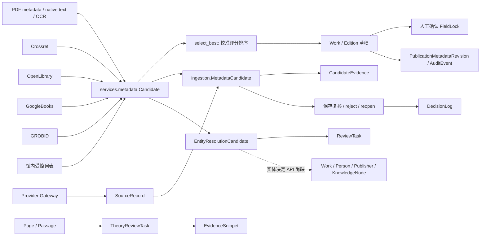
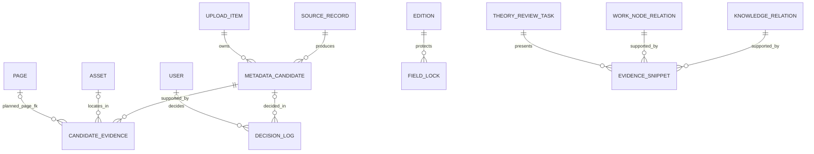
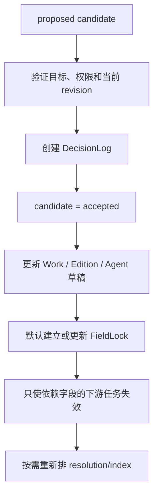

# 元数据来源、候选与实体消歧模型

更新日期：2026-08-13
状态：候选来源、证据、决定和基础消歧已部分接入；实体决定与生产迁移仍待完成

## 1. 证据边界与目标

- [SOURCE] 当前源码快照为 `2.6.1`，目录没有可依赖的 Git 历史。
- [SOURCE] 当前候选系统由内存 `Candidate`、数据库 `MetadataCandidate`、`SourceRecord`、`CandidateEvidence`、`EntityResolutionCandidate`、`ReviewTask`、`DecisionLog`、`FieldLock`、`PublicationPlaceEvidence`、`EvidenceSnippet` 和若干审核/审计表组成。
- [USER] 解析器、规则、外部 Provider 和 LLM 只能生成候选，不能直接写入公开馆藏、权威实体、知识关系或公开页面。
- [USER] 来源必须可追踪，人工决定必须保留，外部服务不可用时本地 OCR 和人工审校仍应工作。
- [USER] 本轮不部署、不修改生产数据。本文件区分已经存在的兼容 schema 与尚未接入的运行逻辑。

## 2. 当前来源模型



### 2.1 已核实对象

| 对象 | 当前字段/能力 | 证据 |
| --- | --- | --- |
| `Candidate` | field_name、value、source、confidence、evidence dict | `api/ingestion/services/metadata.py:20-26` |
| `SourceRecord` | provider、operation、query、request fingerprint、external ID、raw response、版本、过期时间和状态 | `api/ingestion/models.py:310-346` |
| `MetadataCandidate` | legacy 值与 selected；lifecycle、normalized value、source record、conflict group、score factors、lock、接受/拒绝人和时间 | `api/ingestion/models.py:349-401` |
| `CandidateEvidence` | candidate、Asset、SourceRecord、页码、bbox、短引文、来源类型、外部 ID、提取方法和模型版本 | `api/ingestion/models.py:404-438` |
| `EntityResolutionCandidate` | target/source、候选实体、别名、外部 ID、支持属性、分数、理由、冲突、预览和审核结果 | `api/ingestion/models.py:441-493` |
| `ReviewTask` | 通用审核目标、状态、优先级、指派和完成信息 | `api/ingestion/models.py:496-552` |
| `DecisionLog` | 候选/消歧/任务关联、actor、before/after、reason、correlation ID | `api/ingestion/models.py:555-601` |
| `FieldLock` | Edition 字段、锁定者、锁定值、原因，字段唯一 | `api/ingestion/models.py:604-614` |
| `PublicationPlaceEvidence` | 原值、规范值、地点类型、provider、record ID、页码、文本、审核状态 | `api/catalog/models.py:839-901` |
| `EvidenceSnippet` | Work/Asset/Node/Relation、页码、印刷页、quote、bbox、提取方法、审核状态 | `api/catalog/models.py:1990-2048` |
| `TheoryReviewTask` | 候选节点/关系、confidence、证据页和文本、审核状态 | `api/catalog/models.py:2133-2173` |
| `AuditEvent` | actor、action、对象、before/after、request ID | `api/ingestion/models.py:617-629` |

### 2.2 已核实问题

- [SOURCE] `_persist_candidates()` 已委托 `candidate_store.persist_metadata_candidates()`。它按 field/source/normalized value upsert，保留 accepted/rejected/locked，失效的 proposed 标为 superseded，不再 delete all。
- [SOURCE] Provider Gateway 已把真实成功、失败和缓存结果写入 SourceRecord，并把 source_record_id 附到候选证据。
- [SOURCE] `select_best()` 调用 `metadata_scoring.ranked_candidates()`；candidate_store 把校准 score 写入 confidence，并把细项写入 score_factors。
- [SOURCE] Crossref、Open Library、Google Books 和 GROBID 的 resolver 仍在 `metadata.py`，但主 pipeline 和建议刷新统一通过 `provider_gateway.py` 调度。旧 `enrich_candidates()` 保留兼容，当前主路径不调用。
- [SOURCE] Provider 错误由 Gateway 转为 warning 和失败 SourceRecord，本地候选继续处理，不再由主路径静默吞掉。
- [SOURCE] `MetadataReviewView.put` 使用外层数据库事务；字段更新、FieldLock、`accept_candidates_from_review()` 和 DecisionLog 在同一请求事务中完成。单项 reject/reopen 也由事务 service 写 DecisionLog。
- [SOURCE] CandidateEvidence 已由 candidate_store 创建，保存页码、短引文、bbox、外部标识与 SourceRecord。legacy evidence JSON 仍保留用于兼容。
- [SOURCE] `api/tests/test_metadata_provider_gateway.py` 覆盖成功/失败 SourceRecord、同 item 缓存、人工决定保留、stale proposal supersede、证据关联和候选决定；`test_ingestion_reconciliation.py` 覆盖同名不自动合并及 pipeline 不产生公开学者副作用。
- [SOURCE] EntityResolutionCandidate 已由 `reconciliation.py` 生成并随 UploadItem 返回，复核页显示匹配理由。尚无实体候选接受/拒绝/新建草稿的决定 API。

## 3. 设计原则

1. [USER] 自动过程只提出 proposal，正式字段和正式关系由服务器端审核动作写入。
2. [INFERRED] confidence 是可校准的系统评分，不采用 LLM 自报分数。
3. [INFERRED] 候选、来源记录、证据和人工决定分别保存，不能把四种信息压入一个 JSON。
4. [INFERRED] accepted 和 rejected 都是历史证据。重新运行不得删除。
5. [INFERRED] 原始值与规范值同时保留。规范化失败不丢失原文。
6. [USER] 出版地必须来自具体版本证据，不从出版社当前总部反推历史出版地。
7. [USER] 人物不能仅凭姓名自动合并。
8. [INFERRED] 外部 URL 优先保存 provider + external_id；确需 URL 时必须经过 provider adapter 构造或 allowlist 校验。
9. [INFERRED] 知识关系继续使用现有 EvidenceSnippet。元数据证据新增专用关联对象，先在 API 层统一 evidence contract，避免强行把不同约束塞入一张多态表。

## 4. 目标来源关系



## 5. SourceRecord

[SOURCE] `SourceRecord` 已由 `0008_admin_redesign_foundation.py` 创建，并由 `provider_gateway.invoke_provider()` 实际写入。当前字段和仍需补足的能力如下。

| 字段 | 用途 |
| --- | --- |
| provider | crossref、openlibrary、google_books、grobid、pdf_metadata、ocr 等受控值 |
| operation | lookup_book_by_isbn、search_book、lookup_doi 等 |
| request_fingerprint | 规范化请求的 SHA-256，支持缓存和幂等 |
| query | 脱敏、规范化后的查询参数 JSON |
| external_id | DOI、ISBN、provider record ID 等 |
| raw_response | 必要字段或允许保存的响应快照，模型已存在 |
| provider_version | API/adapter/schema 版本 |
| retrieved_at | 获取时间 |
| expires_at | 缓存过期时间 |
| status | 当前仅 pending、succeeded、failed；更细错误通过 error_code 表达 |
| error_code / error_message | 结构化失败信息，模型已存在，禁止记录密钥 |
| duration_ms | 当前缺失，可在有观测需求时 additive 增加 |

- [INFERRED] response_payload 应设置大小上限。含敏感或版权正文的响应不应无界保存。
- [SOURCE] request_fingerprint 只有普通组合索引。Gateway 按 upload_item/provider/operation/fingerprint/有效期读取缓存，允许不同 UploadItem 分别保留来源记录。
- [INFERRED] 是否需要跨 item 全局缓存，应根据频率、来源许可和 provenance 需求评估。不能在未处理历史重复前直接增加唯一约束。

## 6. MetadataCandidate 的兼容扩展现状

[SOURCE] 当前 `ingestion.MetadataCandidate` 已完成 additive 扩展，candidate_store 已消费其中大部分字段。以下表格区分运行中字段与仍缺能力。

| 字段 | 建议 | 兼容方式 |
| --- | --- | --- |
| target_entity_type / target_entity_id | 缺失 | 初期允许为空，沿用 upload_item |
| field_path | 缺失 | 从 field_name 回填，保留 field_name |
| raw_value | 继续使用 legacy value | 第一轮无需复制一份同义 JSON |
| normalized_value | 已存在 | candidate_store 已写入 NFKC/结构化规范值 |
| source_kind | 继续使用 legacy source | 可先由 Gateway 规范受控值，不急于重复字段 |
| source_record | 已存在 | Gateway 候选已写入 |
| lifecycle | 已存在 proposed、accepted、rejected、superseded | candidate_store 维护 proposed/superseded 并保留人工状态；迁移把旧 selected=true 回填 accepted |
| conflict_group | 已存在 | candidate_store 按 item+field 生成稳定组 |
| score_factors | 已存在 | candidate_store 写入 calibration factors |
| accepted/rejected actor 与时间 | 已存在并已消费 | 保存复核接受匹配候选；单项 reject/reopen 写 actor/time 与 DecisionLog |
| superseded_by | 缺失 | 可在需要精确替代关系时 additive 增加 |
| is_locked | 已存在并已消费 | 保存复核时按 lock_fields 与 FieldLock 同事务写入；单项已锁候选禁止拒绝 |

- [INFERRED] 原 `value`、`source`、`evidence`、`selected` 第一轮保留并短期 dual-write。
- [INFERRED] 新约束只能在回填和验证后增加。首轮不得把历史空值设为 non-null。
- [INFERRED] 候选刷新改为基于 `upload_item + field_path + normalized_value + source_record` upsert。旧 proposed 可标 superseded，accepted/rejected 不改动。

## 7. CandidateEvidence

[SOURCE] 元数据候选证据表已经以 `CandidateEvidence` 命名存在。不得再创建同义的 MetadataEvidence。知识关系继续使用 EvidenceSnippet。

建议字段：

- [SOURCE] 已有 metadata_candidate、asset、source_record、page_number、bbox、text_quote、source_kind、external_identifier、extraction_method、model_name、model_revision 和时间字段；candidate_store 已写入并去重。
- [SOURCE] 首次元数据阶段可能早于 Asset 创建。candidate_store 会在后续同证据再次出现且 item.asset 已存在时补写空 Asset FK。
- [INFERRED] 可按真实 UI 需求 additive 增加 Page FK、printed_page_label 和 evidence confidence。当前 page_number 的基准必须在 API 契约中明确，不能让调用方猜是零基还是一基。

[INFERRED] API 层可把 CandidateEvidence 和现有 EvidenceSnippet 序列化为共同格式：

```json
{
  "source_kind": "pdf_copyright_page",
  "file_page_index": 4,
  "printed_page_label": "2",
  "bbox": [0, 0, 0, 0],
  "text_quote": "北京：某某出版社，2019",
  "external_provider": "",
  "external_id": ""
}
```

- [USER] quote 只保存支持候选所需的短证据，不把完整 PDF 发送给外部服务。
- [INFERRED] 对 provider 记录，evidence 可指向 SourceRecord 和 provider record ID，不必复制整个响应。

## 8. 候选评分

### 8.1 当前行为

- [SOURCE] 当前大多数来源仍把原始 confidence 写成固定或 rank 派生数值。
- [SOURCE] `calibrate_candidate()` 已综合来源可靠度、独立来源一致、证据存在、ISBN/DOI 强匹配和冲突惩罚，见 `api/ingestion/services/metadata_scoring.py:48-104`。
- [SOURCE] AI/LLM 来源的自报 confidence 不直接采用。评分器把其 declared component 固定为 0.5，相关测试见 `api/tests/test_metadata_scoring.py`。
- [SOURCE] `select_best()` 和 `overall_confidence()` 已使用校准分数，见 `api/ingestion/services/metadata.py:828-849`。
- [SOURCE] candidate_store 已把校准 score 写入 confidence，把详细因素写入 score_factors。
- [SOURCE] 来源可靠度仍是代码中的固定表，没有使用馆内历史接受率校准，也没有评分版本数据库记录。

### 8.2 目标评分因素

[INFERRED] 评分服务应输出 `score` 与 `explain`，至少包含：

1. identifier_exact：ISBN、DOI、VIAF 等强标识符精确匹配。
2. evidence_role：标题页、版权页、CIP 页的字段证据权重。
3. independent_agreement：独立来源一致数量。
4. bibliographic_similarity：题名、责任者、年份、语言和版本层次一致度。
5. provider_reliability：本馆历史审核结果中的来源准确率。
6. extraction_quality：OCR/文本层置信度和字符异常率。
7. existing_entity_consistency：与已有 Edition/Agent 的属性一致性。
8. conflict_penalty：强冲突的数量和严重度。
9. hierarchy_fit：候选属于 Work 还是 Edition，避免层次错配。

[USER] LLM 返回的 confidence 只能视为原始输出字段，不能直接成为系统 score。

## 9. 接受候选的事务



- [SOURCE] 保存复核在 `MetadataReviewView.put` 的事务内更新正式字段和 FieldLock，再由 `accept_candidates_from_review()` 接受与最终表单值相同的最高分候选，并写 DecisionLog。
- [SOURCE] 单项候选 endpoint 只接受受控 action `reject` 或 `reopen`。已接受或锁定候选不能直接拒绝，必须改选正式字段并保存。
- [SOURCE] provider/pipeline 重跑会保留 accepted、rejected 和 locked；新冲突保持 proposed，缺失的未锁 proposed 才标 superseded。
- [SOURCE] 当前接受动作由保存表单最终值触发，前端没有单独的 accept candidate API，也没有目标 revision 乐观锁。并发复核与旧页面提交仍需专门测试。
- [INFERRED] rejected 候选可补必填 reason。当前 DecisionLog 有 reason 字段，但 reject/reopen endpoint 没有接收管理员理由。

## 10. 实体消歧模型

### 10.1 当前人物行为与剩余风险

- [SOURCE] 自动 pipeline 已不创建或按姓名复用 Person。`_propose_people()` 只生成 Person 候选和 `person_draft` 候选，已有同名人物不会被自动合并。
- [SOURCE] 人工复核中，只有明确提交 `author_ids` 才复用既有 Person。自由文本作者会创建 authority_status=draft 的新 Person，并仅创建 editorial_status=draft 的 ScholarProfile。
- [SOURCE] 这一行为阻止错误自动合并和公开，但在实体决定 API 完成前，同一自由文本反复录入仍可能形成多个 draft Person。
- [USER] 同名人物不得只凭姓名自动合并，创建权威人物与创建公开 ScholarProfile 必须分开。

### 10.2 兼容方向

[SOURCE] 当前快照选择复用已有权威对象，避免建立同义表：

- Person 继续表示人物；aliases、external_ids 和 authority_status 已能承载第一阶段人物权威信息。
- PublisherAuthority 继续表示出版机构权威；Edition 同时保留 publisher 原样值。
- KnowledgeNodeAlias 继续保存知识节点别名。
- EntityResolutionCandidate 保存待确认匹配和 match reasons，不新增 AgentMatchCandidate。
- ScholarProfile 继续作为可选公开策展对象，不等同于 Person 权威记录。

[INFERRED] 机构贡献者确有入库需求时，可新增 OrganizationAuthority 或经过论证的统一 Agent。第一轮不应为了名称一致而复制 Person、PublisherAuthority、KnowledgeNodeAlias 已覆盖的职责。

- [SOURCE] `reconciliation.py` 已实现 Person、Work、PublisherAuthority 和 KnowledgeNode matcher，使用规范化字符串/相似度并返回属性、理由和冲突。它会持久化候选和 ReviewTask。
- [SOURCE] `metadata-review.tsx` 只展示消歧候选并引导回现有选择器。实体决定 service/API 和真正的 `EntityReconciliationPicker` 尚未实现。

### 10.3 reconciliation 返回契约

```json
{
  "entity_id": "uuid",
  "label": "皮埃尔·布迪厄",
  "aliases": ["Pierre Bourdieu"],
  "entity_type": "person",
  "external_ids": {"viaf": "..."},
  "supporting_properties": {"birth_year": 1930, "death_year": 2002},
  "match_score": 0.91,
  "match_reasons": ["name_alias", "life_dates"],
  "conflicts": [],
  "preview_data": {}
}
```

[INFERRED] 管理员必须能选择关联现有实体、创建新草稿、保留未解析名称、忽略或稍后处理。

## 11. Provider Gateway

### 11.1 当前实现

- [SOURCE] 当前已有 Crossref DOI/题名、Open Library ISBN/题名、Google Books ISBN/题名和 GROBID 期刊解析。
- [SOURCE] `api/ingestion/services/provider_gateway.py` 已统一调用现有 resolver，提供 provider enable、host allowlist、有限 retry、Redis 缓存、最小请求间隔、简单 circuit breaker、响应大小上限、SourceRecord 和错误映射。
- [SOURCE] `run_pipeline()` 与管理员刷新建议 API 已改用 Gateway。provider 失败转为 warning，本地解析继续。
- [SOURCE] 配置项已加入 `api/config/settings.py:369-404` 和 `.env.example:93-101`。
- [SOURCE] 国家图书馆、全国馆社共荐和 CNKI 当前只提供人工核对链接，不自动抓取，见 `api/ingestion/services/metadata.py:537-590`。
- [INFERRED] OpenAlex、VIAF、LOC、ORCID、Wikidata 和 WorldCat 在后续阶段按授权和必要性增加，普通测试继续使用 fixture/mock。

### 11.2 接口语义

```text
lookup_book_by_isbn
search_book
lookup_work
lookup_doi
search_agent
lookup_agent
search_subject
health_check
```

当前 Gateway 已具有：

- [SOURCE] 调用 resolver 使用统一 timeout；Gateway 提供有限 retry、provider 级最小间隔、缓存和 circuit breaker。
- [SOURCE] SourceRecord 保存有大小上限的原始响应、candidate snapshot、provider version、尝试次数和结构化错误。
- [SOURCE] 网络异常不使整条入库失败。
- [USER] 明确 allowlist 和 SSRF 防护，不抓取未授权网页。

[INFERRED] 后续仍需更精确的 connect/read timeout、非阻塞限流、深度 health、provider contract 版本与管理员可见诊断。当前 `provider_configuration_health()` 只检查配置，不发网络请求。

## 12. 本地 AI Service 边界

- [SOURCE] 当前已有独立 `api/ingestion/services/ai_client.py`，支持 none、ollama、vllm、openai_compatible。配置位于 `api/config/settings.py:355-369` 和 `.env.example:64-73`，默认 provider 为 none。
- [SOURCE] client 强制 HTTP/HTTPS 与明确 host allowlist，限制输入字符、并发和超时，最多尝试两次，使用 temperature 0 和严格 JSON schema。系统提示明确把 PDF 文本视为不可信数据，也没有向模型提供 tools。
- [SOURCE] `api/tests/test_ai_client.py` 以 MockTransport 验证禁用降级、host allowlist、JSON schema、提示注入保护和非法字段拒绝。
- [SOURCE] `api/tests/test_ingestion_batch_policies.py` 验证 AI 候选保持 proposed，关联 ai SourceRecord 和页内 CandidateEvidence，不能因生成成功自动接受。
- [SOURCE] UploadBatch.ai_suggestions_enabled 为 true 时，pipeline 会调用 `metadata_candidates_from_ai()`。严格 schema 输出被转换为 source=`ai_metadata_candidate` 的 Candidate，再由统一评分和 candidate_store 写入 MetadataCandidate/CandidateEvidence。关闭或不可用时本地流程继续。
- [SOURCE] AI 候选证据记录 model_name、prompt version 和 extraction method，ProcessingAttempt.output_summary 保存 provider/model/prompt/latency/candidate_count 或 unavailable 摘要。
- [SOURCE] AI 调用成功或失败会建立 provider=`ai:<provider>` 的 SourceRecord，保存输入 SHA-256/字符数、模型、prompt version、受 schema 限制的响应或结构化错误；CandidateEvidence 关联该记录。
- [SOURCE] 当前没有独立 AI run 表，也没有持久化完整配置版本或每次重试明细。AI 元数据候选属于“可选基础已接入”，不能写成完整模型治理已完成。
- [INFERRED] 下一步应复用现有 SourceRecord/ProcessingAttempt/CandidateEvidence 补运行 provenance，不另建第二个 AI 调用层。
- [USER] AI 输出必须通过严格 schema 校验，只写 MetadataCandidate、RelationCandidate 或 ReviewTask。
- [USER] AI 不得获得 Shell、文件写入、任意网络或数据库写入工具。
- [USER] PDF 文本是不可信输入，系统提示和 schema 约束不能被文档内容改写。
- [USER] 默认不发送完整 PDF 到外部服务。AI 关闭时基础入库仍需可用。
- [INFERRED] 还需持久化 model、revision、prompt version、latency、attempt、input fingerprint 和设置版本。当前 AIResult 只在内存返回部分字段。

## 13. 与 BIBFRAME 和 reconciliation 模式的关系

- [INFERRED] 当前 Work、Edition、Asset 与 BIBFRAME 的 Work、Instance、Item 分层有可比性，可用于校验对象职责，但本项目继续沿用自己的 Django 模型和公开 API。
- [INFERRED] 实体匹配交互可借鉴 OpenRefine reconciliation 的候选、属性解释和人工选择方式，但不复制其代码，也不假设协议已经实现。
- [USER] 借鉴成熟对象设计不等于引入新框架或复制其他项目的大段实现。

## 14. 回填策略

### 当前源码已提供

1. [SOURCE] 迁移 `0008_admin_redesign_foundation.py` 创建 SourceRecord、CandidateEvidence、EntityResolutionCandidate、ReviewTask 和 DecisionLog。
2. [SOURCE] 迁移为 MetadataCandidate 增加 lifecycle、normalized_value、source_record、conflict_group、score_factors、is_locked 和人工决定字段。
3. [SOURCE] 数据函数把 selected=true 映射为 accepted，其余保持默认 proposed。无法证明人工接受者时 accepted_by 为空。
4. [SOURCE] 迁移保留 legacy value、source、evidence、selected；新运行从 Gateway 开始产生真实 SourceRecord。
5. [SOURCE] `backfill_admin_foundation` 默认 dry-run，可按 item/person 限定范围，并输出 text/json/csv。它只在 legacy source 可以解析时建立标注为 `legacy-record` 的 SourceRecord，raw_response 明确写 `raw_response_available=false`，没有伪造历史网络响应。
6. [UNKNOWN] NAS 生产数据库是否已实际应用 `0008`，本地源码不能证明。

### 下一轮安全回填

1. [INFERRED] `--dry-run` 统计旧 candidate、lifecycle/selected 不一致、evidence JSON 类型和不可规范记录。
2. [INFERRED] 对历史候选，只把结构明确的页码、quote、bbox 拆为 CandidateEvidence。未知 JSON 保留在 legacy evidence。
3. [INFERRED] 历史 provider 请求没有原始响应，不能反向伪造 SourceRecord。新请求已经开始按 Gateway 记录。
4. [INFERRED] 复用 Person.aliases/external_ids、PublisherAuthority 和 KnowledgeNodeAlias 做第一轮权威回填。仅有姓名的记录进入 ReviewTask，不自动合并。
5. [INFERRED] PublisherAuthority、出版地和旧知识对象通过既有映射逐步归一。机构责任者的独立模型待真实数据审计后决定。

## 15. 回滚

- [INFERRED] 保留 MetadataCandidate.value/source/evidence/selected 和 FieldLock 原字段。
- [SOURCE] 迁移 `0008` 的数据反向函数为 noop。直接反向迁移会删除新增字段和表，却不会重建被后续运行改写的 legacy 语义。
- [SOURCE] Provider 与 AI 可按批次关闭；关闭后继续本地解析并读取旧兼容字段。候选 lifecycle service 当前没有总 feature flag。
- [INFERRED] backfill 不删除任何 candidate、Person、Work、Edition 或知识对象。
- [INFERRED] 错误回填通过记录的 migration batch ID 反向清空新字段或删除仅由该批次生成的映射，不修改旧值。
- [INFERRED] 生产开始写新表后，代码回滚保留新表，不执行破坏性的 schema reverse。
- [UNKNOWN] 生产回填批量大小和预计耗时需取得真实数据量后确定。

## 16. 验收条件

- [SOURCE] 真实 provider 调用可追溯到 SourceRecord；成功、失败和缓存均有定向测试。
- [SOURCE] 候选支持 proposed、accepted、rejected、superseded，pipeline 重跑保留人工状态。
- [SOURCE] 结构化证据可以在复核页显示页码、quote 或外部 ID；无证据的候选会明确显示缺口。
- [SOURCE] 人工接受与字段锁在同一复核事务内写入，candidate_store 不覆盖 locked/accepted。
- [SOURCE] 自动 pipeline 对同名人物只生成候选，不合并也不创建公开 ScholarProfile。
- [SOURCE] provider 或 AI 不可用时返回 warning/unavailable，本地候选继续。生产网络条件下的完整人工上架仍待部署环境验收。
- [INFERRED] 下一阶段验收重点是实体决定 API、同作品不同版本复用、并发复核和通用 ReviewTask 工作台。
- [INFERRED] 日志不包含 API key、完整 PDF 正文或无界 provider payload。
