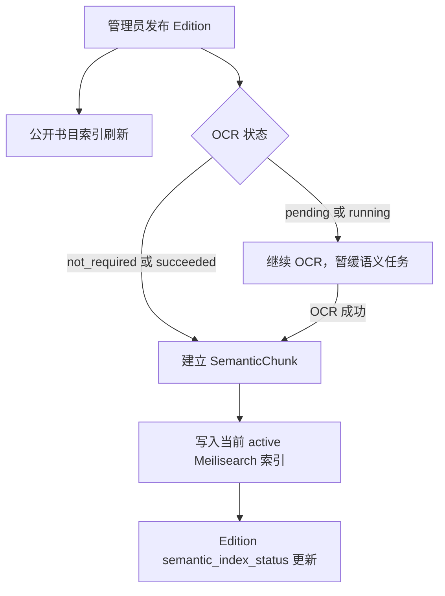
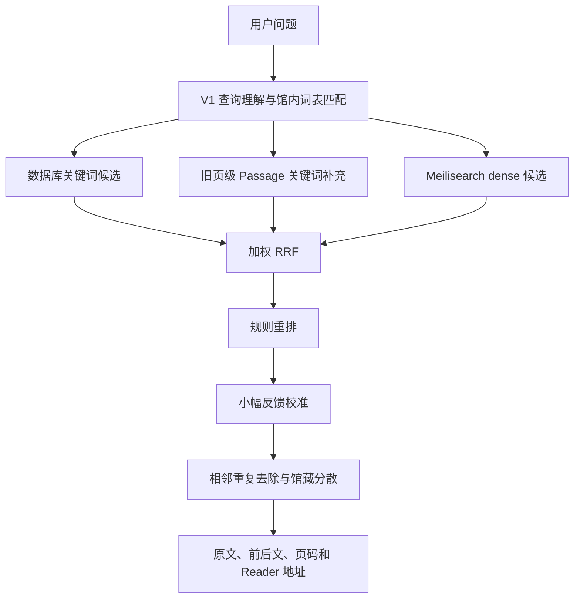
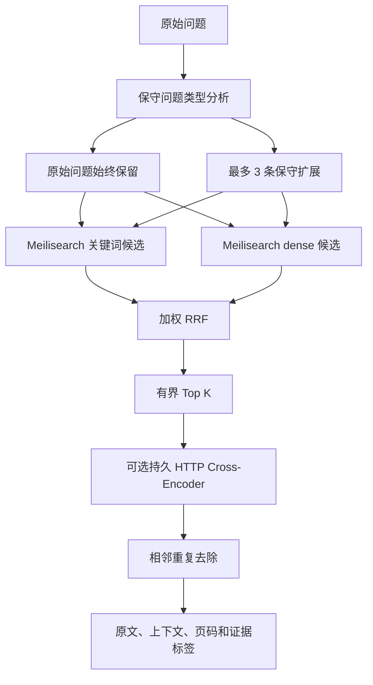

# 观点检索 V2 源码审计

更新日期：2026-08-15

## 1. 证据边界

- [SOURCE] 本文依据当前可读取源码，不把历史部署记录当作当前生产状态。
- [SOURCE] 当前目录没有 `.git`，因此不能用分支、提交或 HEAD 描述版本关系。
- [SOURCE] 本轮审计覆盖 `semantic_search.py`、`semantic_search_v2.py`、`semantic_reranker.py`、`semantic_chunks.py`、`semantic_indexing.py`、`search_evaluation.py`、观点检索 API、后台查询检查器和公开观点检索页。
- [UNKNOWN] 当前 NAS 的 Meilisearch 版本、活动索引文档内容、本地模型驻留状态、CPU、RAM、GPU、并发与公网耗时没有在本轮重新测量，均为 `待核实`。
- [UNKNOWN] 当前源码已提供 V2 路径，不代表它已在 NAS 或公网启用。模板默认 `SEMANTIC_SEARCH_V2_ENABLED=false`。

## 2. 产品目标

观点检索要找到可能构成问题回答依据的馆藏原文。它与普通主题检索的判断标准不同。

以“农业组织化的出路是什么”为例，介绍农业合作史的段落属于同主题材料。提出组织形式、利益联结机制或制度安排的原文，才更可能具有回答价值。当前评估等级已经据此调整。

| 等级 | 含义 | 是否计为有效证据 |
| --- | --- | --- |
| 0 | 不相关 | 否 |
| 1 | 同主题但未回应 | 否，作为困难负样本 |
| 2 | 对回答问题具有实质证据价值 | 是 |
| 3 | 原文直接回应问题 | 是 |

## 3. 当前数据与索引基础

### 3.1 SemanticChunk

[SOURCE] 当前 `SemanticChunk` 已经保存下列 V2 所需数据。

- 稳定的 `document_id` 和数据库 UUID。
- `asset`、`work_id`、文献类型和语言。
- `page_start`、`page_end` 与页码定位信息。
- 章节、小节和自然段顺序。
- 原文、规范化文本、前一段和后一段上下文。
- 质量标记、解析版本、分块版本、embedding 模型和索引状态。

[SOURCE] 当前解析版本是 `page-blocks-v2`，分块版本是 `natural-paragraph-v1`。分块优先沿自然段和标题组织，目标长度 560 字符，上限 960 字符。上下文各保留最多 700 字符。稳定标识不包含 OCR 文本和 embedding 模型名，因此同一位置的文字修订可以复用记录身份。

### 3.2 Meilisearch 文档

[SOURCE] 当前语义文档已经写入题名、作者、章节、小节、原文、规范化文本、前后文、文件页、印刷页定位、文献类型、年份、权威关系、访问状态和公开状态。V2 的首轮查询只需要已有字段。

[SOURCE] `ensure_semantic_index()` 把题名、作者、章节、小节、原文和规范化文本设为可搜索字段。V2 的关键词路径可直接调用同一索引的普通搜索，不需要另建一个并行搜索服务。

### 3.3 索引版本

[SOURCE] `SemanticIndexVersion` 已有 building、ready、active、failed 和 retired 状态。`catalog.0025_semantic_index_v2_lifecycle` 以新增字段方式保存无密钥的配置快照，并为语义任务增加暂停请求时间。候选构建和评估读取自己的快照，不借用当前生产模型配置。模型变更提交时，当前有效设置保持不变；管理员验证并激活候选后，索引指针和有效运行设置才在同一数据库事务中更新。旧索引继续保留。

## 4. V1 的真实执行路径

### 4.1 索引阶段

[SOURCE] 管理员可以在 OCR、页码和语义索引尚未完成时确认发布。这些状态是警告和后台任务，不是发布阻断。扫描件发布后先保持可阅读，OCR 成功后再刷新全文并排语义任务。原生文本可用的文件在发布时直接排语义任务。

[SOURCE] 发布、OCR 和索引状态相互独立。某一本新书尚未完成语义索引时，已有 active 索引仍继续服务。

### 4.2 查询阶段

[SOURCE] V1 不是单一向量 Top K。它已经具备以下步骤。

1. 从查询提取中英文线索，并匹配馆内理论流派、主题和概念。
2. 从数据库 `SemanticChunk` 做 `icontains` 候选，再以词项覆盖、字符 n-gram、原句和题名相似度排序。
3. 对尚无 SemanticChunk 的历史文献，从页级 Passage 补充关键词候选。
4. 从活动 Meilisearch 索引取 dense 候选。该请求使用 `semanticRatio=1.0`，因为关键词候选在另一条路径生成。
5. 用可配置的混合检索权重执行 RRF。
6. 用规则考虑词项覆盖、标题、目录或参考文献质量标记和召回名次。
7. 只有同一查询与分块至少积累 5 个不同的有效反馈记录后，才在很小范围内校准排序。`catalog.0026_semantic_feedback_deduplication` 让同一读者或同一匿名第一方会话的重复点击更新原票，不再增加票数。匿名身份只保存随机会话的 HMAC 摘要，不使用 IP。
8. 去掉同书相邻且高度重叠的分块，再按作品交错展示。

### 4.3 V1 已有价值

- [SOURCE] 结果来自已发布、当前、ready 的规范资产。
- [SOURCE] API 依据匿名、已登录和后台角色计算允许访问的资产状态。V2 在 Meilisearch Top K 之前加入 `access_status` 过滤，数据库 hydration 再次执行同一权限过滤。
- [SOURCE] 结果携带真实文件页、印刷页标签、章节、前后文和 Reader 定位地址。
- [SOURCE] 语义服务失败会降级为关键词路径，原始网络错误不会直接显示给读者。
- [SOURCE] 当前公开页不把 cosine score 显示为百分比。
- [SOURCE] V1 可通过显式 `search_version=v1` 保留为回退路径。

## 5. V1 的精度限制

| 限制 | 源码证据 | 对产品的影响 |
| --- | --- | --- |
| 关键词召回范围受数据库候选上限约束 | `icontains` 后最多读取 800 条再评分 | 馆藏扩大后可能漏掉排序较后的有效原文 |
| dense 主要衡量语义接近 | 查询与分块分别进入 embedding 检索 | 同主题段落可能排在真正回应问题的段落之前 |
| 当前 reranker 是规则 | 只使用召回名次、词项、标题和质量标记 | 不能联合阅读问题与候选后判断回答价值 |
| 查询类型较粗 | V1 只有研究问题、因果、比较等宽泛类型 | “路径”“机制”“评价”等目标没有稳定区分 |
| 改写是一条拼接查询 | 原问题与扩展概念合并为一个 dense 查询 | 相邻概念可能稀释原问题，难以单独控制权重 |
| 展示标签按名次分桶 | “高度相关”等来自当前结果排名 | 标签不能解释成相关概率或已回答问题 |
| 严格馆藏交错 | 同一作品按第一条、第二条依次交错 | 可能为了多样性压低同书中另一条独立强证据 |
| 混合权重后仍有规则加分 | RRF 后再次增加未按同一权重缩放的排序项 | 0.72 不能解释为最终排序严格含 72% 语义贡献 |

## 6. 当前 V2 的新增执行路径

[SOURCE] V2 以 feature flag 接入现有 `semantic_search()`，没有删除 V1，也没有建立第二套 PDF、OCR 或索引版本模型。

### 6.1 查询理解

[SOURCE] V2 区分 definition、cause、mechanism、comparison、path_solution、evaluation、historical_process、relationship 和 statement。扩展来自问题结构和高确定性的馆内受控概念。原始问题始终参加检索，扩展默认最多三条。

[SOURCE] “合作化”“集体化”“组织化”“市场化”等概念不会因为语义相近就自动作为同义词无限扩展。馆内概念只有已出现在原问题中，或本地匹配分数达到保守阈值时才加入。

### 6.2 双路召回

[SOURCE] V2 对同一活动索引发出普通关键词请求和 `semanticRatio=1.0` 的 dense 请求。这里称为关键词或 sparse 路径。源码没有声明它等同于标准 BM25，因此文档不把 Meilisearch 默认关键词排序误写成 BM25。

[SOURCE] 扩展查询的召回权重低于原始查询。多条候选列表先在各路径内按名次融合，再由既有加权 RRF 合并关键词与 dense 结果。

### 6.3 精排

[SOURCE] V2 默认仍使用 `rules`。只有 `SEMANTIC_SEARCH_V2_RERANK_PROVIDER=local_http` 且服务配置完整时，才把有界候选送往 `/rerank` 兼容接口。

[SOURCE] Django 进程不加载模型权重。模型应由持久服务在启动时加载一次。请求只包含查询、题名、章节、小节和截断后的候选文本。它不读取完整 PDF，也不发送整本馆藏。

[SOURCE] 服务失败、格式错误、重定向或超时时保留现有排序，并返回 `reranker_fallback`。观点检索不会因此整体报废。

### 6.4 去重与上下文

[SOURCE] V2 按全局排序依次保留候选。它去掉同一内容哈希，或同书相邻页面且文本高度重叠的结果。它没有设置“每本书只能出现一次”。同一作品的独立证据仍可同时出现。

[SOURCE] precision profile 会把前后文送入可选模型重排。最终界面继续显示命中段落、前后文、章节、文件页、印刷页和 PDF 定位。

## 7. 首轮无需重建索引的判断

[SOURCE] 当前 V2 首轮可以复用 active 索引，依据如下。

1. V2 没有更换 embedding 模型、维度、pooling 或文档模板。
2. 关键词路径使用当前索引已有的 searchable attributes。
3. dense 路径继续使用当前 embedder 和同一分块 ID。
4. 精排候选从数据库 hydrate，现有分块已含题名、章节、原文和前后文。
5. 返回页码和 Reader 地址继续使用现有 locator。

这个判断只说明代码结构不要求首轮重建。它不证明 NAS 活动索引一定完整。启用 V2 前仍要核对 active UID、实际文档数、当前分块覆盖和最小查询。

下列情况才需要建立新的候选版本并渐进回填。

- 更换 embedding provider、模型、revision、维度或 pooling。
- 修改 `documentTemplate`，需要重新生成馆藏向量。
- 更改解析或分块版本，例如正式引入新的章节结构或父子分块。
- 活动索引缺少当前必需字段或 searchable/filterable 配置。
- 历史馆藏没有当前 SemanticChunk、上下文或可靠 locator。
- 文档数、任务统计和候选快照不一致。
- 馆内评估证明必须更改索引阶段结构，单靠查询阶段无法解决。

## 8. 一手资料如何影响设计

- [Meilisearch hybrid search](https://www.meilisearch.com/docs/capabilities/hybrid_search/getting_started) 说明关键词与语义检索可以在同一索引中组合，并由 `semanticRatio` 调节。项目仍以馆内评估确定比例，不把该值当作质量概率。
- [Meilisearch Search API](https://www.meilisearch.com/docs/reference/api/search/search-with-post) 记录 `hybrid`、`semanticRatio`、过滤、排序分数和性能详情等请求参数。当前 V2 复用 POST search，并继续执行服务端访问过滤。
- [Qwen3-Reranker-0.6B 官方模型卡](https://huggingface.co/Qwen/Qwen3-Reranker-0.6B) 把该模型定义为多语种文本重排模型。它只是当前模板中的候选模型，不是已在 NAS 验证的生产选择。
- [FlagEmbedding 官方仓库](https://github.com/FlagOpen/FlagEmbedding) 说明 BGE-M3 支持 dense、lexical 和 multi-vector，且推荐用 cross-encoder 重排 embedding 召回的 Top K。项目没有因此直接更换 MiniLM；任何模型变化都要走新索引和馆内评估。
- [DAPR，ACL 2024](https://aclanthology.org/2024.acl-long.236/) 说明长文档中的 passage 检索会受到文档上下文缺失影响。当前实现先复用题名、章节和相邻段落，不从论文结果推导本馆提升幅度。

## 9. 待核实清单

- [UNKNOWN] 当前 NAS active 索引的真实 UID、Meilisearch 版本和文档数。
- [UNKNOWN] 当前馆藏中多少已发布资产具有完整 SemanticChunk 和上下文。
- [UNKNOWN] 本地 HTTP reranker 是否已部署、能否预加载，以及实际模型版本。
- [UNKNOWN] Rerank Top K 为 8、12、16、24、32 时的中文精度、延迟和内存。
- [UNKNOWN] 单查询、5 并发与 10 并发下的 CPU、RAM、GPU、磁盘 I/O、p50、p95 和 p99。
- [UNKNOWN] 中文专著、中文期刊、繁简体、译名和中英混合查询的实际错误分布。
- [UNKNOWN] V2 相对 V1 的提升。没有完成人工标注和真实运行前，不给出百分比。
