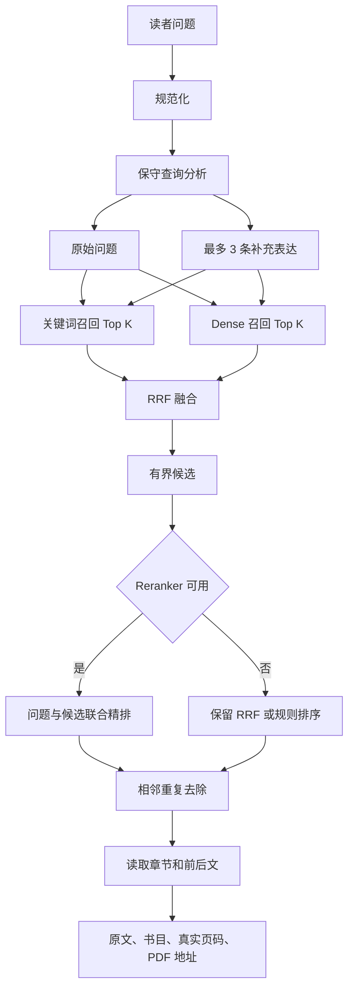

# 观点检索 V2 综合设计

更新日期：2026-08-15

## 1. 设计结论

当前最合适的路径不是立即更换 embedding 模型。先保留现有 MiniLM 和活动索引，在查询阶段增加真正的关键词召回、保守查询分析、有界 RRF、可选 Cross-Encoder 精排、相邻证据去重和上下文恢复。所有变化置于 V2 feature flag 后，V1 始终可回退。

首轮目标是证明哪些模块真的改善馆内原文排序。只有馆内人工评估表明分块或向量本身限制了召回，才建立新的候选索引并渐进回填。

## 2. 两个阶段的边界

### 2.1 Index-time，索引阶段

索引阶段发生在 PDF 发布后，由现有后台任务完成。

- PDF 预检和原生文字检测。
- 仅对需要的扫描页执行 OCR。
- 保存页面、文字块、坐标和真实页码映射。
- 建立自然段分块、章节和相邻上下文。
- 写入关键词字段和 dense embedding。
- 保存版本、文档数、模型和任务状态。

新增 V2 不能让读者每次查询时重新处理 PDF。下列操作禁止放入查询请求。

- OCR 或重新读取整本 PDF。
- 重建页面或章节。
- 重切整本书。
- 为历史馆藏重新生成 embedding。
- 建立或切换整馆索引。

### 2.2 Query-time，查询阶段

查询阶段只执行有界计算。

- 规范化问题。
- 保守识别问题类型与对象。
- 生成至多三条补充表达。
- 关键词与 dense 双路召回。
- RRF 融合。
- 对小候选集执行可选精排。
- 去掉相邻重复证据。
- 从数据库读取已保存的章节、前后文和页码。

## 3. 目标执行流程



## 4. Search Profile

| Profile | 代码中的消融含义 | 查询分析 | 召回 | 精排输入 | 用途 |
| --- | --- | --- | --- | --- | --- |
| `fast` | V2-A | 不做扩展 | 原始问题的关键词与 dense，再做 RRF | 不调用模型 | 测量双路召回本身 |
| `balanced` | V2-B | 不做扩展 | 同上 | 命中 passage，不加前后文，默认最多 12 条 | 测量小候选模型精排 |
| `precision` | V2-C | 问题类型和至多三条保守扩展 | 原始问题与低权重扩展的关键词、dense 召回 | passage 加题名、章节与相邻上下文 | 精度优先候选 |

[SOURCE] 公共默认 profile 由 `SEMANTIC_SEARCH_PROFILE` 控制。管理员诊断和评估可以显式指定版本、profile 与 Rerank Top K。普通读者不能通过 URL 任意扩大精排负载。

## 5. 查询理解

### 5.1 问题类型

V2 初期只识别有限类型，不让模型自由改写问题。

| 类型 | 示例 | 需要优先寻找的表达 |
| --- | --- | --- |
| definition | 福柯如何理解权力 | 定义、界定、意味着 |
| cause | 为什么科层制不断扩张 | 原因、由于、源于 |
| mechanism | 文化资本如何导致教育再生产 | 机制、通过、从而 |
| comparison | 布迪厄与吉登斯有何区别 | 区别、共同点、相比 |
| path_solution | 农业组织化的出路是什么 | 路径、关键、制度安排、应当 |
| evaluation | 合作社能否解决市场进入问题 | 作用、条件、局限 |
| historical_process | 乡村治理结构如何变化 | 形成、阶段、演变 |
| relationship | 市场化如何影响国家能力 | 关系、制约、互动 |

这些标记只帮助组织候选，不能单独证明段落已经回答问题。

### 5.2 保守扩展

原始问题始终拥有最高权重。补充表达只提高召回，不替换原问题。

以“农业组织化的出路是什么”为例，可增加：

- 农业组织化 发展路径
- 农业组织化 制度安排
- 农业组织化 关键在于

不能自动把合作化、集体化、组织化和市场化当作同义词。馆内受控概念只有出现在原问题，或本地匹配达到保守阈值时才进入扩展。

## 6. 双路召回与 RRF

### 6.1 关键词路径

V2 使用活动 Meilisearch 索引的普通搜索作为全量关键词路径。源码没有把其默认排序声明为标准 BM25，因此产品和文档统一称为“关键词召回”或“sparse 路径”。如果以后明确加入标准 BM25，需要单独记录实现、版本和 benchmark。

Meilisearch 不可用时，现有数据库关键词和页级 Passage 仍作为有限降级。这个降级用于可用性，不应作为完整 V2 精度评估结果。

### 6.2 Dense 路径

Dense 路径继续使用当前活动索引的 embedder。首轮不换模型。每次请求使用 `semanticRatio=1.0` 取得纯 dense 候选，再由应用层与关键词候选融合。

### 6.3 RRF

关键词与 dense 的原始分数不可直接相加。V2 延续 rank-based fusion。`SEMANTIC_SEARCH_RATIO` 只控制 RRF 中两条召回路径的相对权重。

该值不是以下任何一种数值。

- 结果正确率。
- 段落回答问题的概率。
- 最终排序中可严格解释的语义占比。

它还会受到后续精排、反馈和去重影响，必须使用代表性馆内查询调参。[Meilisearch 官方文档](https://www.meilisearch.com/docs/capabilities/hybrid_search/advanced/custom_hybrid_ranking) 同样把 `semanticRatio` 用于关键词与语义结果的权衡，而不是质量概率。

## 7. Reranker

### 7.1 职责

embedding 负责把可能相关的原文召回。Reranker 联合读取问题与候选，判断候选是否值得排在其他候选之前。它不生成答案，也不改写馆藏原文。

### 7.2 当前 adapter

[SOURCE] `semantic_reranker.py` 实现有界 `local_http` adapter，使用常见 `/rerank` 请求格式。

- 最多处理 64 条候选。
- 每条文本默认最多 4000 字符，上限 8000。
- 单次请求总候选文本最多约 96000 字符。
- 查询最多 1200 字符。
- 主机必须出现在 allowlist。
- 禁止 URL 中出现凭据、查询参数或片段。
- 不跟随重定向。
- 响应超过 1 MiB 会拒绝。
- API key 只在服务端 Authorization header 中发送。

### 7.3 模型运行方式

模型必须运行在持久进程或独立模型服务中。NAS 启动时加载一次，并持续处理多次查询。Django 不应在每次请求中加载和卸载权重。

模板提供 `Qwen/Qwen3-Reranker-0.6B` 作为候选名称。它的[官方模型卡](https://huggingface.co/Qwen/Qwen3-Reranker-0.6B)记录 0.6B 参数与多语种支持。该信息只能说明模型候选能力，不能替代本馆中文 benchmark 或 NAS 资源测量。

`BGE-reranker-v2-m3` 等多语种 cross-encoder 也可以进入相同 adapter 的候选测试。[FlagEmbedding 官方仓库](https://github.com/FlagOpen/FlagEmbedding)建议把 cross-encoder 用于 embedding 召回后的 Top K 重排。最终模型要由馆内数据决定。

### 7.4 降级

下列情况立即保留 RRF 或规则排序。

- provider 为 `rules`。
- URL、模型或 allowlist 不完整。
- 服务连接、超时或推理失败。
- 服务返回重定向。
- 返回格式、候选 index 或分数无效。

响应中的 `reranker.applied`、`reranker_fallback` 与原因用于后台诊断。需要模型精排的 benchmark 只有所有查询都实际调用模型，且降级率为 0，才可以作为该变体的有效结果。

## 8. Parent Context

当前无需新建父子分块表。小 passage 继续负责召回。题名、章节、小节、前一段、命中段和后一段组成受控 parent context，用于 precision profile 的重排和读者核对。

[DAPR，ACL 2024](https://aclanthology.org/2024.acl-long.236/)说明长文档 passage 检索需要考虑文档上下文。项目只把这一研究用作设计依据，不把论文中的实验幅度外推到本馆。

如评估发现 700 字符相邻上下文不足，下一步应先改变 context builder 和评估，再决定是否改变索引 schema。不要直接把 embedding chunk 无限扩大。

## 9. 证据标签与公开界面

公开界面不显示 cosine 百分比。V2 使用以下保守标签。

- 可能回应。
- 相关论述。
- 语义近似。
- 背景材料。

“可能回应”仍不是事实判断。当前代码只有在模型排位、问题类型信号和词项覆盖同时满足时才使用它。规则路径不会仅凭向量分数标成直接回应。

每条结果必须保留：

- 馆藏题名与责任者。
- 命中原文。
- 章节和小节。
- PDF 文件页。
- 经确认或推断的印刷页标签。
- 前后文。
- 回到 Reader 的稳定地址。

公开页先等待稳定排序再显示主结果。路由 loading 页面使用克制的两阶段文字提示。“正在匹配馆藏原文”随后变为“正在比较候选原文”。

## 10. 发布与新 PDF

### 10.1 原生文本可用

管理员发布后，公开书目索引先刷新。若 `ocr_status=not_required`，现有发布流程立即排语义任务。任务建立或更新当前 SemanticChunk，并写入活动索引。完成后该文献进入观点检索。

### 10.2 扫描 PDF

扫描件允许先发布并阅读原始图像。发布后先排 OCR。OCR 成功后刷新全文，设语义状态 pending，再排语义任务。索引完成前，该书不应作为半成品进入完整观点检索结果。已有馆藏不受影响。

### 10.3 OCR 失败或跳过

OCR 失败不改变 publication status。原始 PDF 继续可读。没有可靠文本时不应生成伪语义结果。管理员可以在处理中心重试。选择 skip 的扫描件保持不可全文检索，直到策略改变并完成处理。

## 11. 暂停与资源优先级

[SOURCE] 语义索引使用持久化全局暂停和单任务暂停请求。

- queued 任务可直接转为 paused。
- running 任务在分块落库或远程索引完成等安全检查点停下。
- 暂停不强杀正在提交文档的进程。
- 恢复时复用原 `index_version`，不会静默改投另一个索引。
- 候选版本按受控 batch 派发，默认模板为 1。

交互查询与后台索引当前已有独立 HTTP 请求和 Celery 任务边界。真实 NAS 是否需要独立 CPU affinity、worker nice、并发隔离或单独模型容器，必须先测量，不能在没有证据时写死。

## 12. 配置

| 环境变量 | 用途 | 模板默认 |
| --- | --- | --- |
| `SEMANTIC_SEARCH_V2_ENABLED` | 公共查询是否默认进入 V2 | `false` |
| `SEMANTIC_SEARCH_PROFILE` | fast、balanced 或 precision | `precision` |
| `SEMANTIC_SEARCH_DENSE_TOP_K` | 原始 dense 候选上限 | `50` |
| `SEMANTIC_SEARCH_SPARSE_TOP_K` | 原始关键词候选上限 | `50` |
| `SEMANTIC_SEARCH_FUSION_TOP_K` | RRF 后保留数 | `24` |
| `SEMANTIC_SEARCH_RERANK_TOP_K` | 精排候选数 | `24` |
| `SEMANTIC_SEARCH_FINAL_TOP_K` | 最终结果数 | `10` |
| `SEMANTIC_SEARCH_QUERY_EXPANSION_MAX` | 补充表达上限 | `3` |
| `SEMANTIC_SEARCH_V2_QUERY_EXPANSION_ENABLED` | 是否允许保守扩展 | `true` |
| `SEMANTIC_SEARCH_V2_RERANK_PROVIDER` | `rules` 或 `local_http` | `rules` |
| `SEMANTIC_SEARCH_V2_RERANK_URL` | 持久重排服务完整地址 | 空 |
| `SEMANTIC_SEARCH_V2_RERANK_MODEL` | 服务端模型名 | `Qwen/Qwen3-Reranker-0.6B` |
| `SEMANTIC_SEARCH_V2_RERANK_API_KEY` | 可选 Bearer 密钥 | 空 |
| `SEMANTIC_SEARCH_V2_RERANK_ALLOWED_HOSTS` | 允许访问的重排主机 | 本地服务名与回环地址 |
| `SEMANTIC_SEARCH_V2_RERANK_TIMEOUT_SECONDS` | 单次服务超时 | `15` |
| `SEMANTIC_SEARCH_V2_RERANK_MAX_TEXT_CHARS` | 每个候选最大字符数 | `4000` |

环境变量由进程启动时读取。修改后需要重启使用这些变量的 API 或 worker。模板值不是当前 NAS 有效配置的证据。

## 13. 索引生命周期

### 13.1 首轮启用

首轮 V2 不修改 embedding 或分块时，先在管理员查询检查器中显式比较 V1 与 V2。完成馆内评估后，再将 feature flag 打开。这个操作不要求建立新索引，但必须只读核对活动索引、文档数和模型健康。

### 13.2 需要重建时

通过现有 `SemanticIndexVersion` 建立独立候选 UID。冻结模型、revision、pooling、document template、解析版本和分块版本。候选任务按小批次运行。全部成功并核对实际文档数后进入 ready。管理员明确确认后再激活。旧 active 变为 retired，但不删除。

模型配置提交与生产生效已经分开。提交不同模型时，系统把新值保存到候选版本的无密钥 `config_snapshot`，但不会提前改写 `SiteSetting.semantic_search_runtime`。候选构建与评估显式使用该快照。激活时才在同一事务中更新活动版本和有效运行配置，避免旧索引在构建期间误用新模型生成查询向量。

管理命令的安全顺序如下。先 dry-run，随后建立候选，再按返回的版本 ID 继续派发。

```powershell
python manage.py backfill_library_processing `
  --phase semantic `
  --published-only `
  --stage-new-version `
  --batch-size 1 `
  --dry-run
```

```powershell
python manage.py backfill_library_processing `
  --phase semantic `
  --published-only `
  --stage-new-version `
  --batch-size 1
```

```powershell
python manage.py backfill_library_processing `
  --phase semantic `
  --semantic-version "<version-uuid>" `
  --batch-size 1
```

激活必须通过管理员 API 或后台的显式确认操作。不要用命令直接删除或覆盖 active UID。

## 14. V1 回退

V1 代码没有删除。回退分两层。

1. 查询逻辑回退。设置 `SEMANTIC_SEARCH_V2_ENABLED=false` 并重启 API，使公共查询重新使用 V1。
2. 索引回退。若曾更换模型或 schema，只在旧索引仍保留且完成只读验证后，通过现有版本切换入口重新选择已验证版本。不得先删除当前索引。

Reranker 单独失败不需要切回 V1。V2 会保留关键词、dense、RRF 和规则排序。

## 15. 反馈防操纵

公开反馈只能小幅校准排序，不能替代人工评估。相同账号，或同一匿名第一方会话，对同一问题和同一原文再次选择时会更新原票。系统不会因此增加样本数。匿名反馈使用随机会话 HMAC，不保存 IP，也不与注册账号永久关联。无法安全恢复操作者的历史记录不做猜测性回填。

评估运行另有不可变证据快照。启动运行时冻结查询、filters、当时的四级判断和稳定段落 ID，并保存 SHA-256。关键词、dense 与最终排序分数分别落库，便于解释 V1 与 V2 的差异，但这些分数均不作为正确概率展示。

## 16. 验收门槛

启用 precision profile 前至少满足：

- 人工评估集覆盖中文专著、中文期刊、繁简体、外国学者译名和中英混合问题。
- V1、V2-A、V2-B、V2-C 使用同一索引和同一人工标注比较。
- V2-B 与 V2-C 的 `reranker_applied_rate=1`，`rerank_fallback_rate=0`。
- 真实记录 Recall@20、nDCG@10、MRR、Precision@5、Top5 Useful Passage Rate 和 Top3 Direct Response Rate。
- 真实记录单查询、5 并发和 10 并发的 p50、p95、p99、CPU、RAM 和磁盘 I/O。
- 核对所有结果都能返回真实 PDF 页面，印刷页码显示逻辑正确。
- 断开 reranker 后，观点检索仍能返回可核对的降级结果。

在这些数据出现前，最终 profile、模型和 Top K 均为 `待核实`。

## 16.1 Task 2A 已实现的查询阶段边界

Task 2A 已在 V2 查询路径加入 QueryLexicon search resolver。它保留 original query，并以有限 branch 运行规范名称、确认跨语言译名和确认别名。branch 数、匹配实体数、每实体术语数和补充字符数均有集中配置。legacy mixed alias 与 generated search variant 只作为低可信的内部检索提示，不能等同于人工译名。

V2 的实体识别不再调用一套独立的 TheorySchool、Topic、Concept 字符串 matcher。它读取 QueryLexicon 的 canonical identity，并保留同词多实体的 ambiguity。孤立高歧义词不会强制收窄到某个理论对象。相关实体扩展和知识图谱扩展仍不在 Task 2A 范围内。

规则重排现在把原文字面覆盖、同一 canonical entity 的确认术语覆盖和跨语言术语覆盖作为三个可解释特征。candidate 在 branch fusion 后去重，重复 alias 不会无限累加。新建 SemanticChunk 使用 passage-level language detector，旧 chunk 和旧 active index 不会自动重建。V1 继续走原有实现，V2 仍需人工 benchmark 后才适合启用为公共默认。

## 16.2 Task 2B-0 评测边界

Task 2B-0 冻结 Task 2A 参数为 `baseline_v2a`，没有调整 branch weight、profile 或 Top K。`explicit_rewrite` 来自调用者显式提交的 rewrite，不使用 LLM。`intent_rewrite` 来自固定问题类型和固定短语表，也不使用 LLM。两者都受统一 branch 数和字符预算限制，并进入 sparse 与 dense。评测调用可以独立关闭任一 supplemental branch，公开 API 的默认行为没有改变。

正式候选池合并 V1、V2、纯 lexical 和纯 dense。人工页面以固定 seed 盲化顺序，默认折叠系统 rank 和 V2 branch provenance。任何 grade 都必须由人工核对 PDF 后填写。

Task 2B-0 只修复了一个确定性实体覆盖错误。英文 term 现在需要拉丁词边界，`field` 不再命中 `midfield`，`structure` 不再命中 `infrastructure`。中文仍按至少两个字符的词项检查，可在没有分词边界的复合词中命中。权重没有变化。

当前本地 SQLite 没有 SemanticChunk，也没有 QueryLexicon 表，因而不能形成真实跨语言质量结论。V2 feature flag 继续关闭。
