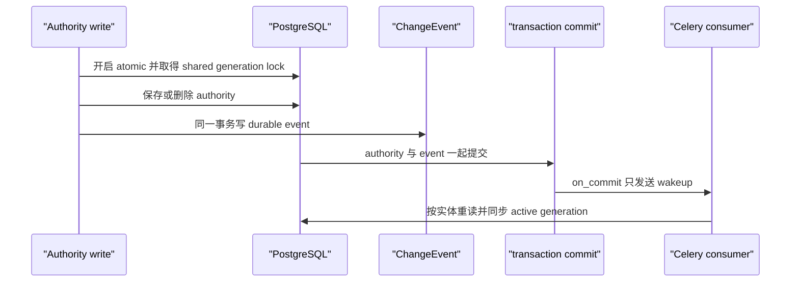
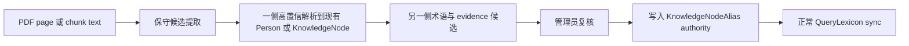

# QueryLexicon 架构与 Task 1、Task 2A 实现

更新日期为 2026-08-17。Task 0 的源码审计和详细设计已经完成。Task 1 已在源码中实现核心模型、Source Registry、事务化 outbox、增量同步、reconciliation 命令和内部 resolver。Task 1.5 已在一次性 PostgreSQL 16.15、Redis 7.4.3 和 Celery 5.6.3 环境完成并发、恢复、migration 与首次重建演练。

本次没有连接生产数据库、生产 NAS、生产 Redis、Meilisearch 或外部 Provider。Task 1.5 使用仓库外的空数据库目录和本机回环端口，不含生产数据。migration 尚未在生产执行。Task 2A 已把 QueryLexicon 接入 V2 的查询阶段代码，但 V2 仍由 feature flag 控制，尚未作为公共默认检索，也没有执行历史索引重建。本文把已经实现和验证的能力与 Task 2B 至 Task 4 的后续工作分开记录。

## 1. 目标和非目标

QueryLexicon 是社会科学双语术语的可重建派生索引。它从 Person、PersonNameVariant、KnowledgeNode、KnowledgeNodeAlias，以及仍保留独立身份的旧 authority 对象提取术语。

当前目标包括以下内容。

- 以 canonical entity 为中心保存术语。同一个字符串可以指向多个实体，一个实体也可以有多个译名。
- 区分规范名、译名、别名、缩写、历史名称、音译和内部检索变体。
- 保存来源类别、可信度、语言、展示许可和解析 scope。
- 在 authority 变化后只重建对应实体。
- 使用 revision 标识当前查询解析状态。
- 通过 staging generation 安全执行全量或定向 reconciliation。

QueryLexicon 不承担以下职责。

- 它不是新的 authority。管理员不能只改 QueryLexiconEntry。
- 它不接受未经复核的 PDF 或网络术语直接进入活动词表。
- Task 1 不修改观点检索、ranking、PDF pipeline、联网补充、RAG、自动完成或前端。
- Task 1 不把词表写入 embedding 文档，也不触发语义索引重建。
- 它不根据同名或字符串相似度自动合并人物与知识对象。

## 2. 当前源码审计

### 2.1 混合别名

`Person.save()` 会把 `preferred_name`、`original_name` 和现有 `aliases` 一起交给 `catalog.services.aliases.search_aliases()`。`NamedKnowledgeObject.save()` 对 `name` 和 `search_aliases` 做相同处理。

该函数会加入 NFKC、casefold、Unidecode、拼音、拼音首字母和空格拼音。JSON 字段因此混合了人工名称与机器变体，也没有语言、类型、审核人和来源版本。现有值不能批量恢复成可靠译名。

Task 1 保留这些字段以兼容旧代码。Registry 将其默认降为 `legacy_mixed_alias` 或 `generated_search_variant`，并设为不可展示。

### 2.2 KnowledgeNodeAlias 与 migration 0013

KnowledgeNodeAlias 已经保存 language 和 alias_type，并继续保留 `(node, normalized_alias)` 唯一约束。Task 1 没有改写它的原始数据。

`0013_seed_normalized_knowledge_nodes.py` 曾把 TheorySchool、Subdiscipline 和 Concept 的 `search_aliases` 写入 KnowledgeNodeAlias。该 migration 用 `isascii()` 推断英文，并把所有 ASCII alias 标成 translation。拼音和普通检索形式因此可能带有错误的 translation 标签。

Registry 会用 mapped legacy 对象的 `foreign_name` 和 `search_aliases` 保守识别疑似 seed。命中该规则的 alias 不会因历史 language 或 alias_type 自动升级为 verified translation。识别规则可能产生审计误报，真实污染比例仍需在生产 dry-run 后核对。

### 2.3 LegacyKnowledgeMapping

Migration 0013 为 TheorySchool、Subdiscipline 和 Concept 建立了 LegacyKnowledgeMapping。`migration_status=mapped` 时，长期 canonical identity 使用 KnowledgeNode。旧对象只提供 term 和 provenance。

`needs_review`、`duplicate`、`rejected` 或没有 mapping 时，不做字符串合并。旧对象仍保留自己的身份，直到编辑决定改变 mapping。

Discipline、Topic，以及没有接受 mapping 的旧对象继续使用自身 UUID。Task 1 没有重构旧后台编辑界面。

### 2.4 Authority 写入口

已核查 Django Admin、DRF serializer、生命周期接口、节点合并与回滚、entity resolution、admin backfill、taxonomy 和现有管理服务。当前运行时代码均通过默认 manager、`save()` 或 `delete()` 修改 Task 1 管理的 authority 模型。

Task 1 使用 model mixin 和自定义 QuerySet 覆盖 `save`、`delete`、`update`、QuerySet `delete`、`bulk_create` 和 `bulk_update`。没有使用 signal。

直接 SQL、`save_base()`、私有 `_raw_delete()`、fixture 原始导入或绕过默认 manager 的代码仍可漏记事件。当前仓库没有发现这些运行时写入口。以后若增加，必须显式接入 outbox，或立即运行 reconciliation。

### 2.5 语义检索边界

Task 1 本身不参与 SemanticChunk、embedding 文档、Meilisearch 文档或 SemanticIndexVersion。Task 2A 在后续独立变更中只让 V2 的 query-time path 读取 QueryLexicon；V1、embedding 文档模板、Meilisearch schema 和 SemanticIndexVersion 仍不读取词表。

## 3. 数据来源可信度分层

Task 1 不保存最终搜索 ranking weight。排序权重将在 Task 2 通过双语 benchmark 决定。当前 schema 使用可解释的分类字段。

| 来源 | term_type | source_kind | trust_level | 默认展示 |
| --- | --- | --- | --- | --- |
| 已确认 authority canonical 字段 | canonical | authority_field | authoritative | 是 |
| 已核验 PersonNameVariant | translation、alias、abbreviation、historical、transliteration | person_name_variant | verified | 由 displayable 决定 |
| 人工建立的 KnowledgeNodeAlias | 保留 alias_type | knowledge_node_alias | verified | historical 默认不展示 |
| 尚未确认的结构化名称 | 保留声明类型 | 对应结构化 source kind | unverified | 否 |
| mapped legacy 的明确名称字段 | alias 或 translation | legacy_authority_field | verified 或 unverified | 取决于来源状态 |
| JSON 混合 aliases | search_variant | legacy_mixed_alias | legacy | 否 |
| NFKC、casefold、Unidecode、拼音等 | search_variant | generated_search_variant | generated | 否 |

`term_type` 表达术语语义。`source_kind` 表达来源类别。`trust_level` 表达审核可信度。这三项不能用一个浮点数替代。

## 4. 推荐并已实现的数据模型

### 4.1 Person.merged_into

Person 新增可空的自关联 `merged_into`。新 ORM 写入遵守以下规则。

- merged 状态必须有目标。
- 非 merged 状态不能带目标。
- 不能合并到自身，不能形成循环。
- 最终 survivor 不能是 rejected 或 archived。

数据库保留自合并检查约束。状态与目标的一致性由 model 和 QuerySet mutation validation 执行。没有直接添加强制 merged target 的数据库约束，因为旧 schema 已允许 merged，却没有目标字段。生产中若存在这类历史行，本任务不能猜测 survivor。

Registry 不为 merged Person 建立独立 canonical entry。只有显式 merge 关系中的旧名称才归入最终 survivor，并以 historical 或相应结构化 variant 保存。

### 4.2 PersonNameVariant

PersonNameVariant 是以后人物译名和别名的结构化 authority 来源。

主要字段如下。

| 字段 | 说明 |
| --- | --- |
| person | 所属 Person |
| name、normalized_name | 原名与统一规范化值 |
| language | 保守规范化后的语言标签 |
| variant_type | translation、alias、abbreviation、historical、transliteration |
| source_kind、source_note | 编辑、权威导入、旧名复核等来源 |
| displayable、is_verified | 展示许可与审核状态 |
| created_by、created_at、updated_at | 责任人与时间 |

约束包括同一 Person 下 normalized_name 唯一、可展示值必须 verified、名称不能为空，以及 variant_type 和 source_kind 白名单。

机器生成的 casefold、Unidecode、拼音和拼音首字母不能写入该表。实例写、QuerySet 字符串更新和 bulk 写都会同步 normalized_name。

### 4.3 QueryLexiconEntry

Entry 属于一个 generation。主要字段包括以下内容。

- `entity_type` 与 `entity_id`
- `term` 与 `normalized_term`
- `language` 与 `term_type`
- `source_kind` 与 `trust_level`
- `source_ref`、`source_fingerprint` 与 `provenance`
- `displayable`
- `public_active` 与 `admin_resolvable`

同一个 normalized_term 可以对应多个实体。同一 generation、实体和 normalized_term 只保存一行。多个来源会合并进 provenance 的 `sources` 列表。代表性来源按明确的 trust 和 term type 优先次序选择，这个次序只处理同实体同术语的来源聚合，不是观点检索 ranking。

数据库约束保证空术语不可写入、public entry 必须同时 admin resolvable、legacy 和 generated 来源不可展示、generated 来源只能是 search_variant。

### 4.4 QueryLexiconGeneration

Generation 状态包括 `staging`、`active`、`retired`、`failed` 和 `discarded`。它保存起始与切换 event 序号、规则版本、切换时内容 hash、entry 数量、构建统计和生命周期时间。

数据库最多允许一个 status 为 active 的 generation。State 对 active generation 使用 PROTECT。

failed、retired、discarded generation 在 Task 1 中都不自动删除。`effective_content_hash` 是切换时快照。增量同步不会为它重新扫描全表。

### 4.5 QueryLexiconState

State 使用固定主键 `default`。它保存以下状态。

- 单调递增 revision
- active generation 指针
- normalization 与 Source Registry 版本
- 最近一次成功增量同步时间
- 最近一次 reconciliation 时间、hash 和 revision

State 指针是 resolver 的读取依据。State 与 generation 的状态或规则版本不一致时，读取和写入都失败，不自行猜测其他 generation。

### 4.6 QueryLexiconChangeEvent

ChangeEvent 是唯一持久 outbox 和审计事件。核心载荷保存 canonical entity、action、来源模型、来源对象和 correlation id。消费元数据保存 lease、attempts、next attempt、错误、processed revision 和 dead-letter 状态。

Task 1 没有建立 QueryLexiconSyncJob。每条 ChangeEvent 再复制一套相同任务状态会形成重复状态机。Celery 消费者一次领取多条事件，并按 canonical entity 合并。Generation 已经承担 rebuild 执行元数据。

事件和 retired generation 均不设置 TTL。未来只有在真实体量和恢复需求可测量后，才单独设计 pruning 或 dead-letter redrive 命令。

### 4.7 Resolver scope 状态矩阵

| Authority | 状态 | public_active | admin_resolvable |
| --- | --- | --- | --- |
| Person | verified | 是 | 是 |
| Person | draft、needs_review | 否 | 是 |
| Person | rejected、archived、merged | 否 | 否 |
| KnowledgeNode | published | 是 | 是 |
| KnowledgeNode | draft、pending | 否 | 是 |
| KnowledgeNode | rejected、archived | 否 | 否 |
| Discipline 等 Named authority | published | 是 | 是 |
| Discipline 等 Named authority | draft | 否 | 是 |
| Discipline 等 Named authority | archived 或未知状态 | 否 | 否 |

merged Person 的旧名称由 survivor 的状态决定。它自身不作为独立 resolver 结果。

## 5. Source Registry

Source Registry 是版本化代码配置，当前版本为 `query-lexicon-registry-v1`。它负责以下工作。

- 枚举 canonical entity。
- 从 authority 字段、结构化 variant 和旧来源提取 term。
- 计算 public 与 admin scope。
- 通过 LegacyKnowledgeMapping 选择 canonical KnowledgeNode。
- 标注 language、term type、source kind、trust 和 provenance。
- 生成内部 search variant。
- 聚合同一实体下相同 normalized_term 的来源。

第一版 canonical 类型包括 person、knowledge_node、discipline、theory_school、topic、concept 和 subdiscipline。

Registry 不读取 biography、description、definition、key themes 或网页摘要作为术语。它们可以在未来帮助候选审核，但不能静默生成正式名称。

对于 KnowledgeNodeAlias，language 和 alias_type 会保存在 provenance。疑似 0013 seed 会降为 legacy 或 generated。非疑似 alias 暂以 `created_by` 是否存在作为 verified 的操作性依据。这是保守过渡规则，生产数据仍需审计。

## 6. normalization 规则

当前 normalization 版本为 `query-lexicon-normalize-v1`。规则确定、幂等且尽量低损失。

1. 执行 Unicode NFKC。
2. 删除零宽空格、BOM 等明确无展示意义的格式字符。
3. 把空格、制表符、全角空格和不换行空格压缩为一个 ASCII 空格。
4. 去掉首尾空白并执行 Unicode casefold。
5. NFKC 会统一兼容的全角拉丁字母与全角标点。
6. 保留汉字、重音字符、连字符、撇号、中文顿号和句号等有意义标点。

normalized_term 不执行 Unidecode、去重音、简繁转换或拼音转换。Unidecode、拼音、拼音首字母和空格拼音是独立的 generated search variant，默认不可展示。

KnowledgeNodeAlias 的原 normalized_alias 规则保持不变。QueryLexiconEntry 使用新的 normalization，不会破坏性改写原 authority 行。

## 7. incremental sync

### 7.1 事务边界

受管 authority 写入按以下次序运行。



ChangeEvent 写入失败时，authority SQL 一起回滚。authority 外层事务回滚时，不会留下 ghost event，也不会派发 worker。

broker 失败不影响已提交 authority。事件仍在数据库中，on_commit callback 会尽力记录 `queue_unavailable`。Celery Beat 默认每分钟执行恢复消费。`QUERY_LEXICON_RECOVERY_INTERVAL_SECONDS` 可在隔离测试中缩短周期，生产默认仍为 60 秒。Task 1.5 已实际停止 Redis，确认 Worker 重连后由 Beat 扫描数据库并处理丢失通知的 pending event。

### 7.2 批量写

QuerySet update、delete、bulk_create 和 bulk_update 都进入同一 mutation wrapper。Task 1 修复了 Django bulk_update 内部再次调用自定义 update 导致的重复事件。

结构化姓名与知识别名的 bulk 写会同步 normalized 字段。Person 与 Named authority 的名称字段禁止用无法重算 mixed alias 的 QuerySet update 直接修改，调用方需使用实例 save 或 bulk_update。authority 主键禁止通过 QuerySet update 修改。

当前实现按默认数据库连接工作。仓库是单数据库架构，也没有发现 authority 使用 `.using(other)` 的写入口。多数据库原子性不在 Task 1 的保证范围内。

### 7.3 事件消费

消费者使用租约领取 pending event。在 PostgreSQL 中使用 `SELECT FOR UPDATE SKIP LOCKED`，在 SQLite 中只有串行降级。每批事件按 EntityKey 合并。

单实体同步会重读完整 authority 状态，比较 active generation 中的逻辑 entry。没有变化时不增加 revision。有变化时，entry 替换、generation entry_count、State revision 和事件完成在同一事务提交。

Worker 失败会释放租约并按指数退避重试。达到上限后保留 dead-letter event。过期租约可由恢复任务重新领取。Task 1 没有自动删除或单独 redrive dead letter 的命令。

Task 1.5 还验证了 Worker 在 claim 已提交、entry transaction 尚未完成时退出的情况。新 Worker 在租约到期前不会重复领取，租约到期后由周期扫描恢复。entry、revision 与 event 完成仍在同一事务提交。

## 8. reconciliation

管理命令支持以下形式。

```powershell
python manage.py rebuild_query_lexicon --dry-run
python manage.py rebuild_query_lexicon
python manage.py rebuild_query_lexicon --entity-type person
python manage.py rebuild_query_lexicon --entity-type person --entity-id <uuid>
```

命令也接受成对的 `--normalization-version` 与 `--source-registry-version`，但版本切换不能与 entity filter 混用。当前发布包只支持 v1。

### 8.1 dry-run

dry-run 不创建 generation、不处理 event、不增加 revision。输出包括来源实体数、期望 entry 数、增加、变化、删除、歧义术语、legacy mixed、generated variant、疑似 seed、孤儿 mapping 和预期 hash。计数同时区分 unique entry 与 provenance source，避免把同一术语的两个机器来源误报成两个可见术语。

人物合并另有 `merge_audit`。它列出缺失目标、自指、循环、失联 survivor、rejected 或 archived survivor，以及过深路径。有效的多级 merge 会记录最终 survivor 和深度，旧名称仍归入最终 survivor。dry-run 只报告，不猜测、不写回 authority。正式 rebuild 遇到致命 merge anomaly 会在创建 staging generation 前停止。自指同时由 PostgreSQL check constraint 阻止。

### 8.2 全量与定向重建

全量、单类型和单实体重建都使用 staging generation。定向模式先复制 active generation，再替换目标范围。单类型模式会先清空 staging 中该类型，因而可以删除失联 entry。

重建流程如下。

1. 在任何 staging 写入前验证 entity type 和 UUID。
2. 取得一次很短的 exclusive generation lock，等待既有 writer 和 worker 完成。
3. 在该提交边界记录起始 event watermark、revision 和 active generation。
4. 释放锁后枚举 authority 并构建 staging。
5. 切换前再次取得 exclusive lock，重放起始 watermark 之后以及仍未处理的 event。
6. 计算排序后的逻辑 entry hash，并与当前 active 内容比较。
7. 内容相同时把 staging 标为 discarded，记录 reconciliation 元数据，不切换 generation，不增加 revision。
8. 内容不同时在一个事务中退休旧 generation、激活 staging、更新 State 指针和 revision，并完成已覆盖 event。

构建或切换失败时，旧 active generation 和 revision 保持不变。failed generation 和错误信息保留供诊断。

全量命令不修改 Person、KnowledgeNode 或其他 authority，也不访问 PDF、NAS、Meilisearch、embedding 或外部网络。

## 9. candidate lifecycle

Task 3 已在源码中实现 QueryLexiconCandidate 与 QueryLexiconCandidateEvidence。它们保存审核状态与原文证据，不是 authority，也不属于 active QueryLexiconEntry。

第一版候选遵守以下边界。



未知词对不能自动创建 Person 或 KnowledgeNode，也不能直接进入 active lexicon。只有一侧由 admin resolver 唯一解析到 authoritative 或 verified term，另一侧才可形成 linked candidate。legacy mixed、pinyin、Unidecode 和 generated search variant 不能单独提供高置信 identity。

Person 另有身份保护。唯一字符串命中仍需当前 Edition 的已确认 Contribution、生卒年或外部标识符等确定性佐证。缺少佐证时只保存 ambiguity，不自动选人。

Candidate fingerprint 由 canonical target、normalized proposed term、language 和 term type 构成。Evidence fingerprint 再加入 Asset、Page、document ID、span、pair 和原文 checksum。同一候选可以合并多条 evidence 与多个独立 Work。accepted/rejected candidate 不会因重扫恢复 pending；未决 evidence 消失时转 stale，pending candidate 可变为 superseded。

管理员 Accept 在单一事务内锁候选，重新验证 canonical target，写 PersonNameVariant 或 KnowledgeNodeAlias，再更新 candidate 状态。AuthorityMixin 自动保存 durable ChangeEvent。服务不直接写 QueryLexiconEntry，也不调用全量 rebuild。Reject 保存 reviewer、timestamp、reason，Evidence 不删除。

当前 deterministic 规则覆盖中英文括号、方括号、斜杠、术语表冒号、英文原文为、又译作、旧译作、又称和以下简称。Evidence 保存 Work、Edition、Asset、Page、SemanticChunk/document ID、原始 passage、span、bbox、OCR quality、quality flags 和 extraction method。核心 discovery 不调用 LLM。

Task 3 FINAL ACCEPTANCE 已在 PostgreSQL 16.14 完整 authority 副本完成。5 Work、1,989 Page、3,881 chunk 产生 1,652 observations、1,473 个通过结构过滤的 pair 和 1,387 个 unique pair。rejection funnel 为 no canonical anchor 1,473、invalid/noisy 179，其余类别均为 0；两次 commit 完全幂等，Candidate/Evidence 为 0。结论是 `REAL CORPUS / AUTHORITY COVERAGE GAP`，不是放宽 linking 的理由。

## 10. viewpoint-search integration

Task 1 没有接入 viewpoint search。Task 2 只接 V2，V1 保持完全不变。

后续 QueryPlan 应遵守以下规则。

- original query 始终保留并拥有最高优先级。
- translation 只能作为 expansion，不能替换原查询。
- entity mention、candidate 和 expansion 都设硬上限。
- 同词多实体时返回歧义，不自动选择唯一答案。
- generated pinyin 只帮助识别，不作为正式译名或默认 dense expansion。
- ranking 权重根据 term_type、source_kind、trust_level 和 benchmark 决定，不写回 Task 1 schema。
- SearchEvaluationRun 冻结并记录 query_lexicon_revision。

## 11. ingestion integration

Task 1 没有修改 taxonomy 或 PDF pipeline。

Task 3 使用现有 ProcessingJob，job type 为 `query_lexicon_candidates`。SemanticChunk 完整提交后排队；任务以 Asset、extraction version 和有序文本 checksum 组成幂等键。Celery message 只是唤醒，现有 ingestion recovery 会重新发现 pending、queue-unavailable 或 stalled job。

候选任务失败只更新自己的 ProcessingJob，不改变 UploadItem、OCR、publication、SemanticChunk index status 或 SemanticIndexVersion。Asset Django Admin 另有手动排队 action；管理命令 `extract_query_lexicon_candidates` 默认 dry-run，只有显式 `--commit` 或 `--queue` 才写派生候选或任务。

Task 3 仍可让 controlled vocabulary classification 读取 QueryLexicon，避免把 mixed search_aliases 当成 curated alias。它仍只能建议已有 authority entity。

候选提取应使用持久 ProcessingJob，在页面文本提交后通过 on_commit 派发。单个 PDF 只处理自己的 page 或 chunk。候选失败不能改变 OCR 成功、PDF 可读性、发布状态或语义索引状态。

现有 `suggest_relations()` 仍可能按硬编码规则建立 draft TheorySchool 或 Topic。Task 3 接入候选流程时需要单独处理该旧路径，本任务没有提前修改。

## 12. web enrichment integration

Task 5 已在源码中接入 field-specific web enrichment。

Provider 查询可以使用 canonical 名称和少量已确认译名。网络返回继续保存为候选与来源证据，不能直接写 active lexicon。人工接受后写入 PersonNameVariant、KnowledgeNodeAlias 或明确 authority 字段，再由普通增量同步更新词表。

authority suggestions 后续可用 QueryLexicon 做本地识别。不可展示的 pinyin 或 legacy term 只能作为内部命中原因。

Task 5 的外部字段候选使用 EnrichmentCandidate 与 EnrichmentEvidence，不强塞进 PDF 专用 QueryLexiconCandidate。Person name variant 或 KnowledgeNode alias 经人工接受后先写结构化 authority，并由既有 ChangeEvent 更新 active lexicon。pending、rejected 和其他非 lexical field candidate 都不改变 QueryLexicon revision。Search snippet 只用于发现 URL，不能成为词典或字段 Evidence。

## 13. RAG integration

Task 4 才让 Library RAG 使用 QueryLexicon。RAG 与观点检索应共用 QueryPlan，但访问控制仍由调用层负责。

明确选择的 scholar、theory、topic 或 work 可以转为硬 scope。自由查询识别到歧义实体时不能自行收窄。KnowledgeNode、Discipline 和 Subdiscipline 当前没有独立语义索引 filter，不能通过放宽 scope 返回范围外内容。

私人问题和完整 QueryPlan 不得以明文写入普通日志、共享缓存或 usage JSON。revision、plan hash、entity id、计数和降级代码可以作为最小诊断信息。

## 14. revision 和 version 语义

| 标识 | 表示内容 | 当前用途 |
| --- | --- | --- |
| QueryLexiconState.revision | active generation 中查询可见术语与规则状态 | resolver 与未来搜索评估 |
| QueryLexiconGeneration | 一次完整或定向词表快照 | staging、切换、诊断和回退依据 |
| SemanticIndexVersion | embedding 模型、分块、模板和远程索引产物 | 现有语义检索 |

revision 只在 entry 逻辑集合或活动规则实际改变时增加。no-op、失败和回滚不增加。revision 永不回退或复用。

增量同步后不会重算 generation 的全局 content hash。实时状态以 State 的 active generation 指针和 revision 为准。

第一版不在 SemanticIndexVersion 记录 lexicon revision。只有未来把词表写入 index-time document template 或索引字段时，二者才需要建立构建关联。

## 15. failure and rollback behavior

### 15.1 Authority 与 outbox

- ChangeEvent 写失败时 authority 一起回滚。
- 外层 transaction 回滚时不留下 event，也不发送 wakeup。
- broker 失败时 authority 和 event 已提交，Beat 可恢复消费。Task 1.5 已用真实 Redis 停止与恢复验证。
- raw SQL 等绕过 manager 的写入由 reconciliation 发现，不能伪造缺失 event 序号。

### 15.2 增量同步

- entry 写入失败时 revision 和事件完成一起回滚。
- 重复或乱序事件通过重读当前 authority 和逻辑内容比较保持幂等。
- 过期 lease 可恢复。Task 1.5 已在真实 Worker claim 后终止进程并验证恢复。
- dead-letter、错误详情和 attempts 保留，不自动清理。

### 15.3 Generation rebuild

- staging 对 resolver 不可见。
- 构建失败保留旧 active。
- cutover 任一步失败时，旧 generation、State 指针和 revision 一起保留。
- 无变化结果保留为 discarded。
- Task 1 不自动 purge retired、failed 或 discarded generation。

### 15.4 Resolver

Resolver 只读取 State 指向的 active generation。它在查询 entry 前后各读一次 State。revision、generation 或规则版本发生变化时会重试，持续变化则返回 invariant error。

结果包含 canonical entity、matched term、term type、language、source kind、trust、source ref、歧义和 revision。完整 provenance 只在 `admin_resolvable` scope 返回，`public_active` 不返回 source note 或 created_by 等管理信息。

Task 1 resolver 不自行降级到原始查询。Task 2 的调用层负责在 resolver 故障时保留原始查询和既有访问过滤。

## 16. migration plan

### 16.1 0027 migration 内容

`catalog.0027_query_lexicon_core` 完成以下 schema 变化。

- Person 新增 nullable `merged_into` 和不能指向自身的数据库约束。
- 新增 PersonNameVariant。
- 新增 QueryLexiconGeneration、QueryLexiconState、QueryLexiconEntry 和 QueryLexiconChangeEvent。
- 建立索引、唯一约束和可信来源展示约束。
- 建立 revision 0 的空 active generation 与 default State。

Migration 不扫描 authority、不调用拼音库、不访问网络，也不回填 active entries。

### 16.2 部署顺序

1. 备份 PostgreSQL、源码、环境和镜像回退入口。
2. 只读核对 Person merged 状态、legacy alias 规模、KnowledgeNodeAlias seed 污染和表体量。
3. 应用 migration 并启动 worker 与 Beat。
4. 运行 `rebuild_query_lexicon --dry-run`，人工检查污染和 orphan 报告。
5. 运行正式 rebuild，确认 active generation、revision 和 pending event。
6. 再次 dry-run，确认没有未解释差异。
7. 完成 PostgreSQL 并发与恢复测试后，才允许 Task 2 使用 resolver。

### 16.3 迁移风险

- 生产中可能已有 merged Person，却没有 survivor。0027 不猜测目标，也不篡改状态。这些记录保持不可解析，并在 dry-run 报告；正式 rebuild 会停止。管理员补齐后，才适合另加更强数据库约束。
- 反向 migration 会删除 PersonNameVariant。该表上线后将保存新的 authority 数据，不能把 schema reverse 当作普通无损回退。
- 0013 污染识别依赖 legacy 当前字段，可能有误报或漏报。疑似值只会降级，不会自动提升。
- 多态 entity_id 没有数据库外键。reconciliation 负责发现孤儿。
- staging 会临时增加词表空间。Task 1.5 的 1,001 个 Person、6,020 个 entry 演练只提供小规模基线，不能外推生产全量空间。
- 当前 helper 使用默认数据库连接，不提供多数据库事务保证。
- PostgreSQL advisory lock、SKIP LOCKED、lease 争抢和单 active generation 条件唯一约束已经在 PostgreSQL 16.15 integration test 验证。生产拓扑、生产数据量和故障注入仍未验证。

### 16.4 Task 3 schema migration

`catalog.0028_query_lexicon_candidates` 新建 Candidate/Evidence，增加 PersonNameVariant 的 `pdf_evidence` source kind，并为 KnowledgeNodeAlias 增加 transliteration choice。`ingestion.0011_query_lexicon_candidate_job_type` 只增加 ProcessingJob choice，并依赖 catalog 0028。

两份 migration 都不含 RunPython，不读取 PDF，不调用网络，不生成候选，不修改 authority 行，也不接触 SemanticChunk 或 Meilisearch。新 schema 已在全新 disposable SQLite 从零迁移通过，并在 PostgreSQL 16.14 真实结构副本完成 apply、rollback 和 reapply。三个边界的 authority、SemanticChunk、SemanticIndexVersion、ProcessingJob 与 QueryLexicon state hash 完全一致。

## 17. test plan 与当前验证

Task 1 测试覆盖以下范围。

- Person 六种状态、显式 merge 与 survivor 历史名称。
- KnowledgeNode 五种状态。
- verified 与 unverified PersonNameVariant。
- generated variant 不进入 PersonNameVariant。
- 三类 Legacy mapping 的 canonical identity。
- 0013 seed alias 降级与 mixed alias 审计。
- NFKC、casefold、空白、中英文标点、全角半角和拉丁大小写。
- authority 与 ChangeEvent 同事务提交及整体回滚。
- bulk 事件去重、主键更新拒绝和 normalized 字段一致性。
- create、update、delete、alias add、alias update 与 alias delete。
- duplicate event、retry、过期 lease、no-op revision。
- staging 隔离、失败保留旧 active、cutover 回滚和单调 revision。
- dry-run、全量 no-op、单类型和单实体重建。
- watermark 期间新增实体的 replay。
- resolver 同词多实体、entity type、public/admin scope 和截断歧义。

原有 SQLite 测试不能单独证明以下生产并发语义。Task 1.5 已补充真实服务测试。

- shared 与 exclusive advisory lock 的多连接次序已通过。
- BigAutoField sequence 分配顺序与提交顺序不同的场景已通过 generation barrier 验证。
- SKIP LOCKED、多 consumer claim、同实体重复事件和 lease 争抢已通过。
- Worker 丢失、Redis broker 失败和 Beat 的真实恢复已通过。
- 1,001 个 Person 产生 6,020 个 entry。bulk create 为 2.338 秒，首次 rebuild 为 52.653 秒，cutover 为 2.699 秒，无变化重试为 29.995 秒。Python `tracemalloc` 峰值为 99.70 MiB，只代表 Python 可追踪分配，不代表进程 RSS 或 PostgreSQL 内存。

这些结果来自本机一次性服务，不代表 DX4600、生产连接池、真实数据分布、10GB 馆藏规模或生产故障恢复已经通过。

Task 3 新增 18 项关键测试，覆盖显式 pair、未知实体、scope/trust funnel、歧义、Person 身份保护、OCR noise、去重、多 Work evidence、拒绝幂等、Accept 两类 authority、事务回滚、revision/no-op、任务恢复入口、默认 dry-run、semantic 非阻塞和跨 locator 定位。PostgreSQL Task 3 为 18 passed，PostgreSQL public/admin 与 Task 2A 为 36 passed；当前非环境专项全仓回归为 441 passed、31 deselected。

Task 1.5 的实际测试结果如下。

- 原有 QueryLexicon 66 项在 PostgreSQL 16.15 通过，也在 SQLite 通过。
- PostgreSQL integration 常规组 15 项通过，大数据项单独 1 项通过。
- Redis/Celery integration 4 项通过，使用 Redis 7.4.3、Celery 5.6.3 Worker 和 Beat。
- 相关旧回归 69 项在既有 SQLite 环境通过。相同集合在 PostgreSQL 中为 56 项通过、13 项失败。失败都来自 ingestion 的可空外连接 `FOR UPDATE`，不在本任务范围，也未伪装成 QueryLexicon 失败或完成项。

## 18. 分阶段实施顺序

### Task 1 当前源码范围

- core models 与 migration
- PersonNameVariant 与显式 Person merge target
- versioned normalization 和 Source Registry
- durable ChangeEvent 与批量消费者
- staging generation reconciliation
- 内部精确 resolver
- 管理命令、只读 derived admin 和回归测试

### Task 2 最小范围

- V1 完全不变。
- 仅在 V2 加入 QueryLexicon entity recognition 和有限 expansion。
- original query 保持最高优先级。
- 给 SearchEvaluationRun 记录 query_lexicon_revision。
- 用中英双向 benchmark 决定 expansion budget、歧义策略和 ranking weight。
- Task 1.5 验证已经完成。Task 2 仍需在生产 migration、真实数据 dry-run 和人工审计完成后再启用 feature flag。

### Task 3

- 为已有 Person 或 KnowledgeNode 产生 PDF term candidate 和 evidence。
- 未知词对不创建 authority，歧义不自动选 target。
- Person 接受后写 PersonNameVariant；KnowledgeNode 接受后写 KnowledgeNodeAlias，再走普通 outbox sync。
- 当前源码、SQLite/PostgreSQL migration、完整 authority rebuild、public/admin scope、单元/回归与 3,881 chunk 最终扫描均已完成。Task 3 状态为 DONE；零 Candidate 归类为 authority coverage gap。

### Task 4

- field-specific web enrichment
- Library RAG QueryPlan
- scholar、theory、topic scoped search
- autocomplete

## 19. 哪些变化不需要 semantic reindex

第一版只在 query time 使用 QueryLexicon。以下变化不需要 semantic reindex。

- 新增、修改、停用译名、别名、缩写、历史名称或音译。
- 增删 PersonNameVariant 或 KnowledgeNodeAlias。
- 生成、调整或停用内部 search variant。
- authority publish、archive、reject 或 merge 导致 scope 变化。
- QueryLexicon revision 增加或 generation 切换。
- Task 2 的 entity recognition、query expansion 和 benchmark 调参。
- 未来候选经人工接受后的单实体 lexicon sync。

本次没有修改 SemanticChunk、semantic document template、embedding 模型、SemanticIndexVersion、Meilisearch 索引字段或活动索引 UID。也没有调用任何 semantic index rebuild 服务。

只有未来把 QueryLexicon 写入 embedding template 或 index-time searchable field 时，才需要评估新 SemanticIndexVersion。

## 20. 尚不能从源码确定的问题

以下事项仍需生产审计、产品决定或后续 benchmark。

1. 生产中 merged Person 的数量，以及每条记录的正确 survivor。
2. Person preferred_name、original_name 和 Named foreign_name 的稳定语言语义。
3. `zh-Hans`、`zh-Hant` 与更细语言标签的编辑规范。
4. historical 和 transliteration 对读者的最终展示规则。
5. 0013 seed alias 的真实污染比例，以及 created_by 作为 verified 过渡依据的误判率。
6. Task 2 对歧义实体、缩写和多译名的 expansion 策略。
7. 双语 benchmark 的查询集、判断标准和 expansion 上限。
8. 生产 PostgreSQL、Redis、Celery 和 Beat 拓扑下的并发与恢复结果。本地一次性服务已经通过。
9. 真实词表规模、staging 空间和 cutover hash 时间。本地 6,020 entry 基线不足以外推生产。
10. dead-letter 是否需要独立 redrive 命令。
11. ChangeEvent 与 generation 的长期保留规模，以及未来 pruning 条件。
12. 若将来引入多数据库，outbox 与 authority 的数据库路由规则。

## 21. Task 2A 查询阶段实现

Task 2A 只修改 V2 查询阶段。V1 的查询分析、召回、RRF、规则排序和响应字段保持原路径。V2 通过 `query_lexicon.search.resolve_search_query()` 统一识别 Person、KnowledgeNode、Discipline、Subdiscipline、TheorySchool、Topic 和 Concept。映射到 KnowledgeNode 的旧对象仍只返回 KnowledgeNode canonical identity。

解析结果包含原始查询、规范化文本、QueryLexicon revision、匹配实体、规范名称、确认译名、确认别名、历史名称、低可信检索变体和歧义信息。缓存键包含规范化查询、scope、实体类型和 revision，缓存有有限 TTL。

V2 的 branch 有明确上限。第一条永远是 original query。补充 branch 按 canonical equivalent、verified translation、verified alias、historical 和 legacy/generated search variant 分类，独立进入 sparse 或 dense 召回。当前默认最多 4 条 branch、4 个实体、每个实体的术语总预算为 4，补充字符预算为 600。机器变体只能使用低权重，pinyin、Unidecode、casefold 和 legacy mixed alias 不会取得确认译名的权重。

孤立的 `field`、`capital`、`recognition`、`practice`、`structure` 等高歧义词仍返回可能实体，但没有足够上下文时抑制实体扩展。原始查询继续正常召回。多个实体共享同一词时保留 ambiguity，不强制选择一个对象。相关理论实体不会因为命中一个人物或概念而自动加入查询。

V2 规则重排同时记录 `literal_coverage`、`entity_coverage` 和 `cross_language_alias_coverage`。实体覆盖只检查本次解析得到的有限确认术语集合，并作为有限 ranking feature，不能覆盖 dense relevance。多个 alias 命中同一 passage 时，branch fusion 先去重，每个 passage 只有一个 candidate，最多保留一个完整扩展贡献和一个受限的附加贡献。

`passage_language.py` 提供确定性的 `zh`、`en`、`mixed`、`unknown` 检测。新建或 force rebuild 的 SemanticChunk 根据正文脚本比例写入 language，`semantic_documents()` 读取 chunk.language。Work.language 仍是书目属性。历史 chunk 不会因为本次代码变更自动重切或重建，历史索引中的旧 language metadata 需要另行 refresh/reindex 方案。

V2 evaluation 的 `config_snapshot` 现在可以冻结 SemanticIndexVersion 标识、QueryLexicon revision 与 generation、search implementation version、ranking profile、branch weights、expansion limits、trust multipliers 和 language detector 配置。`evals/semantic_search/task2a_cross_language.schema.json` 与模板只定义人工标注格式，不包含自动生成的 gold 结果。

这些改动只发生在 query-time 或新 chunk 建立时，没有改 embedding model、dimension、document template、SemanticIndexVersion schema、Meilisearch active UID，也没有调用任何 semantic reindex。最终跨语言 Recall、Precision 和排序改善仍须 Task 2B 的人工 benchmark 验证。

## 22. Task 2B-0 评测状态

Task 2B-0 没有修改 QueryLexicon schema、Source Registry 或 active revision。现有 Task 2A 参数以 `baseline_v2a` ID 和 config hash 冻结。离线 shadow runner 会同时记录指定 SemanticIndexVersion、QueryLexicon revision、四路候选来源和 V2 branch provenance。

`explicit_rewrite` 来自调用者明确提交的 rewrite。`intent_rewrite` 来自固定的问题类型规则。两者都不调用 LLM，也都受现有 branch 数与字符预算约束。评测调用可以独立关闭 branch，以便以后做消融；公开 V2 默认行为没有改变。

当前本地 SQLite 没有 QueryLexicon 表，无法报告真实 active lexicon 的人物、KnowledgeNode、verified translation 和双语缺口。审计命令会明确返回 schema 不可用，不以单元测试数据替代馆藏统计。
